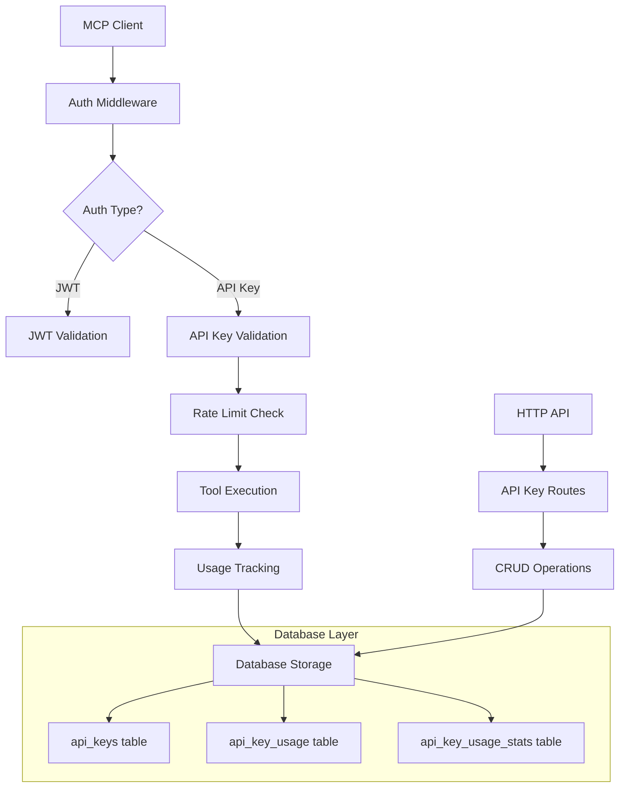

# API Key Management System Design

## Overview

The Pierre MCP Server implements a comprehensive API Key Management System designed for B2B SaaS monetization. This system provides secure authentication, usage tracking, rate limiting, and billing analytics for enterprise customers integrating with the fitness data platform.

## Architecture

### Core Components



### Security Model

1. **Key Generation**: Cryptographically secure 32-byte random keys
2. **Storage**: SHA-256 hashed keys, never stored in plaintext
3. **Transmission**: HTTPS only, keys included in Authorization header
4. **Access Control**: User-scoped keys with strict isolation
5. **Expiration**: Optional time-based expiration

## API Key Format

### Structure
```
pk_live_<32_random_characters>
```

**Example**: `pk_live_abc123def456ghi789jkl012mno345pq`

### Components
- **Prefix**: `pk_live_` (8 characters) - Identifies production keys
- **Random Data**: 32 alphanumeric characters
- **Total Length**: 40 characters

### Key Identification
- **Key Prefix**: First 12 characters stored for fast lookup
- **Key Hash**: SHA-256 hash of full key for secure verification

## Tier System

### Starter Tier
- **Monthly Limit**: 10,000 requests
- **Use Case**: Small integrations, development, proof of concept
- **Rate Window**: 30 days rolling

### Professional Tier  
- **Monthly Limit**: 100,000 requests
- **Use Case**: Production applications, medium-scale integrations
- **Rate Window**: 30 days rolling

### Enterprise Tier
- **Monthly Limit**: Unlimited
- **Use Case**: Large-scale integrations, high-volume applications
- **Rate Window**: N/A

## Authentication Flow

### 1. API Key Creation
```http
POST /api/keys
Authorization: Bearer <jwt_token>
Content-Type: application/json

{
  "name": "Production API Key",
  "description": "Main production integration",
  "tier": "professional",
  "expires_in_days": 365
}
```

### 2. Key Usage in MCP
```json
{
  "jsonrpc": "2.0",
  "method": "tools/call",
  "params": {
    "name": "get_activities",
    "arguments": {"provider": "strava", "limit": 10}
  },
  "auth": "pk_live_abc123def456ghi789jkl012mno345pq",
  "id": "1"
}
```

### 3. Authentication Process
1. Extract API key from `auth` field
2. Validate key format (`pk_live_` prefix, 40 char length)
3. Extract key prefix (first 12 chars)
4. Generate SHA-256 hash of full key
5. Database lookup: `WHERE key_prefix = ? AND key_hash = ?`
6. Verify key is active and not expired
7. Check current month usage against rate limit
8. Update last_used_at timestamp
9. Execute tool call
10. Record usage statistics

## Database Schema

### api_keys Table
```sql
CREATE TABLE api_keys (
    id TEXT PRIMARY KEY,
    user_id TEXT NOT NULL REFERENCES users(id),
    name TEXT NOT NULL,
    key_prefix TEXT NOT NULL,        -- First 12 chars
    key_hash TEXT NOT NULL,          -- SHA-256 hash
    description TEXT,
    tier TEXT NOT NULL,              -- 'starter', 'professional', 'enterprise'
    rate_limit_requests INTEGER,     -- Monthly limit
    rate_limit_window INTEGER,       -- Window in seconds
    is_active BOOLEAN DEFAULT true,
    last_used_at TIMESTAMP,
    expires_at TIMESTAMP,
    created_at TIMESTAMP DEFAULT CURRENT_TIMESTAMP,
    updated_at TIMESTAMP DEFAULT CURRENT_TIMESTAMP,
    UNIQUE(user_id, name)
);
```

### api_key_usage Table
```sql
CREATE TABLE api_key_usage (
    id INTEGER PRIMARY KEY AUTOINCREMENT,
    api_key_id TEXT NOT NULL REFERENCES api_keys(id),
    timestamp TIMESTAMP DEFAULT CURRENT_TIMESTAMP,
    tool_name TEXT NOT NULL,
    response_time_ms INTEGER,
    status_code INTEGER NOT NULL,
    error_message TEXT,
    request_size_bytes INTEGER,
    response_size_bytes INTEGER,
    ip_address TEXT,
    user_agent TEXT
);
```

### api_key_usage_stats Table
```sql
CREATE TABLE api_key_usage_stats (
    api_key_id TEXT NOT NULL REFERENCES api_keys(id),
    period_start TIMESTAMP NOT NULL,
    period_end TIMESTAMP NOT NULL,
    total_requests INTEGER DEFAULT 0,
    successful_requests INTEGER DEFAULT 0,
    failed_requests INTEGER DEFAULT 0,
    total_response_time_ms INTEGER DEFAULT 0,
    tool_usage TEXT DEFAULT '{}',    -- JSON object
    PRIMARY KEY (api_key_id, period_start)
);
```

## Rate Limiting

### Implementation
- **Current Usage Calculation**: Count requests in current calendar month
- **Limit Enforcement**: Block requests when monthly limit exceeded
- **Reset Logic**: Limits reset on 1st day of each month at 00:00 UTC
- **Enterprise Exception**: Unlimited usage, no rate limiting

### Rate Limit Headers (Future Enhancement)
```http
X-RateLimit-Limit: 100000
X-RateLimit-Remaining: 45230
X-RateLimit-Reset: 1701388800
X-RateLimit-Window: 2592000
```

## Usage Tracking

### Metrics Collected
- **Request Count**: Total API calls per time period
- **Response Times**: Latency measurements for performance monitoring
- **Success/Error Rates**: HTTP status codes for reliability tracking
- **Tool Usage**: Per-tool usage statistics for feature analytics
- **Temporal Patterns**: Usage patterns for capacity planning

### Analytics Queries
```sql
-- Monthly usage summary
SELECT 
    DATE_TRUNC('month', timestamp) as month,
    COUNT(*) as total_requests,
    AVG(response_time_ms) as avg_response_time,
    SUM(CASE WHEN status_code >= 400 THEN 1 ELSE 0 END) as error_count
FROM api_key_usage 
WHERE api_key_id = ?
GROUP BY month
ORDER BY month DESC;

-- Top tools by usage
SELECT 
    tool_name,
    COUNT(*) as usage_count,
    AVG(response_time_ms) as avg_response_time
FROM api_key_usage 
WHERE api_key_id = ? AND timestamp >= ?
GROUP BY tool_name
ORDER BY usage_count DESC;
```

## API Endpoints

### Create API Key
```http
POST /api/keys
Authorization: Bearer <jwt_token>
```

**Request**:
```json
{
  "name": "Production Key",
  "description": "Main production integration",
  "tier": "professional",
  "expires_in_days": 365
}
```

**Response**:
```json
{
  "api_key": "pk_live_abc123def456ghi789jkl012mno345pq",
  "key_info": {
    "id": "key_uuid",
    "name": "Production Key",
    "tier": "professional",
    "key_prefix": "pk_live_abc1",
    "created_at": "2024-01-01T00:00:00Z",
    "expires_at": "2025-01-01T00:00:00Z"
  },
  "warning": "Store this API key securely. It will not be shown again."
}
```

### List API Keys
```http
GET /api/keys
Authorization: Bearer <jwt_token>
```

**Response**:
```json
{
  "api_keys": [
    {
      "id": "key_uuid",
      "name": "Production Key",
      "tier": "professional",
      "key_prefix": "pk_live_abc1",
      "is_active": true,
      "last_used_at": "2024-01-15T10:30:00Z",
      "created_at": "2024-01-01T00:00:00Z"
    }
  ]
}
```

### Deactivate API Key
```http
DELETE /api/keys/{key_id}
Authorization: Bearer <jwt_token>
```

### Get Usage Statistics
```http
GET /api/keys/{key_id}/usage?start_date=2024-01-01T00:00:00Z&end_date=2024-01-31T23:59:59Z
Authorization: Bearer <jwt_token>
```

## Security Considerations

### Key Security
1. **Generation**: Cryptographically secure random number generator
2. **Storage**: One-way hashing with SHA-256, no plaintext storage
3. **Transmission**: HTTPS only, included in request headers
4. **Rotation**: Support for key expiration and regeneration
5. **Revocation**: Immediate deactivation capability

### Access Control
1. **User Isolation**: Keys scoped to creating user only
2. **Principle of Least Privilege**: Keys only access user's own data
3. **Audit Trail**: Complete usage tracking for compliance
4. **Rate Limiting**: Prevents abuse and ensures fair usage

### Threat Mitigation
1. **Key Leakage**: Limited blast radius due to user scoping
2. **Brute Force**: 256-bit key space makes attacks infeasible
3. **Replay Attacks**: HTTPS and proper key validation
4. **Rate Limit Bypass**: Server-side enforcement with database backing

## Monitoring and Alerting

### Key Metrics
- **Authentication Success Rate**: Track failed authentication attempts
- **Rate Limit Violations**: Monitor tier limit breaches
- **API Key Usage Patterns**: Detect anomalous usage
- **Response Time Trends**: Performance monitoring
- **Error Rate Tracking**: Reliability monitoring

### Alerts
- High error rate for specific API keys
- Unusual usage spikes or patterns
- Rate limit threshold approaching (80%, 90%, 95%)
- Authentication failures above baseline
- Key expiration warnings

## Migration and Versioning

### Key Format Evolution
- Current: `pk_live_` prefix for production keys
- Future: `pk_test_` for development/testing keys
- Backward compatibility maintained for existing keys

### Database Migrations
- Schema versioning with migration scripts
- Zero-downtime deployments with rolling updates
- Backward-compatible API changes

## Performance Considerations

### Database Optimization
- **Indexes**: Key prefix, user_id, timestamp for fast lookups
- **Partitioning**: Usage tables partitioned by time period
- **Archival**: Automated cleanup of old usage data
- **Caching**: Redis cache for frequently accessed keys

### Scalability
- **Horizontal Scaling**: Stateless authentication allows load balancing
- **Database Sharding**: User-based sharding for large scale
- **CDN Integration**: Static content delivery optimization
- **Async Processing**: Background usage aggregation

## Future Enhancements

### Planned Features
1. **API Key Scopes**: Fine-grained permissions per key
2. **Usage Quotas**: Granular limits per tool/endpoint
3. **Webhook Notifications**: Real-time usage alerts
4. **Key Rotation**: Automated key rotation policies
5. **Usage Forecasting**: ML-based usage prediction
6. **Billing Integration**: Direct integration with payment systems

### API Versioning
- RESTful API versioning with path-based versions
- Deprecation notices and migration guides
- Client SDK updates and compatibility matrix

## Integration Examples

### cURL
```bash
# Create API key
curl -X POST https://api.pierre-mcp.com/api/keys \
  -H "Authorization: Bearer <jwt_token>" \
  -H "Content-Type: application/json" \
  -d '{
    "name": "My Integration",
    "tier": "professional",
    "expires_in_days": 365
  }'

# Use API key with MCP
curl -X POST https://mcp.pierre-fitness.com/ \
  -H "Content-Type: application/json" \
  -d '{
    "jsonrpc": "2.0",
    "method": "tools/call",
    "params": {
      "name": "get_activities",
      "arguments": {"provider": "strava", "limit": 10}
    },
    "auth": "pk_live_abc123def456ghi789jkl012mno345pq",
    "id": "1"
  }'
```

### Python SDK
```python
import pierremcp

# Initialize client with API key
client = pierremcp.Client(api_key="pk_live_abc123def456ghi789jkl012mno345pq")

# Get activities
activities = client.get_activities(provider="strava", limit=10)

# Get usage statistics
usage = client.get_key_usage(
    start_date="2024-01-01",
    end_date="2024-01-31"
)
```

### JavaScript SDK
```javascript
import { PierreMCP } from 'pierre-mcp-sdk';

const client = new PierreMCP({
  apiKey: 'pk_live_abc123def456ghi789jkl012mno345pq'
});

// Get activities
const activities = await client.getActivities({
  provider: 'strava',
  limit: 10
});

// Monitor usage
const usage = await client.getKeyUsage({
  startDate: '2024-01-01',
  endDate: '2024-01-31'
});
```

This comprehensive API Key Management System provides a robust foundation for B2B SaaS monetization while maintaining security, scalability, and excellent developer experience.