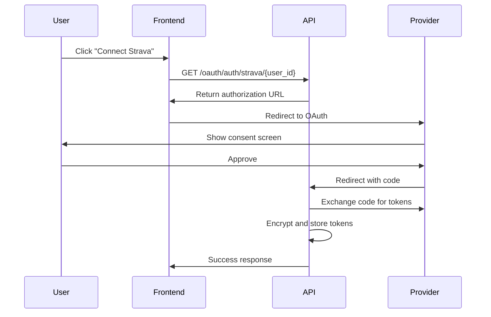

# Pierre MCP Server - Technical Architecture Documentation

## Table of Contents
1. [System Overview](#system-overview)
2. [Architecture Components](#architecture-components)
3. [Service Architecture](#service-architecture)
4. [Authentication & Security](#authentication--security)
5. [API Key Management System](#api-key-management-system)
6. [Database Schema](#database-schema)
7. [Integration Points](#integration-points)
8. [Deployment Architecture](#deployment-architecture)
9. [What's Next](#whats-next)

## System Overview

Pierre MCP Server is a multi-tenant fitness data platform that provides secure access to fitness data from multiple providers (Strava, Fitbit) through both the Model Context Protocol (MCP) and traditional REST APIs. The system is designed for B2B use cases, allowing AI assistants and applications to access fitness data with proper authentication and rate limiting.

### Core Services

1. **MCP Server (Port 8080)**: Handles MCP protocol connections for AI assistants
2. **HTTP API Server (Port 8081)**: Provides REST endpoints for authentication, API key management, and dashboard access
3. **Admin Service (Port 8082)**: Manages API key approval workflows and email notifications
4. **Frontend (Port 5173)**: React-based dashboard for user management and analytics

## Architecture Components

### Technology Stack

- **Backend**: Rust with Tokio async runtime
- **Web Framework**: Warp for HTTP endpoints
- **Database**: SQLite with SQLx for async operations
- **Authentication**: JWT tokens and API keys with SHA-256 hashing
- **Frontend**: React with TypeScript
- **Email Service**: SMTP integration for notifications
- **Encryption**: AES-256-GCM for sensitive data at rest

### Key Libraries

```toml
# Core dependencies
tokio = { version = "1", features = ["full"] }
warp = "0.3"
sqlx = { version = "0.7", features = ["sqlite", "runtime-tokio-native-tls"] }
serde = { version = "1.0", features = ["derive"] }
jsonwebtoken = "9"
bcrypt = "0.15"
sha2 = "0.10"
aes-gcm = "0.10"
```

## Service Architecture

### 1. MCP Server (Multi-tenant)

The MCP server implements the Model Context Protocol for AI assistant integration:

```rust
pub struct MultiTenantMcpServer {
    database: Arc<Database>,
    auth_manager: Arc<AuthManager>,
    auth_middleware: Arc<McpAuthMiddleware>,
    websocket_manager: Arc<WebSocketManager>,
    user_providers: Arc<RwLock<HashMap<String, HashMap<String, Box<dyn FitnessProvider>>>>>,
}
```

**Key Features:**
- User-scoped provider instances
- JWT and API key authentication
- Rate limiting per API key tier
- WebSocket support for real-time updates
- Tool-based interface for fitness data access

**Available Tools:**
- `get_activities`: Retrieve user activities
- `get_athlete`: Get athlete profile information
- `get_stats`: Fetch fitness statistics
- `get_activity_intelligence`: AI-enhanced activity analysis
- `connect_strava/connect_fitbit`: OAuth integration
- `set_goal/track_progress`: Goal management
- `analyze_training_load`: Training analysis
- `calculate_fitness_score`: Fitness scoring

### 2. HTTP API Server

REST API endpoints for web clients and management:

```rust
// Authentication
POST   /auth/register
POST   /auth/login

// OAuth
GET    /oauth/auth/{provider}/{user_id}
GET    /oauth/callback/{provider}

// API Keys
POST   /api/keys                 // Create API key
POST   /api/keys/trial          // Create trial key
GET    /api/keys                // List user's keys
DELETE /api/keys/{id}           // Deactivate key
GET    /api/keys/{id}/usage     // Get usage stats

// Dashboard
GET    /dashboard/overview      // Dashboard data
GET    /dashboard/analytics     // Usage analytics
GET    /dashboard/rate-limits   // Rate limit status

// Health
GET    /health                  // Comprehensive health check
GET    /ready                   // Readiness probe
GET    /live                    // Liveness probe
```

### 3. Admin Service

Separate service for administrative functions:

- API key request management
- Approval/denial workflow
- Email notifications
- Auto-approval configuration
- Audit logging

## Authentication & Security

### Multi-Layer Authentication

1. **JWT Token Authentication**
   - Used for web dashboard and user sessions
   - 24-hour expiration (configurable)
   - Contains user ID, email, and available providers
   - Enhanced error handling with detailed expiration info

2. **API Key Authentication**
   - Production keys: `pk_live_` prefix
   - Trial keys: `pk_trial_` prefix
   - SHA-256 hashed storage
   - Rate limiting based on tier

### Security Features

```rust
// JWT Token Structure
pub struct Claims {
    pub sub: String,              // User ID
    pub email: String,
    pub iat: i64,                // Issued at
    pub exp: i64,                // Expiration
    pub providers: Vec<String>,   // Available fitness providers
}

// API Key Validation
pub enum JwtValidationError {
    TokenExpired { expired_at: DateTime<Utc>, current_time: DateTime<Utc> },
    TokenInvalid { reason: String },
    TokenMalformed { details: String },
}
```

### CORS Configuration

```rust
let cors = warp::cors()
    .allow_any_origin()
    .allow_headers(vec![
        "content-type", 
        "authorization", 
        "x-requested-with",
        "accept",
        "origin",
        "access-control-request-method",
        "access-control-request-headers"
    ])
    .allow_methods(vec!["GET", "POST", "PUT", "DELETE", "OPTIONS"]);
```

## API Key Management System

### Tier System

```rust
pub enum ApiKeyTier {
    Trial,        // 1,000 requests/month, 14-day expiration
    Starter,      // 10,000 requests/month
    Professional, // 100,000 requests/month
    Enterprise,   // Unlimited
}
```

### Key Features

1. **Trial Keys**
   - Automatic 14-day expiration
   - One trial key per user limit
   - 1,000 request monthly limit
   - `pk_trial_` prefix for identification

2. **Rate Limiting**
   - Monthly request limits per tier
   - Real-time usage tracking
   - Automatic reset on month boundary
   - Enterprise tier unlimited

3. **Usage Tracking**
   ```rust
   pub struct ApiKeyUsage {
       pub api_key_id: String,
       pub timestamp: DateTime<Utc>,
       pub tool_name: String,
       pub response_time_ms: Option<u32>,
       pub status_code: u16,
       pub error_message: Option<String>,
   }
   ```

4. **Automatic Cleanup**
   - Hourly background task
   - Deactivates expired trial keys
   - Maintains audit trail

## Database Schema

### Core Tables

```sql
-- Users table
CREATE TABLE users (
    id TEXT PRIMARY KEY,
    email TEXT UNIQUE NOT NULL,
    password_hash TEXT NOT NULL,
    display_name TEXT,
    is_active BOOLEAN DEFAULT true,
    created_at TEXT NOT NULL,
    last_active_at TEXT
);

-- API Keys
CREATE TABLE api_keys (
    id TEXT PRIMARY KEY,
    user_id TEXT NOT NULL,
    name TEXT NOT NULL,
    key_prefix TEXT NOT NULL,
    key_hash TEXT NOT NULL,
    description TEXT,
    tier TEXT NOT NULL,
    rate_limit_requests INTEGER NOT NULL,
    rate_limit_window INTEGER NOT NULL,
    is_active BOOLEAN DEFAULT true,
    last_used_at TEXT,
    expires_at TEXT,
    created_at TEXT NOT NULL,
    updated_at TEXT NOT NULL,
    FOREIGN KEY (user_id) REFERENCES users(id)
);

-- OAuth Tokens (Encrypted)
CREATE TABLE oauth_tokens (
    id TEXT PRIMARY KEY,
    user_id TEXT NOT NULL,
    provider TEXT NOT NULL,
    encrypted_access_token TEXT NOT NULL,
    encrypted_refresh_token TEXT NOT NULL,
    expires_at TEXT NOT NULL,
    scope TEXT NOT NULL,
    created_at TEXT NOT NULL,
    updated_at TEXT NOT NULL,
    UNIQUE(user_id, provider)
);

-- API Key Usage
CREATE TABLE api_key_usage (
    id INTEGER PRIMARY KEY AUTOINCREMENT,
    api_key_id TEXT NOT NULL,
    timestamp TEXT NOT NULL,
    tool_name TEXT NOT NULL,
    response_time_ms INTEGER,
    status_code INTEGER NOT NULL,
    error_message TEXT,
    request_size_bytes INTEGER,
    response_size_bytes INTEGER,
    ip_address TEXT,
    user_agent TEXT,
    FOREIGN KEY (api_key_id) REFERENCES api_keys(id)
);
```

### Encryption

All sensitive data (OAuth tokens) are encrypted using AES-256-GCM:

```rust
pub struct EncryptedData {
    pub ciphertext: Vec<u8>,
    pub nonce: Vec<u8>,
}
```

## Integration Points

### 1. Fitness Provider Integration

```rust
#[async_trait]
pub trait FitnessProvider: Send + Sync {
    async fn authenticate(&mut self, auth_data: AuthData) -> Result<()>;
    async fn get_activities(&self, limit: Option<usize>, offset: Option<usize>) -> Result<Vec<Activity>>;
    async fn get_athlete(&self) -> Result<Athlete>;
    async fn get_stats(&self) -> Result<Stats>;
}
```

### 2. OAuth2 Flow



### 3. WebSocket Integration

Real-time updates for dashboard:
- API key usage notifications
- Rate limit warnings
- Connection status updates

## Deployment Architecture

### Docker Configuration

```yaml
version: '3.8'
services:
  mcp-server:
    build: .
    ports:
      - "8080:8080"  # MCP protocol
      - "8081:8081"  # HTTP API
    environment:
      - DATABASE_URL=sqlite:./data/users.db
      - RUST_LOG=info
    volumes:
      - ./data:/app/data

  admin-service:
    build: ./admin
    ports:
      - "8082:8082"
    environment:
      - DATABASE_URL=sqlite:./data/users.db
      - SMTP_HOST=${SMTP_HOST}
      - SMTP_PORT=${SMTP_PORT}
```

### Security Considerations

1. **Network Security**
   - All services bind to localhost by default
   - TLS termination at reverse proxy
   - Rate limiting at application level

2. **Data Security**
   - Encryption keys stored separately
   - JWT secrets rotated regularly
   - API keys hashed with SHA-256
   - OAuth tokens encrypted at rest

3. **Access Control**
   - User-scoped data access
   - API key tied to user account
   - Provider access validated per request

## What's Next

### 1. Frontend Enhancements (High Priority)
- **API Key Request Status Tracking**
  - Show pending/approved/denied status
  - Display approval timeline
  - Email notification preferences
  
- **Enhanced Dashboard Analytics**
  - Real-time usage graphs
  - Tool-specific usage breakdown
  - Cost projection based on usage

### 2. Advanced Features (Medium Priority)

- **Webhook Support**
  - Activity upload notifications
  - Goal achievement alerts
  - Rate limit warnings

- **Data Export API**
  - Bulk activity export
  - Custom date ranges
  - Multiple format support (JSON, CSV, GPX)

- **Enhanced Intelligence Features**
  - ML-based performance predictions
  - Personalized training recommendations
  - Injury risk assessment

### 3. Enterprise Features (Future)

- **Team Management**
  - Multi-user organizations
  - Role-based access control
  - Centralized billing

- **Advanced Analytics**
  - Custom metrics definition
  - A/B testing for training plans
  - Population-level insights

- **SLA Management**
  - Uptime guarantees
  - Custom rate limits
  - Priority support queue

### 4. Technical Improvements

- **Performance Optimization**
  - Redis caching layer
  - Database query optimization
  - Connection pooling enhancements

- **Monitoring & Observability**
  - OpenTelemetry integration
  - Distributed tracing
  - Custom metrics dashboards

- **API Gateway**
  - Kong or similar for advanced routing
  - GraphQL endpoint
  - API versioning strategy

### 5. Compliance & Certification

- **Security Certifications**
  - SOC 2 Type II
  - ISO 27001
  - HIPAA compliance (for health data)

- **Data Privacy**
  - GDPR compliance tools
  - Data retention policies
  - User data export/deletion

The platform is now production-ready with core B2B features implemented. The next phase focuses on enhancing the user experience, adding enterprise features, and preparing for scale.