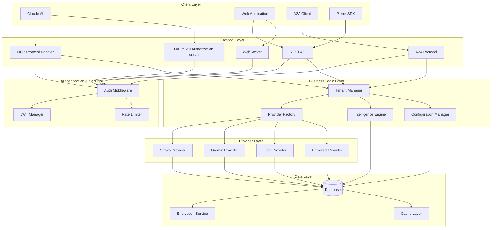
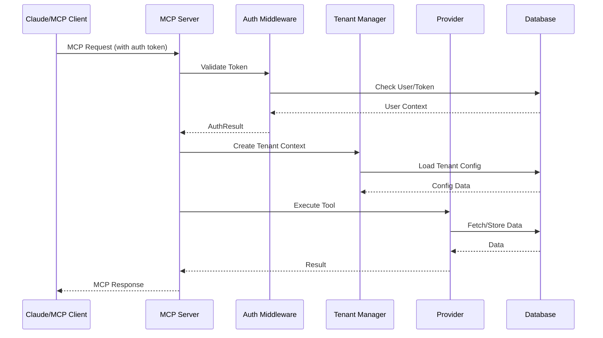
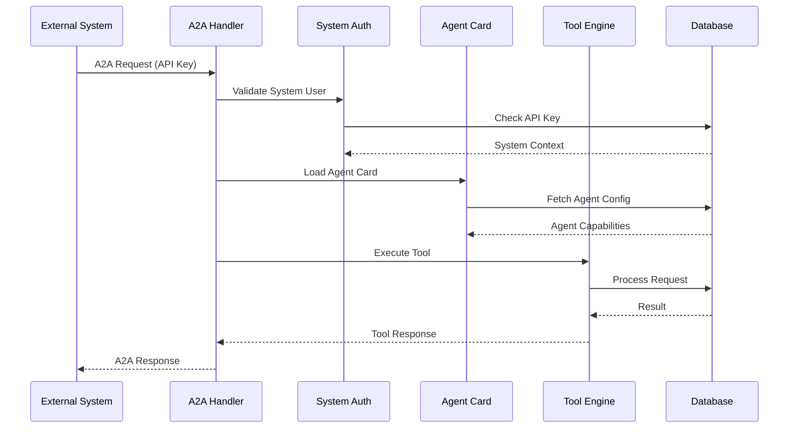
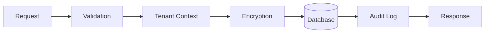
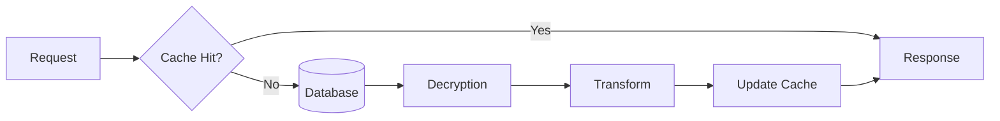
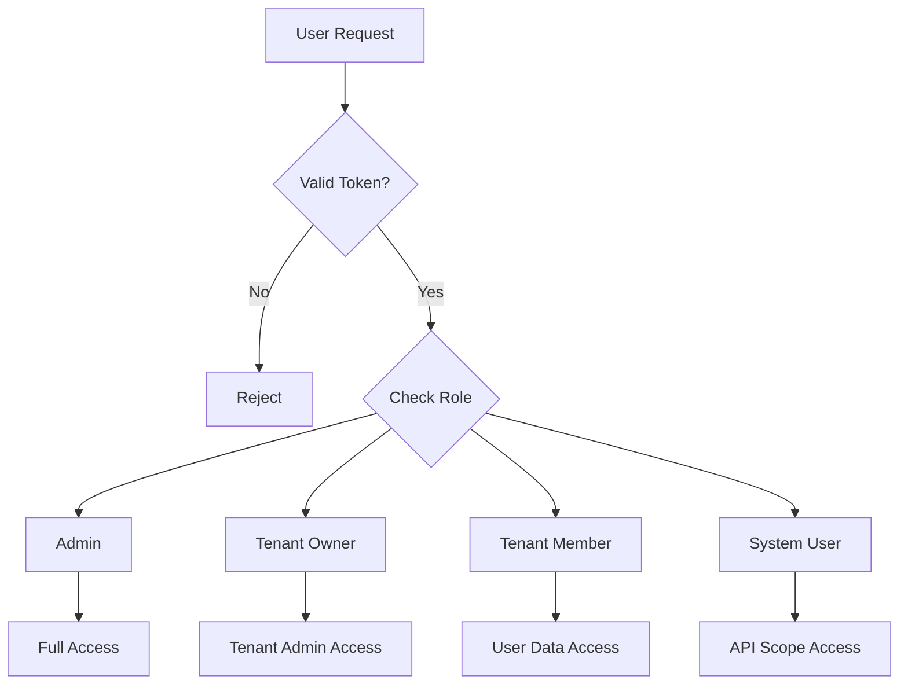
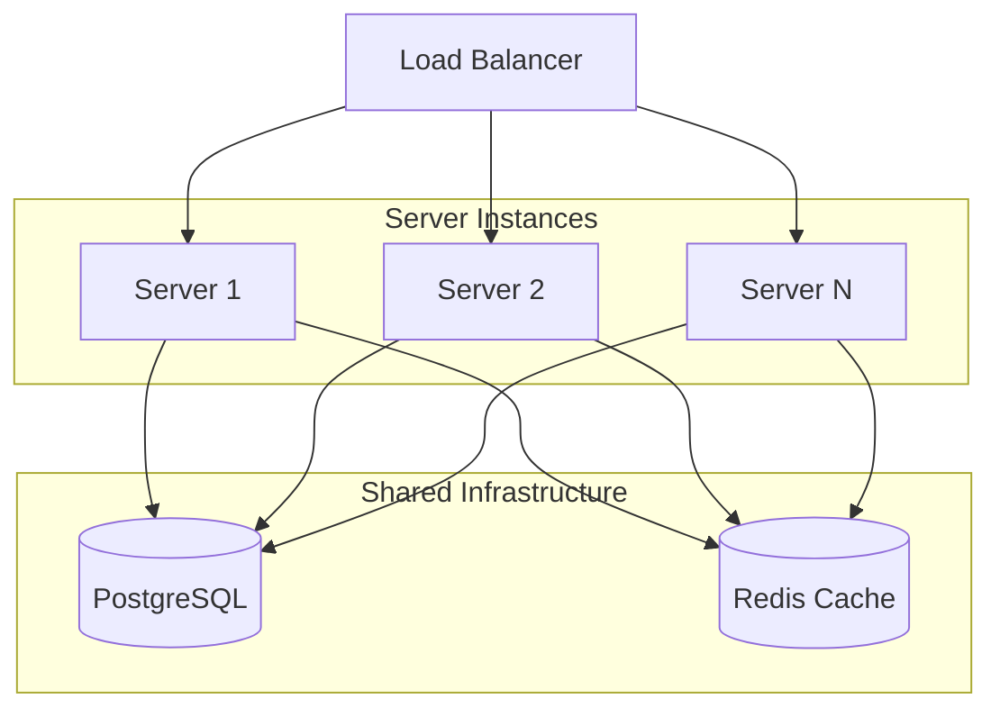

# Architecture Overview

## System Architecture

Pierre MCP Server follows a layered, multi-protocol architecture designed for scalability, security, and extensibility.



## Core Design Patterns

### 1. Multi-Tenant Architecture

Every request operates within a tenant context, ensuring complete data isolation:

```rust
pub struct TenantContext {
    pub tenant_id: Uuid,
    pub user_id: Uuid,
    pub role: TenantRole,
    pub rate_limit_multiplier: f32,
    pub features: HashSet<String>,
}
```

### 2. Consolidated Server Architecture

All protocols run on a single port (8081) for simplified deployment. The server uses `warp`'s filter system to compose the routes:

```rust
// src/mcp/multitenant.rs
let routes = auth_route_filter
    .or(oauth_route_filter)
    .or(oauth2_server_routes)
    .or(api_key_route_filter)
    .or(api_key_usage_filter)
    .or(dashboard_route_filter)
    .or(dashboard_detailed_filter)
    .or(a2a_basic_filter)
    .or(a2a_client_filter)
    .or(a2a_monitoring_filter)
    .or(a2a_execution_filter)
    .or(configuration_filter)
    .or(user_configuration_filter)
    .or(specialized_configuration_filter)
    .or(fitness_configuration_filter)
    .or(admin_routes_filter)
    .or(tenant_routes_filter)
    .or(sse_routes)
    .or(mcp_sse_routes)
    .or(mcp_endpoint_routes)
    .or(health_route)
    .with(cors)
    .with(security_headers)
    .recover(handle_rejection);
```

### 3. Routing Design (Warp)

The project uses the `warp` web framework, which employs a filter-based system for routing. Each route is a combination of filters that match on different aspects of the incoming request, such as the path, method, headers, and body.

**Pros:**

*   **Type-safe:** `warp`'s filter system is type-safe, which means that the compiler can catch errors at compile time.
*   **Composable:** Filters can be combined and reused to create complex routing logic.
*   **Flexible:** The filter system is very flexible and can be used to match on almost any aspect of the request.

**Cons:**

*   **Verbose:** The filter chains can be verbose and difficult to read, especially for complex routes.
*   **Imperative Style:** The routing is defined in an imperative style, which can make it difficult to see the overall routing structure at a glance.
*   **Clones and Closures:** The use of closures and `Arc` for sharing state can lead to a lot of `clone()` calls, which can add visual noise to the code.

While `warp` is a powerful and flexible framework, the routing implementation in this project could be simplified by using a more declarative approach or by extracting common logic into middleware.

### 4. OAuth 2.0 Authorization Server

Pierre implements a standards-compliant OAuth 2.0 Authorization Server for MCP client compatibility:

```rust
// src/oauth2/routes.rs
pub fn oauth2_routes(
    db: Arc<Database>,
    auth_manager: &AuthManager,
    http_port: u16,
) -> impl Filter<Extract = impl Reply, Error = Rejection> + Clone {
    let registration = register_client(db.clone());
    let authorization = authorize_client(db.clone(), auth_manager, http_port);
    let token = exchange_token(db, auth_manager.clone());

    warp::path("oauth2").and(registration.or(authorization).or(token))
}
```

### 4. Provider Factory Pattern

Providers are created dynamically based on tenant configuration:

```rust
pub struct TenantProviderFactory {
    oauth_client: Arc<TenantOAuthClient>,
}

impl TenantProviderFactory {
    pub async fn create_provider(
        &self,
        provider_type: &str,
        context: &TenantContext,
    ) -> Result<Box<dyn FitnessProvider>>;
}
```

### 3. Protocol Abstraction

Core business logic is protocol-agnostic:

```rust
// Core functionality
pub trait FitnessProvider: Send + Sync {
    async fn get_athlete(&self) -> Result<Athlete>;
    async fn get_activities(&self, params: ActivityParams) -> Result<Vec<Activity>>;
    // ...
}

// Protocol handlers call core functionality
impl McpHandler {
    async fn handle_tool(&self, tool: &str, params: Value) -> Result<Value> {
        let provider = self.get_provider()?;
        match tool {
            "get_athlete" => provider.get_athlete().await,
            // ...
        }
    }
}
```

## Request Flow

### MCP Request Flow



### A2A Request Flow



## Data Flow Architecture

### Write Path



### Read Path



## Security Architecture

### Authentication Layers

1. **Transport Security**: HTTPS/TLS for all communications
2. **Token Authentication**: JWT tokens with expiry
3. **API Key Authentication**: For A2A communication
4. **OAuth2**: For provider authentication

### Authorization Model



## Scalability Considerations

### Horizontal Scaling



### Database Sharding Strategy

- **By Tenant**: Each tenant's data in separate tables/schemas
- **By Time**: Historical data partitioned by date
- **By Provider**: Provider-specific data in dedicated tables

## Performance Optimization

### Caching Strategy

1. **Request Cache**: 15-minute TTL for identical requests
2. **Provider Cache**: OAuth tokens and provider metadata
3. **Computation Cache**: Intelligence engine results
4. **Database Query Cache**: Frequently accessed data

### Async Processing

```rust
// All I/O operations are async
pub async fn handle_request() -> Result<Response> {
    // Concurrent provider calls
    let (athlete, activities, stats) = tokio::join!(
        provider.get_athlete(),
        provider.get_activities(params),
        provider.get_stats()
    );
    
    // Process results
    Ok(build_response(athlete?, activities?, stats?))
}
```

## Monitoring & Observability

### Metrics Collection

- Request latency
- Error rates
- Provider API usage
- Database query performance
- Cache hit rates
- Token validation time

### Health Checks

```rust
pub struct HealthStatus {
    pub status: HealthState,
    pub database: ComponentHealth,
    pub cache: ComponentHealth,
    pub providers: HashMap<String, ComponentHealth>,
    pub uptime_seconds: u64,
}
```

## Error Handling Strategy

### Error Categories

1. **Client Errors (4xx)**: Invalid requests, authentication failures
2. **Server Errors (5xx)**: Internal errors, provider failures
3. **Provider Errors**: Rate limits, API failures
4. **Database Errors**: Connection issues, query failures

### Error Propagation

```rust
#[derive(Debug, thiserror::Error)]
pub enum AppError {
    #[error("Authentication failed: {0}")]
    Auth(#[from] AuthError),
    
    #[error("Database error: {0}")]
    Database(#[from] DatabaseError),
    
    #[error("Provider error: {0}")]
    Provider(#[from] ProviderError),
    
    #[error("Rate limit exceeded")]
    RateLimit,
}
```

## Development Principles

### SOLID Principles

- **Single Responsibility**: Each module has one clear purpose
- **Open/Closed**: Extensible through traits, not modification
- **Liskov Substitution**: All providers implement common interface
- **Interface Segregation**: Minimal, focused interfaces
- **Dependency Inversion**: Depend on abstractions, not concretions

### Code Organization

```
src/
├── protocols/         # Protocol handlers (MCP, A2A, REST)
├── mcp/              # MCP protocol implementation
├── a2a/              # A2A protocol implementation
├── providers/        # External fitness integrations
├── database_plugins/ # Database backends (SQLite/PostgreSQL)
├── intelligence/     # Analytics and recommendations
├── tenant/           # Multi-tenant management
├── security/         # Security components
├── oauth/            # OAuth management
├── config/           # Configuration management
├── crypto/           # Cryptographic utilities
└── utils/            # Shared utilities
```

### Testing Strategy

- **Unit Tests**: Pure business logic
- **Integration Tests**: Database and provider interactions
- **E2E Tests**: Full request/response cycles
- **Performance Tests**: Load and stress testing