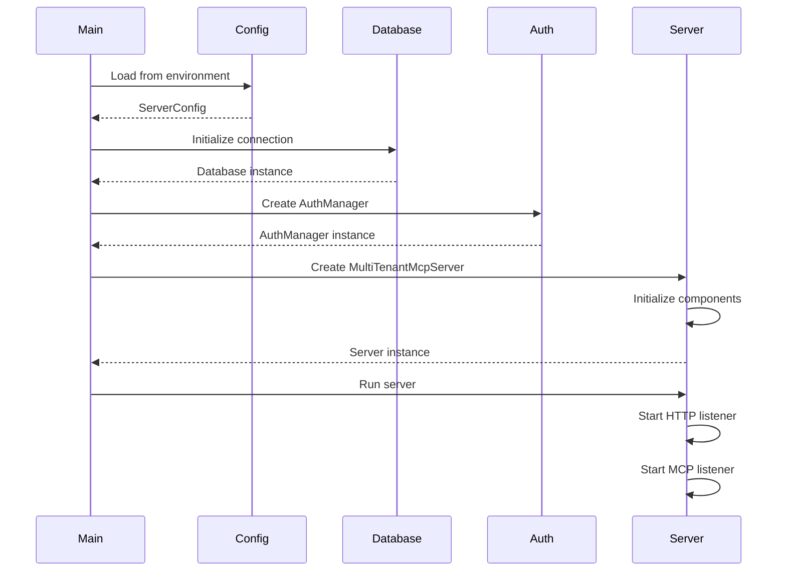
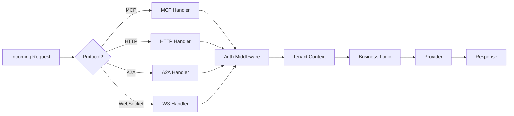

# Core Components

## Component Overview

The Pierre MCP Server is built with modular, reusable components that work together to provide a robust fitness data platform.

## Primary Components

### 1. Server Binary (`src/bin/pierre-mcp-server.rs`)

The main entry point that orchestrates all components:

```rust
pub struct MultiTenantMcpServer {
    database: Arc<Database>,
    auth_manager: Arc<AuthManager>,
    auth_middleware: Arc<McpAuthMiddleware>,
    websocket_manager: Arc<WebSocketManager>,
    tenant_provider_factory: Arc<TenantProviderFactory>,
    config: Arc<ServerConfig>,
}
```

**Responsibilities:**
- Initialize database connections
- Set up authentication
- Configure HTTP and MCP listeners
- Manage server lifecycle

### 2. Database Layer (`src/database/`)

Provides abstraction over database operations with support for multiple backends:

```rust
pub trait DatabaseProvider: Send + Sync {
    async fn create_user(&self, user: &User) -> Result<Uuid>;
    async fn get_user_by_email(&self, email: &str) -> Result<Option<User>>;
    async fn store_oauth_tokens(&self, tokens: &OAuthTokens) -> Result<()>;
    // ... more operations
}
```

**Key Files:**
- `mod.rs`: Database trait definitions
- `users.rs`: User management
- `tokens.rs`: Token storage
- `api_keys.rs`: API key management
- `analytics.rs`: Usage analytics
- `a2a.rs`: A2A system users

### 3. Authentication Manager (`src/auth.rs`)

Handles JWT token generation and validation:

```rust
pub struct AuthManager {
    secret: Vec<u8>,
    expiry_hours: i64,
}

impl AuthManager {
    pub fn generate_token(&self, user_id: &Uuid) -> Result<String>;
    pub fn verify_token(&self, token: &str) -> Result<Claims>;
    pub fn generate_refresh_token(&self) -> String;
}
```

**Features:**
- JWT token generation with configurable expiry
- Token validation and claims extraction
- Refresh token support
- API key authentication for A2A

### 4. Tenant Management (`src/tenant/`)

Implements multi-tenant isolation:

```rust
pub struct TenantContext {
    pub tenant_id: Uuid,
    pub user_id: Uuid,
    pub role: TenantRole,
    pub rate_limit_multiplier: f32,
    pub features: HashSet<String>,
}

pub enum TenantRole {
    Owner,
    Admin,
    Member,
    ReadOnly,
}
```

**Capabilities:**
- Tenant isolation
- Role-based access control
- Feature flags per tenant
- Rate limit customization

### 5. Provider System (`src/providers/`)

Abstracts fitness data providers:

```rust
#[async_trait]
pub trait FitnessProvider: Send + Sync {
    async fn name(&self) -> &str;
    async fn authenticate(&mut self, auth_data: AuthData) -> Result<()>;
    async fn get_athlete(&self) -> Result<Athlete>;
    async fn get_activities(&self, params: ActivityParams) -> Result<Vec<Activity>>;
    async fn get_activity(&self, id: &str) -> Result<Activity>;
    async fn get_stats(&self) -> Result<Stats>;
}
```

**Implementations:**
- `strava_tenant.rs`: Strava API integration
- `fitbit.rs`: Fitbit API integration
- `tenant_provider.rs`: Tenant-aware provider wrapper
- `universal.rs`: Protocol converter for unified access

### 6. MCP Protocol Handler (`src/mcp/`)

Implements the Model Context Protocol:

```rust
pub struct MpcpHandler {
    database: Arc<Database>,
    provider_factory: Arc<TenantProviderFactory>,
}

impl MpcpHandler {
    pub async fn handle_request(&self, request: JsonRpcRequest) -> JsonRpcResponse;
    async fn handle_tool_call(&self, tool: &str, params: Value) -> Result<Value>;
}
```

**Protocol Support:**
- JSON-RPC 2.0 transport
- Tool discovery and execution
- Error handling per MCP spec
- Streaming responses

### 7. A2A Protocol (`src/a2a/`)

Agent-to-Agent communication protocol:

```rust
pub struct A2ASystem {
    pub id: Uuid,
    pub name: String,
    pub api_key: String,
    pub capabilities: Vec<String>,
    pub rate_limit: RateLimit,
}

pub struct AgentCard {
    pub agent_id: String,
    pub name: String,
    pub version: String,
    pub capabilities: Vec<Capability>,
    pub endpoints: Vec<Endpoint>,
}
```

**Features:**
- System-to-system authentication
- Agent capability negotiation
- Tool routing
- Rate limiting per system

### 8. Intelligence Engine (`src/intelligence/`)

Advanced analytics and recommendations:

```rust
pub struct IntelligenceEngine {
    analyzer: ActivityAnalyzer,
    performance: PerformanceAnalyzer,
    recommendations: RecommendationEngine,
    goal_engine: GoalEngine,
}

impl IntelligenceEngine {
    pub async fn analyze_activity(&self, activity: &Activity) -> ActivityAnalysis;
    pub async fn generate_recommendations(&self, athlete: &Athlete) -> Vec<Recommendation>;
    pub async fn predict_performance(&self, params: PredictionParams) -> PerformancePrediction;
}
```

**Capabilities:**
- Activity analysis (pace, heart rate, power)
- Performance trend detection
- Training load calculation
- Goal feasibility analysis
- Personalized recommendations

### 9. Configuration System (`src/configuration/`)

Runtime configuration management:

```rust
pub struct ConfigurationManager {
    profiles: ProfileManager,
    runtime: RuntimeConfig,
    catalog: ConfigCatalog,
}

pub struct FitnessProfile {
    pub vo2_max: f64,
    pub threshold_power: Option<f64>,
    pub max_heart_rate: u32,
    pub zones: ZoneConfiguration,
}
```

**Features:**
- User fitness profiles
- Training zones configuration
- VO2 max calculations
- Runtime parameter updates

### 10. Rate Limiting (`src/rate_limiting.rs`)

Request throttling and quota management:

```rust
pub struct RateLimiter {
    limits: HashMap<String, Limit>,
    window: Duration,
}

pub struct Limit {
    pub max_requests: u32,
    pub window_seconds: u64,
    pub burst_size: u32,
}
```

**Implementation:**
- Token bucket algorithm
- Per-tenant limits
- Burst support
- Graceful degradation

## Component Interactions

### Initialization Sequence



### Request Processing Pipeline



## Component Lifecycle

### Server Startup

1. **Environment Loading**: Parse environment variables and config files
2. **Database Initialization**: Connect to database, run migrations
3. **Key Loading**: Load or generate encryption keys and JWT secrets
4. **Component Creation**: Instantiate all major components
5. **Route Registration**: Set up HTTP routes and handlers
6. **Listener Startup**: Begin accepting connections

### Request Handling

1. **Protocol Detection**: Identify request type (MCP, HTTP, A2A, WebSocket)
2. **Authentication**: Validate tokens or API keys
3. **Authorization**: Check permissions and rate limits
4. **Context Creation**: Build tenant context
5. **Processing**: Execute business logic
6. **Response Generation**: Format response per protocol
7. **Logging**: Record request metrics

### Graceful Shutdown

1. **Signal Reception**: Handle SIGTERM/SIGINT
2. **Stop Accepting**: Close listeners
3. **Drain Requests**: Complete in-flight requests
4. **Provider Cleanup**: Close provider connections
5. **Database Cleanup**: Close database connections
6. **Final Logging**: Write shutdown metrics

## Error Handling

### Error Types

```rust
#[derive(Debug, thiserror::Error)]
pub enum CoreError {
    #[error("Database error: {0}")]
    Database(#[from] DatabaseError),
    
    #[error("Authentication failed: {0}")]
    Auth(#[from] AuthError),
    
    #[error("Provider error: {0}")]
    Provider(#[from] ProviderError),
    
    #[error("Rate limit exceeded")]
    RateLimit,
    
    #[error("Invalid request: {0}")]
    Validation(String),
}
```

### Error Propagation

- Use `Result<T, E>` for all fallible operations
- Convert errors at boundaries using `From` trait
- Log errors with appropriate levels
- Return user-friendly error messages

## Performance Considerations

### Connection Pooling

```rust
pub struct ConnectionPool {
    max_connections: u32,
    min_connections: u32,
    connection_timeout: Duration,
    idle_timeout: Duration,
}
```

### Caching Strategy

- **Memory Cache**: Hot data with LRU eviction
- **Query Cache**: Database query results
- **Provider Cache**: OAuth tokens and metadata
- **Response Cache**: Computed responses

### Async Execution

All I/O operations use async/await for non-blocking execution:

```rust
pub async fn process_request(req: Request) -> Result<Response> {
    // Concurrent operations
    let futures = vec![
        fetch_user_data(),
        fetch_provider_data(),
        compute_analytics(),
    ];
    
    let results = futures::future::join_all(futures).await;
    // Process results...
}
```

## Testing Components

### Unit Testing

Each component has comprehensive unit tests:

```rust
#[cfg(test)]
mod tests {
    use super::*;
    
    #[tokio::test]
    async fn test_component_initialization() {
        let component = Component::new();
        assert!(component.is_initialized());
    }
}
```

### Integration Testing

Components are tested together in `tests/` directory:

```rust
#[tokio::test]
async fn test_full_request_flow() {
    let server = create_test_server().await;
    let response = server.handle_request(request).await;
    assert_eq!(response.status, 200);
}
```

## Component Configuration

### Environment Variables

```bash
# Database
DATABASE_URL=sqlite://data/pierre.db
DATABASE_ENCRYPTION_KEY_PATH=data/encryption.key

# Authentication
JWT_SECRET_PATH=data/jwt.secret
JWT_EXPIRY_HOURS=24

# Server
HTTP_PORT=8080
MCP_PORT=8081

# Providers
STRAVA_CLIENT_ID=xxx
STRAVA_CLIENT_SECRET=yyy
```

### Configuration Files

```toml
# fitness_config.toml
[server]
max_connections = 100
request_timeout = 30

[intelligence]
cache_ttl = 900
max_computation_time = 5

[providers.strava]
rate_limit = 600
burst_size = 100
```

## Monitoring & Metrics

### Health Checks

```rust
pub struct HealthCheck {
    pub database: bool,
    pub cache: bool,
    pub providers: HashMap<String, bool>,
    pub uptime: Duration,
}
```

### Metrics Collection

- Request latency histogram
- Error rate counter
- Active connections gauge
- Provider API usage
- Cache hit/miss ratio

## Security Hardening

### Input Validation

All inputs are validated before processing:

```rust
pub fn validate_request(req: &Request) -> Result<()> {
    validate_headers(req.headers)?;
    validate_body(req.body)?;
    validate_params(req.params)?;
    Ok(())
}
```

### Encryption

Sensitive data is encrypted at rest:

```rust
pub struct EncryptionService {
    key: [u8; 32],
    cipher: Aes256Gcm,
}

impl EncryptionService {
    pub fn encrypt(&self, data: &[u8]) -> Result<Vec<u8>>;
    pub fn decrypt(&self, encrypted: &[u8]) -> Result<Vec<u8>>;
}
```