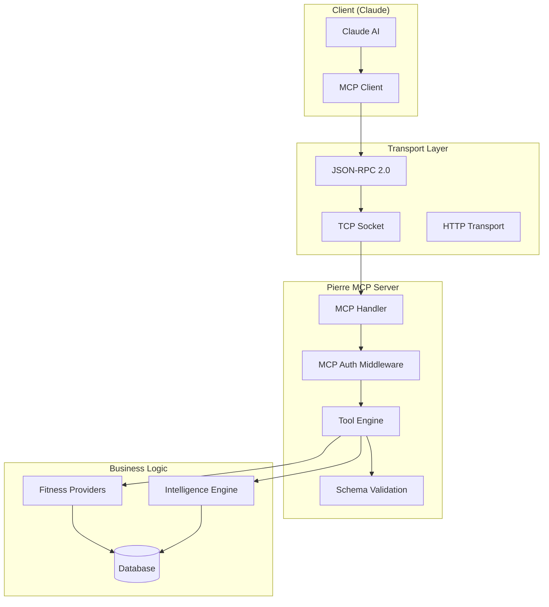
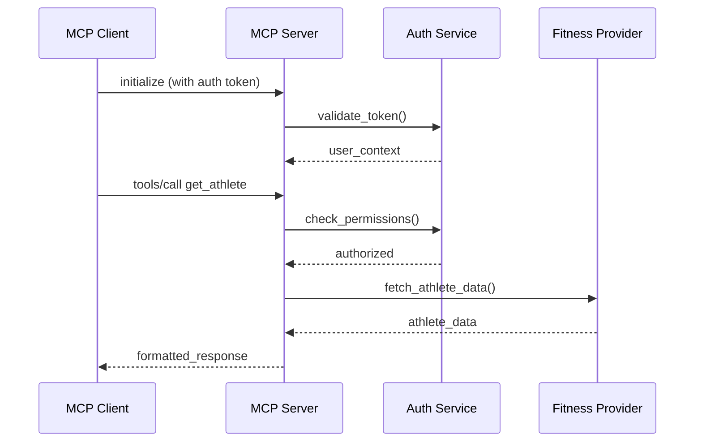

# MCP Protocol Implementation

## Overview

Pierre MCP Server implements the Model Context Protocol (MCP) version 2025-06-18 with **conditional authentication** and **OAuth 2.0 integration**, providing AI assistants like Claude with structured access to fitness data and analytics capabilities.

## Key Features

- **Conditional Authentication**: Discovery methods (initialize, tools/list) work without authentication, execution methods require JWT tokens
- **OAuth 2.0 Integration**: Standards-compliant OAuth 2.0 Authorization Server for MCP client compatibility
- **Single Port Architecture**: All protocols consolidated on port 8081
- **JWT Access Tokens**: OAuth 2.0 flow issues JWT tokens for MCP authentication

## MCP Protocol Architecture



## Protocol Messages

### Initialization

The MCP protocol starts with an initialization handshake:

```json
// Client -> Server
{
    "jsonrpc": "2.0",
    "id": 1,
    "method": "initialize",
    "params": {
        "protocolVersion": "2025-06-18",
        "capabilities": {
            "roots": {
                "listChanged": true
            }
        },
        "clientInfo": {
            "name": "Claude",
            "version": "1.0"
        }
    }
}
```

```json
// Server -> Client
{
    "jsonrpc": "2.0",
    "id": 1,
    "result": {
        "protocolVersion": "2025-06-18",
        "capabilities": {
            "tools": {
                "listChanged": true
            },
            "logging": {}
        },
        "serverInfo": {
            "name": "pierre-mcp-server",
            "version": "0.1.0"
        }
    }
}
```

## OAuth 2.0 + MCP Integration

Pierre implements a dual authentication model:

### Option 1: OAuth 2.0 Authorization Server (Recommended)

```bash
# MCP clients can use automatic OAuth 2.0 flow
# Configure MCP client to connect to http://localhost:8081/mcp
```

**OAuth 2.0 to JWT Flow** (src/oauth2/routes.rs):
1. MCP client registers as OAuth 2.0 client (`POST /oauth2/register` - line 75-81)
2. Authorization flow (`GET /oauth2/authorize` - line 89-96)
3. Token exchange (`POST /oauth2/token` - line 122-129) - **Returns JWT access token**
4. MCP requests authenticated with JWT via `Authorization: Bearer <jwt>`

### Option 2: Direct JWT Authentication

```json
{
  "mcpServers": {
    "pierre-fitness": {
      "url": "http://localhost:8081/mcp",
      "headers": {
        "Authorization": "Bearer <jwt_token>"
      }
    }
  }
}
```

### Conditional Authentication Logic

Implementation in src/mcp/multitenant.rs handles authentication based on method type:

```rust
// src/mcp/multitenant.rs - Authentication routing
match request.method.as_str() {
    "initialize" | "tools/list" => {
        // No authentication required - discovery methods
        // Allows MCP clients to discover capabilities before auth
        handle_unauthenticated_request(request).await
    },
    "tools/call" => {
        // JWT authentication required - execution methods
        // Validates JWT token from OAuth 2.0 flow or direct login
        match authenticate_request(&headers).await {
            Ok(user_context) => handle_authenticated_request(request, user_context).await,
            Err(_) => return_auth_error(),
        }
    }
}
```

### Tool Discovery

Clients can discover available tools:

```json
// Client -> Server
{
    "jsonrpc": "2.0",
    "id": 2,
    "method": "tools/list"
}
```

```json
// Server -> Client
{
    "jsonrpc": "2.0",
    "id": 2,
    "result": {
        "tools": [
            {
                "name": "get_athlete",
                "description": "Get authenticated athlete profile information",
                "inputSchema": {
                    "type": "object",
                    "properties": {
                        "provider": {
                            "type": "string",
                            "description": "Fitness provider (strava, fitbit)"
                        }
                    },
                    "required": ["provider"]
                }
            },
            {
                "name": "get_activities",
                "description": "Retrieve recent activities from fitness provider",
                "inputSchema": {
                    "type": "object",
                    "properties": {
                        "provider": {
                            "type": "string",
                            "description": "Fitness provider"
                        },
                        "limit": {
                            "type": "integer",
                            "description": "Maximum number of activities",
                            "minimum": 1,
                            "maximum": 100,
                            "default": 10
                        },
                        "offset": {
                            "type": "integer",
                            "description": "Pagination offset",
                            "minimum": 0,
                            "default": 0
                        }
                    },
                    "required": ["provider"]
                }
            }
        ]
    }
}
```

### Tool Execution

Tools are executed via the `tools/call` method:

```json
// Client -> Server
{
    "jsonrpc": "2.0",
    "id": 3,
    "method": "tools/call",
    "params": {
        "name": "get_athlete",
        "arguments": {
            "provider": "strava"
        }
    }
}
```

```json
// Server -> Client
{
    "jsonrpc": "2.0",
    "id": 3,
    "result": {
        "content": [
            {
                "type": "text",
                "text": "Successfully retrieved athlete profile for John Doe"
            }
        ],
        "isError": false,
        "structuredContent": {
            "id": "12345",
            "username": "john_doe",
            "firstname": "John",
            "lastname": "Doe",
            "profile": "https://strava.com/athletes/12345",
            "city": "San Francisco",
            "state": "California",
            "country": "United States",
            "sex": "M",
            "follower_count": 150,
            "friend_count": 75,
            "athlete_type": "cyclist"
        }
    }
}
```

## Implementation Details

### MCP Handler Structure

```rust
// src/mcp/multitenant.rs
impl MultiTenantMcpServer {
    async fn handle_mcp_request(&self, request: JsonRpcRequest) -> JsonRpcResponse {
        match request.method.as_str() {
            "initialize" => self.handle_initialize(request.params).await,
            "tools/list" => self.handle_tools_list().await,
            "tools/call" => self.handle_tool_call(request.params).await,
            "notifications/initialized" => self.handle_initialized().await,
            _ => JsonRpcResponse::error(
                request.id,
                ERROR_METHOD_NOT_FOUND,
                "Method not found"
            ),
        }
    }
}
```

### Authentication Integration

MCP requests include authentication headers:

```rust
async fn authenticate_mcp_request(&self, headers: &HeaderMap) -> Result<AuthResult> {
    // Extract Bearer token from Authorization header
    let auth_header = headers.get("Authorization")
        .ok_or(AuthError::MissingToken)?;
    
    let token = extract_bearer_token(auth_header)?;
    let claims = self.auth_manager.verify_token(&token)?;
    
    // Load tenant context
    let user = self.database.get_user(&claims.user_id).await?;
    let tenant_context = self.create_tenant_context(&user).await?;
    
    Ok(AuthResult::Authenticated {
        user_id: user.id,
        tenant_context,
    })
}
```

### Tool Schema Generation

Tool schemas are dynamically generated based on available capabilities:

```rust
// src/mcp/schema.rs
pub fn create_tool_schemas() -> Vec<ToolSchema> {
    vec![
        // Athlete tools
        create_athlete_tool_schema(),
        create_activities_tool_schema(),
        create_stats_tool_schema(),
        
        // Provider management
        create_connect_strava_schema(),
        create_connect_fitbit_schema(),
        create_disconnect_provider_schema(),
        create_connection_status_schema(),
        
        // Intelligence tools
        create_analyze_activity_schema(),
        create_analyze_performance_schema(),
        create_generate_recommendations_schema(),
        create_predict_performance_schema(),
        
        // Goal management
        create_create_goal_schema(),
        create_get_goals_schema(),
        create_suggest_goals_schema(),
    ]
}

fn create_athlete_tool_schema() -> ToolSchema {
    ToolSchema {
        name: GET_ATHLETE.to_string(),
        description: "Get authenticated athlete profile information".to_string(),
        input_schema: JsonSchema {
            schema_type: "object".to_string(),
            properties: Some({
                let mut props = HashMap::new();
                props.insert(PROVIDER.to_string(), PropertySchema {
                    property_type: "string".to_string(),
                    description: Some("Fitness provider (strava, fitbit)".to_string()),
                });
                props
            }),
            required: Some(vec![PROVIDER.to_string()]),
        },
    }
}
```

## Available Tools

### Provider Management Tools

#### `connect_strava`
Connect to Strava account via OAuth2.

**Parameters:**
- `redirect_uri` (optional): Custom OAuth redirect URI

**Response:**
- OAuth authorization URL for user authentication
- State parameter for CSRF protection

#### `connect_fitbit`
Connect to Fitbit account via OAuth2.

**Parameters:**
- `redirect_uri` (optional): Custom OAuth redirect URI

**Response:**
- OAuth authorization URL for user authentication
- Scopes requested from Fitbit API

#### `disconnect_provider`
Disconnect from a fitness provider.

**Parameters:**
- `provider` (required): Provider name (strava, fitbit)

**Response:**
- Confirmation of disconnection
- Cleanup status

#### `get_connection_status`
Check connection status for all or specific providers.

**Parameters:**
- `provider` (optional): Specific provider to check

**Response:**
- Connection status per provider
- Token validity information
- Last sync timestamps

### Data Retrieval Tools

#### `get_athlete`
Retrieve athlete profile information.

**Parameters:**
- `provider` (required): Fitness provider

**Response:**
```json
{
    "id": "12345",
    "username": "athlete_name",
    "firstname": "John",
    "lastname": "Doe",
    "profile": "https://strava.com/athletes/12345",
    "city": "San Francisco",
    "state": "California",
    "country": "United States",
    "sex": "M",
    "follower_count": 150,
    "friend_count": 75
}
```

#### `get_activities`
Retrieve recent activities.

**Parameters:**
- `provider` (required): Fitness provider
- `limit` (optional): Number of activities (1-100, default: 10)
- `offset` (optional): Pagination offset (default: 0)

**Response:**
Array of activity objects with:
- Activity ID, name, type
- Distance, duration, elevation
- Start date and location
- Performance metrics

#### `get_stats`
Get athlete statistics and totals.

**Parameters:**
- `provider` (required): Fitness provider

**Response:**
- Recent activity totals (4 weeks)
- Year-to-date totals
- All-time totals
- Activity counts by type

### Intelligence Tools

#### `analyze_activity`
Perform detailed analysis of a specific activity.

**Parameters:**
- `provider` (required): Fitness provider
- `activity_id` (required): Activity identifier

**Response:**
- Performance analysis (pace, power, heart rate zones)
- Effort analysis and training load
- Efficiency metrics
- Recommendations for improvement

#### `analyze_performance_trends`
Analyze performance trends over time.

**Parameters:**
- `provider` (required): Fitness provider
- `timeframe` (optional): Analysis period (30d, 90d, 1y)
- `activity_type` (optional): Filter by activity type

**Response:**
- Trend analysis for key metrics
- Performance progression indicators
- Seasonal patterns
- Recommendations based on trends

#### `generate_recommendations`
Generate personalized training recommendations.

**Parameters:**
- `provider` (required): Fitness provider
- `goal_type` (optional): Training goal focus

**Response:**
- Personalized recommendations
- Training plan suggestions
- Recovery recommendations
- Goal-specific advice

#### `predict_performance`
Predict performance for upcoming events or goals.

**Parameters:**
- `provider` (required): Fitness provider
- `event_type` (required): Event or goal type
- `target_date` (optional): Target event date

**Response:**
- Performance predictions
- Confidence intervals
- Training recommendations
- Goal feasibility analysis

### Goal Management Tools

#### `create_goal`
Set a training or performance goal.

**Parameters:**
- `provider` (required): Fitness provider
- `goal_type` (required): Type of goal (distance, time, event)
- `target_value` (required): Target value or description
- `target_date` (optional): Goal deadline

**Response:**
- Goal confirmation
- Feasibility analysis
- Training plan outline

#### `get_goals`
Track progress toward set goals.

**Parameters:**
- `provider` (required): Fitness provider
- `goal_id` (optional): Specific goal to track

**Response:**
- Progress percentage
- Recent activity contribution
- Time to goal estimate
- Adjustment recommendations

## Error Handling

### Error Response Format

```json
{
    "jsonrpc": "2.0",
    "id": 123,
    "error": {
        "code": -32000,
        "message": "Provider authentication required",
        "data": {
            "provider": "strava",
            "auth_url": "https://pierre.example.com/oauth/strava"
        }
    }
}
```

### Error Codes

```rust
pub mod error_codes {
    pub const PARSE_ERROR: i32 = -32700;
    pub const INVALID_REQUEST: i32 = -32600;
    pub const METHOD_NOT_FOUND: i32 = -32601;
    pub const INVALID_PARAMS: i32 = -32602;
    pub const INTERNAL_ERROR: i32 = -32603;
    
    // Custom error codes
    pub const AUTHENTICATION_REQUIRED: i32 = -32000;
    pub const PROVIDER_NOT_CONNECTED: i32 = -32001;
    pub const RATE_LIMIT_EXCEEDED: i32 = -32002;
    pub const PROVIDER_API_ERROR: i32 = -32003;
    pub const INVALID_PROVIDER: i32 = -32004;
}
```

### Error Recovery

The MCP implementation includes automatic error recovery:

```rust
impl ToolExecutor {
    async fn execute_with_retry(&self, tool: &str, params: Value, retries: u32) -> Result<Value> {
        for attempt in 0..=retries {
            match self.execute_tool(tool, params.clone()).await {
                Ok(result) => return Ok(result),
                Err(e) if e.is_retryable() && attempt < retries => {
                    tokio::time::sleep(Duration::from_millis(100 * 2_u64.pow(attempt))).await;
                    continue;
                }
                Err(e) => return Err(e),
            }
        }
        unreachable!()
    }
}
```

## Transport Layer

### TCP Socket Communication

```rust
async fn handle_mcp_connection(&self, stream: TcpStream, addr: SocketAddr) -> Result<()> {
    let (reader, writer) = stream.into_split();
    let reader = BufReader::new(reader);
    let writer = Arc::new(Mutex::new(writer));
    
    let mut lines = reader.lines();
    while let Some(line) = lines.next_line().await? {
        let request: JsonRpcRequest = serde_json::from_str(&line)?;
        let response = self.handle_mcp_request(request).await;
        
        let response_json = serde_json::to_string(&response)?;
        let mut writer = writer.lock().await;
        writer.write_all(response_json.as_bytes()).await?;
        writer.write_all(b"\n").await?;
        writer.flush().await?;
    }
    
    Ok(())
}
```

### HTTP Transport (Alternative)

MCP can also be transported over HTTP for web-based clients:

```rust
async fn handle_mcp_http(
    State(state): State<AppState>,
    Json(request): Json<JsonRpcRequest>
) -> Json<JsonRpcResponse> {
    let response = state.server.handle_mcp_request(request).await;
    Json(response)
}
```

## Protocol Extensions

### Streaming Responses

For long-running operations, MCP supports streaming responses:

```rust
pub enum McpResponse {
    Complete(JsonRpcResponse),
    Streaming {
        id: Value,
        stream_id: String,
        chunk: ResponseChunk,
    },
}

pub struct ResponseChunk {
    pub sequence: u32,
    pub data: Value,
    pub is_final: bool,
}
```

### Capability Negotiation

Server and client can negotiate extended capabilities:

```json
{
    "capabilities": {
        "tools": {
            "listChanged": true
        },
        "experimental": {
            "streaming": true,
            "batch_requests": true,
            "push_notifications": true
        }
    }
}
```

## Security Considerations

### Authentication Flow



### Rate Limiting

MCP requests are subject to rate limiting based on user tier:

```rust
pub struct McpRateLimiter {
    limits: HashMap<TenantRole, RateLimit>,
    current_usage: HashMap<Uuid, Usage>,
}

impl McpRateLimiter {
    pub async fn check_rate_limit(&self, user_id: &Uuid, role: &TenantRole) -> Result<()> {
        let limit = self.limits.get(role).unwrap_or(&self.default_limit());
        let usage = self.current_usage.get(user_id).unwrap_or(&Usage::default());
        
        if usage.requests_this_window >= limit.max_requests {
            return Err(RateLimitError::Exceeded);
        }
        
        Ok(())
    }
}
```

### Input Validation

All MCP tool parameters are validated against their schemas:

```rust
pub fn validate_tool_params(tool: &str, params: &Value) -> Result<()> {
    let schema = get_tool_schema(tool)?;
    let validator = JSONSchemaValidator::new(&schema.input_schema)?;
    
    validator.validate(params)?;
    Ok(())
}
```

## Testing MCP Implementation

### Unit Tests

```rust
#[tokio::test]
async fn test_mcp_initialize() {
    let server = create_test_server().await;
    let request = JsonRpcRequest {
        jsonrpc: "2.0".to_string(),
        id: Some(Value::Number(1.into())),
        method: "initialize".to_string(),
        params: Some(json!({
            "protocolVersion": "2025-06-18",
            "clientInfo": {
                "name": "test-client",
                "version": "1.0"
            }
        })),
    };
    
    let response = server.handle_mcp_request(request).await;
    assert!(response.error.is_none());
    assert!(response.result.is_some());
}
```

### Integration Tests

```rust
#[tokio::test]
async fn test_end_to_end_mcp_workflow() {
    let server = create_authenticated_test_server().await;
    
    // Initialize
    let init_response = server.initialize().await?;
    assert_eq!(init_response.protocol_version, "2025-06-18");
    
    // List tools
    let tools = server.list_tools().await?;
    assert!(tools.iter().any(|t| t.name == "get_athlete"));
    
    // Call tool
    let result = server.call_tool("get_athlete", json!({
        "provider": "strava"
    })).await?;
    
    assert!(!result.is_error);
    assert!(result.structured_content.is_some());
}
```

## Performance Optimization

### Connection Pooling

```rust
pub struct McpConnectionPool {
    connections: Arc<Mutex<Vec<McpConnection>>>,
    max_connections: usize,
}

impl McpConnectionPool {
    pub async fn get_connection(&self) -> Result<PooledConnection> {
        let mut connections = self.connections.lock().await;
        if let Some(conn) = connections.pop() {
            Ok(PooledConnection::new(conn, self.clone()))
        } else {
            self.create_connection().await
        }
    }
}
```

### Response Caching

```rust
pub struct McpResponseCache {
    cache: Arc<RwLock<HashMap<String, CachedResponse>>>,
    ttl: Duration,
}

impl McpResponseCache {
    pub async fn get_or_execute<F, Fut>(&self, key: &str, executor: F) -> Result<Value>
    where
        F: FnOnce() -> Fut,
        Fut: Future<Output = Result<Value>>,
    {
        // Check cache first
        if let Some(cached) = self.get(key).await {
            return Ok(cached);
        }
        
        // Execute and cache
        let result = executor().await?;
        self.set(key, result.clone()).await;
        Ok(result)
    }
}
```

## Monitoring & Metrics

### MCP-Specific Metrics

```rust
pub struct McpMetrics {
    pub requests_total: Counter,
    pub requests_duration: Histogram,
    pub active_connections: Gauge,
    pub tool_calls_total: Counter,
    pub errors_total: Counter,
}

impl McpMetrics {
    pub fn record_request(&self, method: &str, duration: Duration, success: bool) {
        self.requests_total.with_label_values(&[method]).inc();
        self.requests_duration.observe(duration.as_secs_f64());
        
        if !success {
            self.errors_total.with_label_values(&[method]).inc();
        }
    }
}
```

### Health Checks

```rust
pub struct McpHealthCheck {
    pub protocol_version: String,
    pub active_connections: usize,
    pub tools_available: usize,
    pub last_request_at: Option<chrono::DateTime<chrono::Utc>>,
}
```