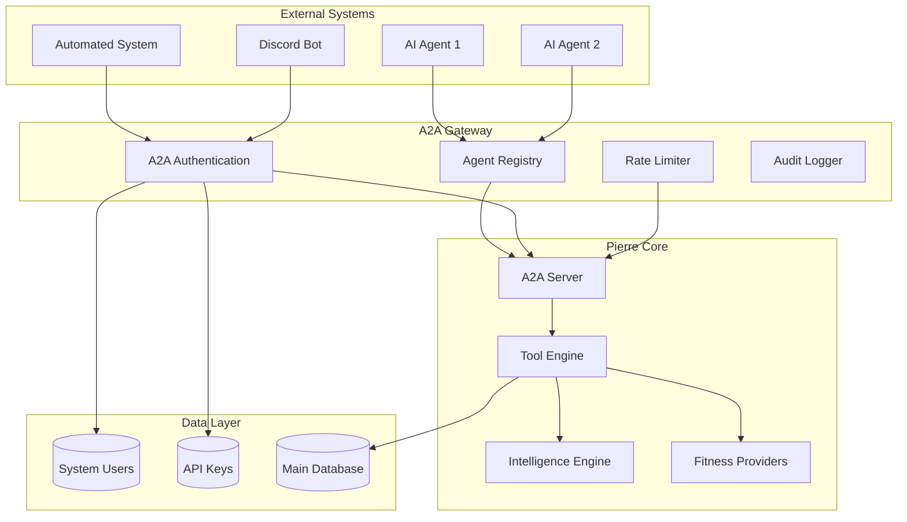

# A2A Protocol Implementation

## Overview

The A2A (Agent-to-Agent) protocol enables system-to-system communication between Pierre MCP Server and other AI agents or automated systems. It provides a structured way for agents to discover capabilities, authenticate, and execute fitness-related tasks programmatically.

## A2A Architecture



## Protocol Specification

### Protocol Version
A2A Protocol Version: `1.0.0`

### Transport
- **Primary**: HTTP/HTTPS with JSON-RPC 2.0
- **Alternative**: WebSocket for real-time communication
- **Authentication**: API Key based authentication

### Message Format

All A2A messages follow JSON-RPC 2.0 specification:

```json
{
    "jsonrpc": "2.0",
    "method": "method_name",
    "params": { ... },
    "id": "unique_request_id"
}
```

## Agent Registration

### System User Creation

Before using A2A protocol, systems must register as A2A clients:

```bash
# Register new A2A client
curl -X POST http://localhost:8081/api/a2a/register \
  -H "Content-Type: application/json" \
  -H "Authorization: Bearer <admin_token>" \
  -d '{
    "name": "My Fitness Bot",
    "description": "Discord bot for fitness tracking",
    "capabilities": ["fitness-analysis", "goal-tracking"],
    "webhook_url": "https://mybot.example.com/webhook",
    "rate_limit": {
      "requests_per_minute": 100,
      "burst_size": 20
    }
  }'
```

**Response:**
```json
{
  "system_id": "550e8400-e29b-41d4-a716-446655440000",
  "name": "My Fitness Bot",
  "api_key": "A2A_abc123def456ghi789jkl012mno345pqr678stu901vwx234yz",
  "status": "active",
  "created_at": "2024-01-15T10:30:00Z",
  "rate_limit": {
    "requests_per_minute": 100,
    "burst_size": 20
  }
}
```

### Agent Card Discovery

External systems can discover Pierre's capabilities through the Agent Card:

```bash
curl -X GET http://localhost:8081/api/a2a/agent-card \
  -H "X-API-Key: A2A_abc123def456ghi789jkl012mno345pqr678stu901vwx234yz"
```

**Response:**
```json
{
  "name": "Pierre Fitness AI",
  "description": "AI-powered fitness data analysis and insights platform",
  "version": "1.0.0",
  "capabilities": [
    "fitness-data-analysis",
    "activity-intelligence",
    "goal-management",
    "performance-prediction",
    "training-analytics",
    "provider-integration"
  ],
  "authentication": {
    "schemes": ["api-key", "oauth2"],
    "api_key": {
      "header_name": "X-API-Key",
      "prefix": "A2A_",
      "registration_url": "https://pierre.ai/a2a/register"
    }
  },
  "tools": [
    {
      "name": "analyze_activity",
      "description": "Perform detailed analysis of a fitness activity",
      "input_schema": {
        "type": "object",
        "properties": {
          "activity_data": {
            "type": "object",
            "description": "Raw activity data (GPX, TCX, or structured JSON)"
          },
          "analysis_type": {
            "type": "string",
            "enum": ["basic", "advanced", "comprehensive"]
          }
        },
        "required": ["activity_data"]
      },
      "output_schema": {
        "type": "object",
        "properties": {
          "analysis": {
            "type": "object",
            "description": "Comprehensive activity analysis"
          },
          "recommendations": {
            "type": "array",
            "description": "Training recommendations based on analysis"
          }
        }
      }
    }
  ]
}
```

## Core Protocol Messages

### Authentication

All A2A requests must include authentication:

```http
X-API-Key: A2A_abc123def456ghi789jkl012mno345pqr678stu901vwx234yz
Content-Type: application/json
```

### Tool Execution

Execute tools through the A2A interface:

```json
{
    "jsonrpc": "2.0",
    "method": "tools.execute",
    "params": {
        "tool": "analyze_activity",
        "arguments": {
            "activity_data": {
                "type": "run",
                "distance": 5000,
                "duration": 1800,
                "gps_points": [...],
                "heart_rate": [...]
            },
            "analysis_type": "comprehensive"
        }
    },
    "id": "req_001"
}
```

**Response:**
```json
{
    "jsonrpc": "2.0",
    "result": {
        "analysis": {
            "average_pace": "3:36/km",
            "training_load": 156,
            "efficiency_score": 87,
            "zones": {
                "z1": 15,
                "z2": 45,
                "z3": 30,
                "z4": 10
            },
            "insights": [
                "Strong consistent pacing throughout the run",
                "Heart rate indicates good aerobic efficiency",
                "Slight negative split suggests good energy management"
            ]
        },
        "recommendations": [
            {
                "type": "training",
                "priority": "high",
                "description": "Consider adding tempo intervals to improve lactate threshold"
            },
            {
                "type": "recovery",
                "priority": "medium",
                "description": "Plan easy recovery run for next session"
            }
        ],
        "metadata": {
            "processed_at": "2024-01-15T10:35:00Z",
            "processing_time_ms": 234,
            "confidence_score": 0.94
        }
    },
    "id": "req_001"
}
```

### Batch Operations

A2A supports batch operations for efficiency:

```json
{
    "jsonrpc": "2.0",
    "method": "tools.batch",
    "params": {
        "operations": [
            {
                "tool": "get_athlete_stats",
                "arguments": {
                    "timeframe": "last_30_days"
                }
            },
            {
                "tool": "analyze_training_load",
                "arguments": {
                    "period": "last_week"
                }
            }
        ]
    },
    "id": "batch_001"
}
```

## Available A2A Tools

### Data Analysis Tools

#### `analyze_activity`
Comprehensive activity analysis with AI insights.

**Input:**
```json
{
    "activity_data": {
        "type": "string",
        "description": "Activity type (run, bike, swim, etc.)"
    },
    "raw_data": {
        "type": "object",
        "description": "GPS, heart rate, power, or other sensor data"
    },
    "analysis_depth": {
        "type": "string",
        "enum": ["quick", "standard", "deep"],
        "default": "standard"
    }
}
```

#### `compare_activities`
Compare multiple activities for trends and improvements.

**Input:**
```json
{
    "activity_ids": {
        "type": "array",
        "items": {"type": "string"},
        "description": "Array of activity identifiers to compare"
    },
    "comparison_metrics": {
        "type": "array",
        "items": {"type": "string"},
        "description": "Metrics to compare (pace, power, heart_rate, etc.)"
    }
}
```

### Intelligence Tools

#### `generate_training_plan`
Create personalized training plans based on goals and fitness level.

**Input:**
```json
{
    "athlete_profile": {
        "type": "object",
        "description": "Athlete fitness profile and history"
    },
    "goal": {
        "type": "object",
        "description": "Target goal (race, distance, time, etc.)"
    },
    "constraints": {
        "type": "object",
        "description": "Time availability, equipment, preferences"
    }
}
```

#### `predict_performance`
Predict race times and performance based on current fitness.

**Input:**
```json
{
    "current_fitness": {
        "type": "object",
        "description": "Current fitness metrics and recent performances"
    },
    "target_event": {
        "type": "object",
        "description": "Target race distance and date"
    }
}
```

### Goal Management Tools

#### `create_goal`
Create and track fitness goals.

**Input:**
```json
{
    "goal_type": {
        "type": "string",
        "enum": ["distance", "time", "race", "fitness"]
    },
    "target": {
        "type": "object",
        "description": "Goal target and deadline"
    },
    "tracking_metrics": {
        "type": "array",
        "description": "Metrics to track progress"
    }
}
```

#### `update_progress`
Update goal progress with new activity data.

**Input:**
```json
{
    "goal_id": {
        "type": "string",
        "description": "Goal identifier"
    },
    "progress_data": {
        "type": "object",
        "description": "New progress information"
    }
}
```

## Implementation Details

### A2A Server Structure

```rust
// src/a2a/protocol.rs
pub struct A2AServer {
    database: Arc<Database>,
    tool_engine: Arc<ToolEngine>,
    rate_limiter: Arc<RateLimiter>,
    audit_logger: Arc<AuditLogger>,
}

impl A2AServer {
    pub async fn handle_request(&self, request: A2ARequest, api_key: &str) -> A2AResponse {
        // Authenticate system user
        let system_user = self.authenticate_system_user(api_key).await?;
        
        // Check rate limits
        self.rate_limiter.check_limit(&system_user.id).await?;
        
        // Process request
        match request.method.as_str() {
            "tools.list" => self.handle_tools_list().await,
            "tools.execute" => self.handle_tool_execute(request.params).await,
            "tools.batch" => self.handle_batch_execute(request.params).await,
            "agent.info" => self.handle_agent_info().await,
            _ => A2AResponse::error(request.id, -32601, "Method not found"),
        }
    }
}
```

### Authentication Flow

```rust
// src/a2a/auth.rs
impl A2AAuthenticator {
    pub async fn authenticate_api_key(&self, api_key: &str) -> Result<SystemUser> {
        // Validate API key format
        if !api_key.starts_with("A2A_") {
            return Err(A2AError::AuthenticationFailed("Invalid API key format".into()));
        }
        
        // Hash and lookup
        let key_hash = self.hash_api_key(api_key);
        let system_user = self.database
            .get_system_user_by_api_key(&key_hash)
            .await?;
        
        // Check if active
        if !system_user.is_active {
            return Err(A2AError::ClientDeactivated(system_user.name));
        }
        
        Ok(system_user)
    }
}
```

### Rate Limiting

A2A requests have dedicated rate limits:

```rust
// src/rate_limiting.rs
pub struct A2ARateLimiter {
    limits: HashMap<Uuid, RateLimit>,
    current_usage: HashMap<Uuid, TokenBucket>,
}

impl A2ARateLimiter {
    pub async fn check_limit(&self, system_id: &Uuid) -> Result<()> {
        let limit = self.limits.get(system_id)
            .ok_or(A2AError::ClientNotRegistered("System not found".into()))?;
        
        let bucket = self.current_usage.entry(*system_id)
            .or_insert_with(|| TokenBucket::new(limit.clone()));
        
        if bucket.try_consume(1) {
            Ok(())
        } else {
            Err(A2AError::RateLimitExceeded("Request quota exceeded".into()))
        }
    }
}
```

## Error Handling

### Error Codes

```rust
impl From<A2AError> for A2AErrorResponse {
    fn from(error: A2AError) -> Self {
        let (code, message) = match error {
            A2AError::InvalidRequest(msg) => (-32600, msg),
            A2AError::AuthenticationFailed(msg) => (-32001, msg),
            A2AError::ClientNotRegistered(msg) => (-32002, msg),
            A2AError::RateLimitExceeded(msg) => (-32003, msg),
            A2AError::InsufficientPermissions(msg) => (-32004, msg),
            A2AError::ResourceNotFound(msg) => (-32005, msg),
            A2AError::ServiceUnavailable(msg) => (-32006, msg),
            A2AError::InternalError(msg) => (-32603, msg),
        };
        
        A2AErrorResponse {
            code,
            message,
            data: None,
        }
    }
}
```

### Error Response Example

```json
{
    "jsonrpc": "2.0",
    "error": {
        "code": -32003,
        "message": "Rate limit exceeded: 100 requests per minute",
        "data": {
            "retry_after": 42,
            "current_usage": 100,
            "limit": 100,
            "reset_time": "2024-01-15T10:36:00Z"
        }
    },
    "id": "req_001"
}
```

## Security Features

### API Key Management

```rust
// src/a2a/system_user.rs
pub struct SystemUser {
    pub id: Uuid,
    pub name: String,
    pub api_key_hash: String,
    pub capabilities: Vec<String>,
    pub rate_limit: RateLimit,
    pub is_active: bool,
    pub created_at: chrono::DateTime<chrono::Utc>,
    pub last_used_at: Option<chrono::DateTime<chrono::Utc>>,
}

impl SystemUser {
    pub fn generate_api_key() -> String {
        use rand::Rng;
        let mut rng = rand::thread_rng();
        let random_bytes: [u8; 32] = rng.gen();
        format!("A2A_{}", base64::encode(random_bytes))
    }
}
```

### Request Validation

```rust
impl A2AServer {
    fn validate_request(&self, request: &A2ARequest) -> Result<()> {
        // Check JSON-RPC version
        if request.jsonrpc != "2.0" {
            return Err(A2AError::InvalidRequest("Invalid JSON-RPC version".into()));
        }
        
        // Validate method
        if !self.is_valid_method(&request.method) {
            return Err(A2AError::InvalidRequest("Unknown method".into()));
        }
        
        // Validate parameters
        if let Some(params) = &request.params {
            self.validate_params(&request.method, params)?;
        }
        
        Ok(())
    }
}
```

### Audit Logging

```rust
// src/a2a/audit.rs
pub struct A2AAuditLogger {
    database: Arc<Database>,
}

impl A2AAuditLogger {
    pub async fn log_request(&self, event: A2AAuditEvent) -> Result<()> {
        let audit_record = AuditRecord {
            id: Uuid::new_v4(),
            system_id: event.system_id,
            method: event.method,
            params_hash: self.hash_params(&event.params),
            response_code: event.response_code,
            processing_time_ms: event.processing_time_ms,
            timestamp: chrono::Utc::now(),
            client_ip: event.client_ip,
        };
        
        self.database.store_audit_record(&audit_record).await?;
        Ok(())
    }
}
```

## WebSocket Support

### Real-time Communication

A2A supports WebSocket connections for real-time updates:

```javascript
// Example WebSocket client
const ws = new WebSocket('wss://pierre.ai/a2a/ws');

// Authenticate
ws.send(JSON.stringify({
    type: 'auth',
    api_key: 'A2A_abc123...'
}));

// Subscribe to events
ws.send(JSON.stringify({
    type: 'subscribe',
    events: ['goal_progress', 'activity_completed']
}));

// Handle messages
ws.onmessage = (event) => {
    const message = JSON.parse(event.data);
    if (message.type === 'goal_progress') {
        // Handle goal progress update
        console.log('Goal progress:', message.data);
    }
};
```

### Push Notifications

```rust
// src/a2a/websocket.rs
impl A2AWebSocketManager {
    pub async fn notify_subscribers(&self, event: A2AEvent) -> Result<()> {
        let subscribers = self.get_subscribers_for_event(&event.event_type).await?;
        
        let message = json!({
            "type": "notification",
            "event": event.event_type,
            "data": event.data,
            "timestamp": chrono::Utc::now()
        });
        
        for subscriber in subscribers {
            if let Some(connection) = self.connections.get(&subscriber.system_id) {
                let _ = connection.send(message.clone()).await;
            }
        }
        
        Ok(())
    }
}
```

## Client SDK

### JavaScript SDK Example

```javascript
// pierre-a2a-client.js
class PierreA2AClient {
    constructor(apiKey, baseUrl = 'https://pierre.ai') {
        this.apiKey = apiKey;
        this.baseUrl = baseUrl;
        this.requestId = 0;
    }
    
    async executetool(toolName, params) {
        const request = {
            jsonrpc: '2.0',
            method: 'tools.execute',
            params: {
                tool: toolName,
                arguments: params
            },
            id: ++this.requestId
        };
        
        const response = await fetch(`${this.baseUrl}/api/a2a/rpc`, {
            method: 'POST',
            headers: {
                'Content-Type': 'application/json',
                'X-API-Key': this.apiKey
            },
            body: JSON.stringify(request)
        });
        
        const result = await response.json();
        
        if (result.error) {
            throw new Error(`A2A Error: ${result.error.message}`);
        }
        
        return result.result;
    }
    
    async analyzeActivity(activityData, analysisType = 'standard') {
        return this.executeTools('analyze_activity', {
            activity_data: activityData,
            analysis_type: analysisType
        });
    }
}

// Usage
const client = new PierreA2AClient('A2A_your_api_key_here');

const analysis = await client.analyzeActivity({
    type: 'run',
    distance: 5000,
    duration: 1800,
    // ... more data
});
```

### Python SDK Example

```python
# pierre_a2a_client.py
import requests
import json
from typing import Dict, Any, Optional

class PierreA2AClient:
    def __init__(self, api_key: str, base_url: str = 'https://pierre.ai'):
        self.api_key = api_key
        self.base_url = base_url
        self.request_id = 0
        self.session = requests.Session()
        self.session.headers.update({
            'X-API-Key': api_key,
            'Content-Type': 'application/json'
        })
    
    def execute_tool(self, tool_name: str, params: Dict[str, Any]) -> Dict[str, Any]:
        self.request_id += 1
        request_data = {
            'jsonrpc': '2.0',
            'method': 'tools.execute',
            'params': {
                'tool': tool_name,
                'arguments': params
            },
            'id': self.request_id
        }
        
        response = self.session.post(
            f'{self.base_url}/api/a2a/rpc',
            json=request_data
        )
        response.raise_for_status()
        
        result = response.json()
        if 'error' in result:
            raise Exception(f"A2A Error: {result['error']['message']}")
        
        return result['result']
    
    def analyze_activity(self, activity_data: Dict[str, Any], 
                        analysis_type: str = 'standard') -> Dict[str, Any]:
        return self.execute_tool('analyze_activity', {
            'activity_data': activity_data,
            'analysis_type': analysis_type
        })

# Usage
client = PierreA2AClient('A2A_your_api_key_here')

analysis = client.analyze_activity({
    'type': 'run',
    'distance': 5000,
    'duration': 1800,
    # ... more data
})
```

## Testing A2A Integration

### Unit Tests

```rust
#[tokio::test]
async fn test_a2a_authentication() {
    let server = create_test_a2a_server().await;
    
    // Test valid API key
    let system_user = server.authenticate_api_key("A2A_valid_key").await?;
    assert_eq!(system_user.name, "Test System");
    
    // Test invalid API key
    let result = server.authenticate_api_key("invalid_key").await;
    assert!(result.is_err());
}

#[tokio::test]
async fn test_tool_execution() {
    let server = create_test_a2a_server().await;
    let request = A2ARequest {
        jsonrpc: "2.0".to_string(),
        method: "tools.execute".to_string(),
        params: Some(json!({
            "tool": "analyze_activity",
            "arguments": {
                "activity_data": test_activity_data(),
                "analysis_type": "standard"
            }
        })),
        id: Some(json!(1)),
    };
    
    let response = server.handle_request(request, "A2A_test_key").await;
    assert!(response.error.is_none());
    assert!(response.result.is_some());
}
```

### Integration Tests

```rust
#[tokio::test]
async fn test_end_to_end_a2a_workflow() {
    let server = create_test_server().await;
    
    // Register A2A client
    let registration = server.register_a2a_client(A2ARegistration {
        name: "Test Bot".to_string(),
        capabilities: vec!["fitness-analysis".to_string()],
        webhook_url: Some("https://test.com/webhook".to_string()),
    }).await?;
    
    // Get agent card
    let agent_card = server.get_agent_card(&registration.api_key).await?;
    assert!(!agent_card.tools.is_empty());
    
    // Execute tool
    let result = server.execute_tool(
        "analyze_activity",
        test_activity_data(),
        &registration.api_key
    ).await?;
    
    assert!(result.contains_key("analysis"));
}
```

## Performance Optimization

### Connection Pooling

```rust
pub struct A2AConnectionPool {
    pool: Arc<Mutex<Vec<A2AConnection>>>,
    max_connections: usize,
}

impl A2AConnectionPool {
    pub async fn get_connection(&self) -> PooledA2AConnection {
        let mut pool = self.pool.lock().await;
        if let Some(conn) = pool.pop() {
            PooledA2AConnection::new(conn, self.clone())
        } else {
            self.create_connection().await
        }
    }
}
```

### Request Batching

```rust
impl A2AServer {
    pub async fn handle_batch_request(&self, requests: Vec<A2ARequest>) -> Vec<A2AResponse> {
        // Process requests concurrently
        let futures = requests.into_iter()
            .map(|req| self.handle_single_request(req));
        
        futures::future::join_all(futures).await
    }
}
```

## Monitoring & Analytics

### A2A Metrics

```rust
pub struct A2AMetrics {
    pub requests_total: Counter,
    pub requests_duration: Histogram,
    pub active_systems: Gauge,
    pub tool_executions: Counter,
    pub authentication_failures: Counter,
    pub rate_limit_hits: Counter,
}
```

### Usage Analytics

```rust
pub struct A2AUsageAnalytics {
    pub system_id: Uuid,
    pub tool_usage: HashMap<String, u64>,
    pub total_requests: u64,
    pub average_response_time: f64,
    pub error_rate: f64,
    pub last_active: chrono::DateTime<chrono::Utc>,
}
```