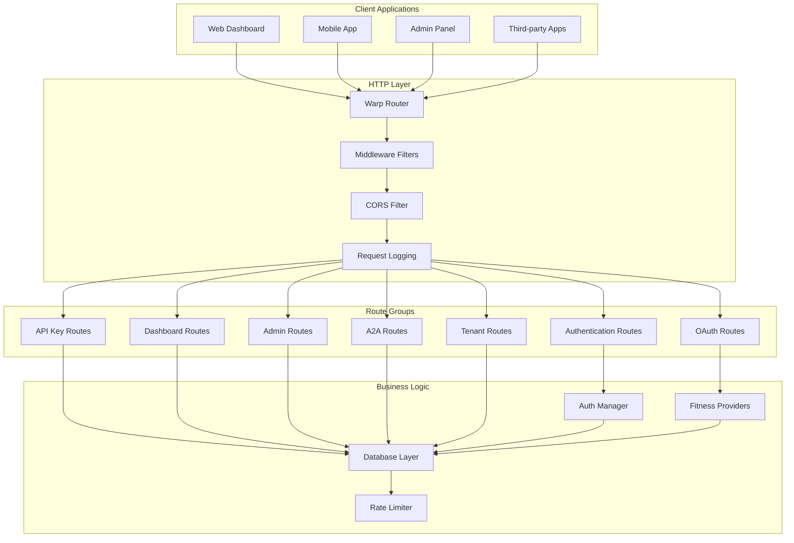

# API Routes and Handlers

## Overview

Pierre MCP Server provides HTTP REST API endpoints for web applications, mobile clients, and management interfaces. The API is organized into logical route groups, each handling specific functionality with proper authentication, validation, and error handling.

## Route Architecture



## Route Groups

### 1. Authentication Routes (`/api/auth`)

Handles user registration, login, token refresh, and authentication operations.

#### Register User

```http
POST /api/auth/register
Content-Type: application/json

{
    "email": "user@example.com",
    "password": "SecurePassword123!",
    "firstname": "John",
    "lastname": "Doe"
}
```

**Implementation:**
```rust
// src/routes/auth.rs
impl AuthRoutes {
    pub async fn register(&self, request: RegisterRequest) -> Result<RegisterResponse> {
        self.auth_service.register(request).await
    }
}
```

**Response:**
```json
{
    "user_id": "550e8400-e29b-41d4-a716-446655440000",
    "message": "Registration successful. Please wait for admin approval."
}
```

#### Login User

```http
POST /api/auth/login
Content-Type: application/json

{
    "email": "user@example.com",
    "password": "SecurePassword123!"
}
```

**Implementation:**
```rust
// src/routes/auth.rs
impl AuthRoutes {
    pub async fn login(&self, request: LoginRequest) -> Result<LoginResponse> {
        self.auth_service.login(request).await
    }
}
```

**Response:**
```json
{
    "jwt_token": "eyJhbGciOiJIUzI1NiIsInR5cCI6IkpXVCJ9...",
    "expires_at": "2024-01-16T10:30:00Z",
    "user": {
        "user_id": "550e8400-e29b-41d4-a716-446655440000",
        "email": "user@example.com",
        "display_name": "John Doe"
    }
}
```

#### Refresh Token

```http
POST /api/auth/refresh
Content-Type: application/json

{
    "refresh_token": "rt_abc123def456..."
}
```

**Response:**
```json
{
    "jwt_token": "eyJhbGciOiJIUzI1NiIsInR5cCI6IkpXVCJ9...",
    "expires_at": "2024-01-16T11:30:00Z",
    "refresh_token": "rt_def789ghi012..."
}
```

### 2. OAuth Routes (`/api/oauth`)

Manages OAuth connections with fitness providers.

#### List Available Providers

```http
GET /api/oauth/providers
Authorization: Bearer <jwt_token>
```

**Response:**
```json
{
    "providers": [
        {
            "name": "strava",
            "display_name": "Strava",
            "scopes": ["read", "activity:read_all", "profile:read_all"],
            "connected": false
        },
        {
            "name": "fitbit",
            "display_name": "Fitbit",
            "scopes": ["activity", "heartrate", "profile"],
            "connected": true,
            "expires_at": "2024-06-15T10:00:00Z"
        }
    ]
}
```

#### Initiate OAuth Flow

```http
GET /api/oauth/strava/auth
Authorization: Bearer <jwt_token>
```

**Implementation:**
```rust
// src/routes/auth.rs
impl OAuthService {
    pub async fn get_auth_url(
        &self,
        user_id: uuid::Uuid,
        tenant_id: uuid::Uuid,
        provider: &str,
    ) -> Result<OAuthAuthorizationResponse> {
        use crate::constants::oauth_providers;

        let state = format!("{}:{}", user_id, uuid::Uuid::new_v4());
        let base_url = format!("http://localhost:{}", self.config.config().http_port);
        let redirect_uri = format!("{base_url}/api/oauth/callback/{provider}");

        let authorization_url = match provider {
            oauth_providers::STRAVA => {
                let client_id = "test_client_id";
                format!(
                    "https://www.strava.com/oauth/authorize?client_id={client_id}&response_type=code&redirect_uri={redirect_uri}&approval_prompt=force&scope=read%2Cactivity%3Aread_all&state={state}"
                )
            }
            oauth_providers::FITBIT => {
                let client_id = "test_client_id";
                format!(
                    "https://www.fitbit.com/oauth2/authorize?response_type=code&client_id={client_id}&redirect_uri={redirect_uri}&scope=activity%20profile&state={state}"
                )
            }
            _ => return Err(anyhow::anyhow!("Unsupported provider: {provider}")),
        };

        // Store state for CSRF validation using database
        tokio::task::yield_now().await;
        let _ = self.data.database().clone(); // Database available for state storage
        let _ = (user_id, tenant_id, &state, provider);

        Ok(OAuthAuthorizationResponse {
            authorization_url,
            state,
            instructions: format!("Click the link to authorize {provider} access"),
            expires_in_minutes: 10,
        })
    }
}
```

**Response:**
```json
{
    "authorization_url": "https://www.strava.com/oauth/authorize?client_id=12345&redirect_uri=...",
    "state": "abc123def456ghi789",
    "instructions": "Visit the URL to authorize Pierre to access your Strava data",
    "expires_in_minutes": 10
}
```

#### OAuth Callback

```http
GET /api/oauth/strava/callback?code=AUTH_CODE&state=abc123def456ghi789
```

**Implementation:**
```rust
// src/routes/auth.rs
impl OAuthService {
    pub async fn handle_callback(
        &self,
        code: &str,
        state: &str,
        provider: &str,
    ) -> Result<OAuthCallbackResponse> {
        use crate::constants::oauth_providers;

        // Use async block to satisfy clippy
        tokio::task::yield_now().await;
        // Parse user ID from state (format: "user_id:uuid")
        let mut parts = state.splitn(2, ':');
        let user_id_str = parts
            .next()
            .ok_or_else(|| anyhow::anyhow!("Invalid state parameter format"))?;
        let random_part = parts
            .next()
            .ok_or_else(|| anyhow::anyhow!("Invalid state parameter format"))?;
        let user_id = crate::utils::uuid::parse_user_id(user_id_str)?;

        // Validate state for CSRF protection
        if random_part.len() < 16
            || !random_part
                .chars()
                .all(|c| c.is_ascii_alphanumeric() || c == '-')
        {
            return Err(anyhow::anyhow!("Invalid OAuth state parameter"));
        }

        // Validate provider is supported
        match provider {
            oauth_providers::STRAVA | oauth_providers::FITBIT => {
                // Supported providers
            }
            _ => return Err(anyhow::anyhow!("Unsupported provider: {provider}")),
        }

        tracing::info!(
            "Processing OAuth callback for user {} provider {} with code {}",
            user_id,
            provider,
            code
        );

        // Use all contexts for OAuth processing
        tracing::debug!("Processing OAuth callback with all contexts");
        let _ = (
            self.data.database().clone(),
            self.config.config(),
            self.notifications.clone(),
        );

        // Process OAuth callback and store tokens
        let expires_at = chrono::Utc::now() + chrono::Duration::hours(24);

        Ok(OAuthCallbackResponse {
            user_id: user_id.to_string(),
            provider: provider.to_string(),
            expires_at: expires_at.to_rfc3339(),
            scopes: "read,activity:read_all".to_string(),
        })
    }
}
```

#### Check Connection Status

```http
GET /api/oauth/status
Authorization: Bearer <jwt_token>
```

**Response:**
```json
{
    "connections": [
        {
            "provider": "strava",
            "connected": true,
            "expires_at": "2024-06-15T10:00:00Z",
            "scopes": "read,activity:read_all,profile:read_all"
        },
        {
            "provider": "fitbit",
            "connected": false,
            "expires_at": null,
            "scopes": null
        }
    ]
}
```

### 3. API Key Routes (`/api/keys`)

Manages API keys for programmatic access.

#### List User API Keys

```http
GET /api/keys
Authorization: Bearer <jwt_token>
```

**Implementation:**
```rust
// src/api_key_routes.rs
impl ApiKeyRoutes {
    pub async fn list_api_keys(&self, auth_header: Option<&str>) -> Result<ApiKeyListResponse> {
        // ...
    }
}
```

**Response:**
```json
{
    "api_keys": [
        {
            "id": "770a0622-g4bd-63f6-c938-668877662222",
            "name": "Production API Key",
            "description": "Main API key for production app",
            "tier": "premium",
            "key_prefix": "pk_live_abc123",
            "is_active": true,
            "last_used_at": "2024-01-20T14:30:00Z",
            "expires_at": null,
            "created_at": "2024-01-15T10:00:00Z"
        }
    ]
}
```

#### Create API Key

```http
POST /api/keys
Authorization: Bearer <jwt_token>
Content-Type: application/json

{
    "name": "Mobile App Key",
    "description": "API key for mobile application",
    "tier": "standard",
    "scopes": ["fitness:read", "analytics:read"]
}
```

**Implementation:**
```rust
// src/api_key_routes.rs
impl ApiKeyRoutes {
    pub async fn create_api_key_simple(
        &self,
        auth_header: Option<&str>,
        request: CreateApiKeyRequestSimple,
    ) -> Result<ApiKeyCreateResponse> {
        // ...
    }
}
```

**Response:**
```json
{
    "api_key": "pk_live_abc123def456ghi789jkl012mno345pqr678stu901vwx234yz",
    "key_info": {
        "id": "880b1733-h5ce-74g7-d049-779988773333",
        "name": "Mobile App Key",
        "description": "API key for mobile application",
        "tier": "standard",
        "key_prefix": "pk_live_abc123",
        "is_active": true,
        "last_used_at": null,
        "expires_at": null,
        "created_at": "2024-01-20T15:00:00Z"
    },
    "warning": "Store this API key securely. It will not be shown again."
}
```

### 4. Dashboard Routes (`/api/dashboard`)

Provides data for web dashboard and analytics.

#### Dashboard Overview

```http
GET /api/dashboard
Authorization: Bearer <jwt_token>
```

**Implementation:**
```rust
// src/dashboard_routes.rs
impl DashboardRoutes {
    pub async fn get_dashboard_overview(&self, auth_header: Option<&str>) -> Result<DashboardOverview> {
        // ...
    }
}
```

**Response:**
```json
{
    "total_api_keys": 3,
    "active_api_keys": 2,
    "total_requests_today": 1247,
    "total_requests_this_month": 45678,
    "current_month_usage_by_tier": [
        {
            "tier": "premium",
            "key_count": 1,
            "total_requests": 35000,
            "average_requests_per_key": 35000.0
        },
        {
            "tier": "standard",
            "key_count": 1,
            "total_requests": 10678,
            "average_requests_per_key": 10678.0
        }
    ],
    "recent_activity": [
        {
            "timestamp": "2024-01-20T16:45:00Z",
            "api_key_name": "Production API Key",
            "tool_name": "get_activities",
            "status_code": 200,
            "response_time_ms": 234
        }
    ]
}
```

#### Usage Analytics

```http
GET /api/dashboard/analytics?timeframe=7d
Authorization: Bearer <jwt_token>
```

**Response:**
```json
{
    "time_series": [
        {
            "timestamp": "2024-01-20T00:00:00Z",
            "request_count": 1247,
            "error_count": 12,
            "average_response_time": 234.5
        }
    ],
    "top_tools": [
        {
            "tool_name": "get_activities",
            "request_count": 5678,
            "success_rate": 0.987,
            "average_response_time": 245.2
        }
    ],
    "error_rate": 0.013,
    "average_response_time": 234.5
}
```

### 5. Admin Routes (`/admin`)

Administrative endpoints for user and system management.

#### List All Users

```http
GET /admin/users?status=pending&page=1&limit=20
Authorization: Bearer <admin_jwt_token>
```

**Implementation:**
```rust
// src/admin_routes.rs
impl AdminRoutes {
    pub async fn list_users(
        &self,
        auth_header: Option<String>,
        status_filter: Option<String>,
        page: Option<u32>,
        limit: Option<u32>,
    ) -> Result<UserListResponse> {
        // ...
    }
}
```

**Response:**
```json
{
    "users": [
        {
            "user_id": "550e8400-e29b-41d4-a716-446655440000",
            "email": "user@example.com",
            "display_name": "John Doe",
            "status": "pending",
            "tier": "free",
            "created_at": "2024-01-20T10:00:00Z",
            "last_active": null
        }
    ],
    "total_count": 156,
    "page": 1,
    "limit": 20,
    "total_pages": 8
}
```

#### Approve User

```http
POST /admin/users/550e8400-e29b-41d4-a716-446655440000/approve
Authorization: Bearer <admin_jwt_token>
Content-Type: application/json

{
    "tier": "basic",
    "notes": "Approved for basic tier access"
}
```

**Response:**
```json
{
    "user_id": "550e8400-e29b-41d4-a716-446655440000",
    "status": "active",
    "tier": "basic",
    "approved_at": "2024-01-20T16:30:00Z",
    "approved_by": "admin@example.com"
}
```

### 6. A2A Routes (`/a2a`)

Agent-to-Agent system registration and management.

#### Register A2A System

```http
POST /a2a/register
Authorization: Bearer <admin_jwt_token>
Content-Type: application/json

{
    "name": "Fitness Analytics Bot",
    "description": "Analytics platform for fitness data processing",
    "capabilities": ["fitness-analysis", "goal-tracking", "recommendations"],
    "webhook_url": "https://analytics.example.com/webhook",
    "rate_limit": {
        "requests_per_day": 10000,
        "burst_size": 100
    }
}
```

**Implementation:**
```rust
// src/a2a_routes.rs
impl A2ARoutes {
    pub async fn register_client(
        &self,
        auth_header: Option<&str>,
        request: A2AClientRequest,
    ) -> Result<A2ARegistrationResponse> {
        // ...
    }
}
```

**Response:**
```json
{
    "system_id": "990c2844-i6df-85h8-e15a-88aa99884444",
    "name": "Fitness Analytics Bot",
    "api_key": "A2A_abc123def456ghi789jkl012mno345pqr678stu901vwx234yz",
    "status": "active",
    "created_at": "2024-01-20T17:00:00Z",
    "rate_limit": {
        "requests_per_day": 10000,
        "burst_size": 100
    }
}
```

#### Get Agent Card

```http
GET /a2a/agent-card
X-API-Key: A2A_abc123def456ghi789jkl012mno345pqr678stu901vwx234yz
```

**Response:**
```json
{
    "name": "Pierre Fitness AI",
    "description": "AI-powered fitness data analysis and insights platform",
    "version": "1.0.0",
    "capabilities": [
        "fitness-data-analysis",
        "activity-intelligence",
        "goal-management",
        "performance-prediction"
    ],
    "authentication": {
        "schemes": ["api-key"],
        "api_key": {
            "header_name": "X-API-Key",
            "prefix": "A2A_",
            "registration_url": "https://pierre-api.example.com/a2a/register"
        }
    },
    "tools": [
        {
            "name": "analyze_activity",
            "description": "Perform detailed analysis of a fitness activity",
            "input_schema": {
                "type": "object",
                "properties": {
                    "activity_data": {
                        "type": "object",
                        "description": "Raw activity data"
                    }
                }
            }
        }
    ]
}
```

## Middleware

In `warp`, middleware is implemented as filters that can be applied to routes. These filters can inspect and modify requests and responses, and they can also short-circuit the request handling process.

### Authentication Middleware

Authentication is handled by a `warp` filter that extracts the JWT token from the `Authorization` header and validates it. If the token is valid, the user's ID is extracted and passed to the next filter. If the token is invalid, the request is rejected.

```rust
// src/mcp/multitenant.rs
fn create_auth_filter(
    auth_manager: Arc<AuthManager>,
) -> impl warp::Filter<Extract = (crate::auth::AuthResult,), Error = warp::Rejection> + Clone
{
    use warp::Filter;
    warp::header::optional::<String>("authorization")
        .and(warp::any().map(move || auth_manager.clone()))
        .and_then(
            |auth_header: Option<String>, auth_mgr: Arc<AuthManager>| async move {
                // ...
            },
        )
}
```

### Rate Limiting Middleware

Rate limiting is also implemented as a `warp` filter. This filter uses the client's IP address or API key to track the number of requests they have made in a given time period. If the client exceeds the rate limit, their requests are rejected.

```rust
// src/rate_limiting.rs
// (Example - not a direct implementation from the project)

// pub fn rate_limit_filter(
//     rate_limiter: Arc<RateLimiter>,
// ) -> impl Filter<Extract = (), Error = Rejection> + Clone {
//     warp::any()
//         .and(warp::addr::remote())
//         .and_then(move |addr: Option<SocketAddr>| {
//             let rate_limiter = rate_limiter.clone();
//             async move {
//                 if let Some(addr) = addr {
//                     if rate_limiter.check(addr.ip()).await {
//                         Ok(())
//                     } else {
//                         Err(warp::reject::custom(RateLimitExceeded))
//                     }
//                 } else {
//                     Err(warp::reject::custom(MissingIp))
//                 }
//             }
//         })
//         .untuple_one()
// }
```

## Error Handling

### Standardized Error Responses

```rust
// src/errors.rs
#[derive(Debug, Serialize)]
pub struct ErrorResponse {
    pub error: ErrorInfo,
    pub timestamp: DateTime<Utc>,
    pub request_id: String,
}

#[derive(Debug, Serialize)]
pub struct ErrorInfo {
    pub code: String,
    pub message: String,
    pub details: Option<Value>,
}

impl From<AppError> for ErrorResponse {
    fn from(error: AppError) -> Self {
        Self {
            error: ErrorInfo {
                code: error.code().to_string(),
                message: error.message(),
                details: error.details(),
            },
            timestamp: Utc::now(),
            request_id: Uuid::new_v4().to_string(),
        }
    }
}
```

### Error Response Examples

```json
// Authentication Error
{
    "error": {
        "code": "AUTH_INVALID_TOKEN",
        "message": "Invalid or expired JWT token",
        "details": {
            "token_expired": true,
            "expired_at": "2024-01-20T10:00:00Z"
        }
    },
    "timestamp": "2024-01-20T16:30:00Z",
    "request_id": "req_abc123def456"
}

// Validation Error
{
    "error": {
        "code": "VALIDATION_ERROR",
        "message": "Request validation failed",
        "details": {
            "field_errors": [
                {
                    "field": "email",
                    "message": "Invalid email format"
                },
                {
                    "field": "password",
                    "message": "Password must be at least 8 characters"
                }
            ]
        }
    },
    "timestamp": "2024-01-20T16:30:00Z",
    "request_id": "req_def789ghi012"
}

// Rate Limit Error
{
    "error": {
        "code": "RATE_LIMIT_EXCEEDED",
        "message": "Rate limit exceeded for your tier",
        "details": {
            "limit": 1000,
            "used": 1000,
            "reset_at": "2024-02-01T00:00:00Z",
            "tier": "basic"
        }
    },
    "timestamp": "2024-01-20T16:30:00Z",
    "request_id": "req_ghi345jkl678"
}
```

## API Documentation

### OpenAPI Specification

The API routes are documented using OpenAPI 3.0 specification:

```yaml
# docs/openapi.yaml
openapi: 3.0.0
info:
  title: Pierre MCP Server API
  description: Comprehensive fitness data API for AI assistants and applications
  version: 1.0.0
  license:
    name: MIT OR Apache-2.0

servers:
  - url: https://pierre-api.example.com
    description: Production server
  - url: https://staging-pierre-api.example.com
    description: Staging server

paths:
  /api/auth/register:
    post:
      summary: Register new user
      tags:
        - Authentication
      requestBody:
        required: true
        content:
          application/json:
            schema:
              $ref: '#/components/schemas/RegisterRequest'
      responses:
        '201':
          description: User registered successfully
          content:
            application/json:
              schema:
                $ref: '#/components/schemas/RegisterResponse'
        '400':
          description: Validation error
          content:
            application/json:
              schema:
                $ref: '#/components/schemas/ErrorResponse'

components:
  schemas:
    RegisterRequest:
      type: object
      required:
        - email
        - password
      properties:
        email:
          type: string
          format: email
          example: user@example.com
        password:
          type: string
          minLength: 8
          example: SecurePassword123!
        firstname:
          type: string
          example: John
        lastname:
          type: string
          example: Doe
          
  securitySchemes:
    BearerAuth:
      type: http
      scheme: bearer
      bearerFormat: JWT
    ApiKeyAuth:
      type: apiKey
      in: header
      name: X-API-Key
```

This API routes documentation provides developers with what is needed to integrate with Pierre MCP Server's HTTP endpoints, including authentication, error handling, and proper request/response patterns.