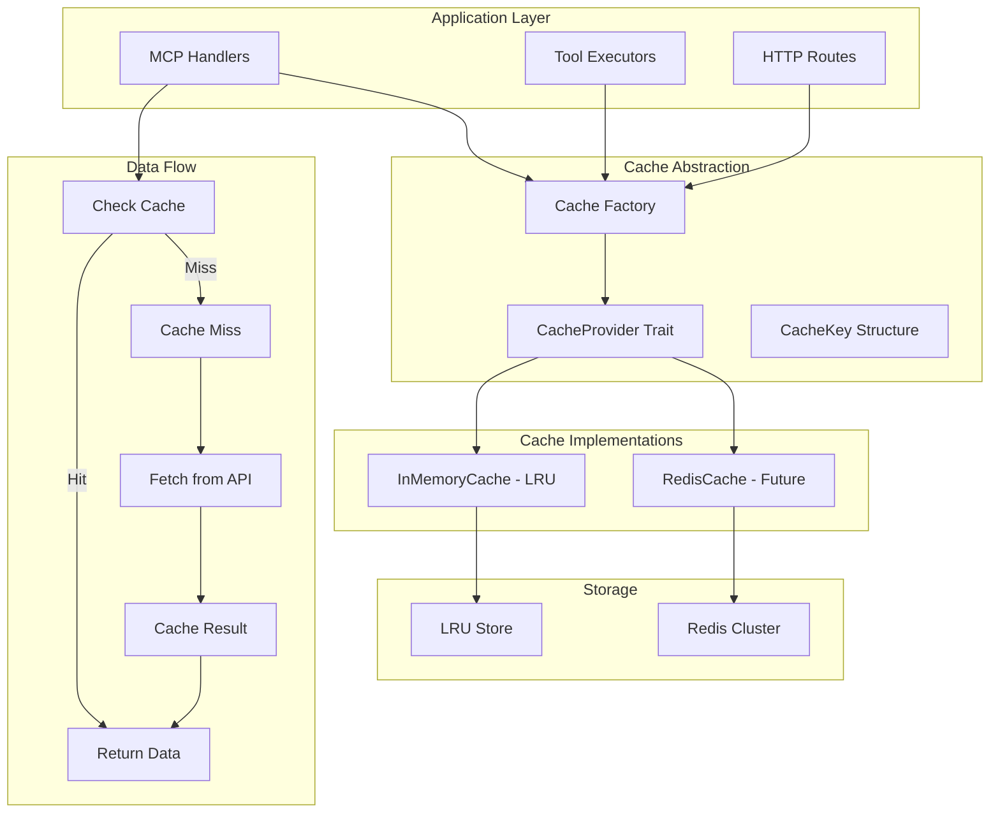

# Cache System

## Overview

Pierre MCP Server implements a pluggable cache layer for API response caching with multi-tenant isolation. The cache system reduces load on external fitness providers (Strava, Fitbit) and improves response times for frequently accessed data. The architecture follows the same plugin pattern as the database layer, supporting in-memory LRU caching with future Redis support planned.

## Cache Architecture



## Cache Provider Interface

### Core Trait Definition

```rust
// src/cache/mod.rs
#[async_trait]
pub trait CacheProvider: Send + Sync + Clone {
    async fn new(config: CacheConfig) -> Result<Self>;

    async fn set<T: Serialize + Send + Sync>(
        &self,
        key: &CacheKey,
        value: &T,
        ttl: Duration,
    ) -> Result<()>;

    async fn get<T: for<'de> Deserialize<'de>>(
        &self,
        key: &CacheKey,
    ) -> Result<Option<T>>;

    async fn invalidate(&self, key: &CacheKey) -> Result<()>;
    async fn invalidate_pattern(&self, pattern: &str) -> Result<u64>;
    async fn exists(&self, key: &CacheKey) -> Result<bool>;
    async fn ttl(&self, key: &CacheKey) -> Result<Option<Duration>>;
    async fn health_check(&self) -> Result<()>;
    async fn clear_all(&self) -> Result<()>;
}
```

### Cache Key Structure

Cache keys provide structured, multi-tenant isolation:

```rust
// src/cache/mod.rs
#[derive(Debug, Clone, PartialEq, Eq, Hash)]
pub struct CacheKey {
    pub tenant_id: Uuid,
    pub user_id: Uuid,
    pub provider: String,
    pub resource: CacheResource,
}

impl fmt::Display for CacheKey {
    fn fmt(&self, f: &mut fmt::Formatter<'_>) -> fmt::Result {
        write!(
            f,
            "tenant:{}:user:{}:provider:{}:{}",
            self.tenant_id, self.user_id, self.provider, self.resource
        )
    }
}
```

**Key format**:
```
tenant:47a10602-50b1-4a0b-9f55-1295363babd9:user:912a606f-1c44-4363-8ca6-4136f3fd68f1:provider:strava:athlete_profile
```

### Cache Resource Types

```rust
// src/cache/mod.rs
#[derive(Debug, Clone, PartialEq, Eq, Hash)]
pub enum CacheResource {
    AthleteProfile,
    ActivityList { page: u32, per_page: u32 },
    Activity { activity_id: u64 },
    Stats { athlete_id: u64 },
    DetailedActivity { activity_id: u64 },
}

impl CacheResource {
    pub const fn recommended_ttl(&self) -> Duration {
        match self {
            Self::AthleteProfile => Duration::from_secs(TTL_PROFILE_SECS),
            Self::ActivityList { .. } => Duration::from_secs(TTL_ACTIVITY_LIST_SECS),
            Self::Activity { .. } | Self::DetailedActivity { .. } => {
                Duration::from_secs(TTL_ACTIVITY_SECS)
            }
            Self::Stats { .. } => Duration::from_secs(TTL_STATS_SECS),
        }
    }
}
```

## Cache Factory System

### Environment-Based Cache Creation

```rust
// src/cache/factory.rs
#[derive(Clone)]
pub struct Cache {
    inner: InMemoryCache,
}

impl Cache {
    pub async fn from_env() -> Result<Self> {
        let config = CacheConfig {
            max_entries: std::env::var("CACHE_MAX_ENTRIES")
                .ok()
                .and_then(|s| s.parse().ok())
                .unwrap_or(DEFAULT_CACHE_MAX_ENTRIES),
            redis_url: std::env::var("REDIS_URL").ok(),
            cleanup_interval: std::env::var("CACHE_CLEANUP_INTERVAL_SECS")
                .ok()
                .and_then(|s| s.parse().ok())
                .map_or_else(
                    || Duration::from_secs(DEFAULT_CLEANUP_INTERVAL_SECS),
                    Duration::from_secs,
                ),
            enable_background_cleanup: true,
        };

        Self::new(config).await
    }

    pub async fn new(config: CacheConfig) -> Result<Self> {
        if config.redis_url.is_some() {
            tracing::warn!(
                "Redis cache requested but not yet implemented. Using in-memory cache instead."
            );
        }

        tracing::info!(
            "Initializing in-memory cache (max entries: {})",
            config.max_entries
        );
        let inner = InMemoryCache::new(config).await?;
        Ok(Self { inner })
    }
}
```

## In-Memory Cache Implementation

### LRU Cache with TTL

```rust
// src/cache/memory.rs
#[derive(Clone)]
pub struct InMemoryCache {
    store: Arc<RwLock<LruCache<String, CacheEntry>>>,
    shutdown_tx: Option<Arc<tokio::sync::mpsc::Sender<()>>>,
}

#[derive(Debug, Clone)]
struct CacheEntry {
    data: Vec<u8>,
    expires_at: Instant,
}

impl CacheEntry {
    fn new(data: Vec<u8>, ttl: Duration) -> Self {
        Self {
            data,
            expires_at: Instant::now() + ttl,
        }
    }

    fn is_expired(&self) -> bool {
        Instant::now() >= self.expires_at
    }
}
```

**Arc Usage Justification**: The `Arc<RwLock<LruCache>>` is required because the background cleanup task needs shared ownership of the store to remove expired entries concurrently with handler operations. The `RwLock` allows multiple concurrent reads (cache hits) while ensuring safe writes (cache updates, evictions).

### Background Cleanup Task

```rust
// src/cache/memory.rs
impl InMemoryCache {
    fn new_with_config(config: &CacheConfig) -> Self {
        let capacity = NonZeroUsize::new(config.max_entries)
            .unwrap_or_else(|| NonZeroUsize::new(1000).expect("1000 is non-zero"));

        let store = Arc::new(RwLock::new(LruCache::new(capacity)));

        let shutdown_tx = if config.enable_background_cleanup {
            let (shutdown_tx, mut shutdown_rx) = tokio::sync::mpsc::channel::<()>(1);
            let store_clone = store.clone();
            let cleanup_interval = config.cleanup_interval;

            tokio::spawn(async move {
                let mut interval = tokio::time::interval(cleanup_interval);
                loop {
                    tokio::select! {
                        _ = interval.tick() => {
                            Self::cleanup_expired(&store_clone).await;
                        }
                        _ = shutdown_rx.recv() => {
                            tracing::debug!("Cache cleanup task received shutdown signal");
                            break;
                        }
                    }
                }
            });

            Some(Arc::new(shutdown_tx))
        } else {
            None
        };

        Self { store, shutdown_tx }
    }

    async fn cleanup_expired(store: &Arc<RwLock<LruCache<String, CacheEntry>>>) {
        let mut store_guard = store.write().await;

        let expired_keys: Vec<String> = store_guard
            .iter()
            .filter_map(|(k, v)| {
                if v.is_expired() {
                    Some(k.clone())
                } else {
                    None
                }
            })
            .collect();

        for key in &expired_keys {
            store_guard.pop(key);
        }

        let removed = expired_keys.len();
        drop(store_guard);
        if removed > 0 {
            tracing::debug!("Cleaned up {} expired cache entries", removed);
        }
    }
}
```

### Pattern-Based Invalidation

```rust
// src/cache/memory.rs
async fn invalidate_pattern(&self, pattern: &str) -> Result<u64> {
    let mut store = self.store.write().await;

    let glob_pattern = glob::Pattern::new(pattern)
        .map_err(|e| anyhow!("Invalid glob pattern '{}': {}", pattern, e))?;

    let keys_to_remove: Vec<String> = store
        .iter()
        .filter_map(|(k, _)| {
            if glob_pattern.matches(k) {
                Some(k.clone())
            } else {
                None
            }
        })
        .collect();

    for key in &keys_to_remove {
        store.pop(key);
    }

    let removed = keys_to_remove.len() as u64;
    drop(store);
    Ok(removed)
}
```

**Pattern examples**:
```rust
// Invalidate all entries for a user
let pattern = CacheKey::user_pattern(tenant_id, user_id, "strava");
// Pattern: tenant:{tenant_id}:user:{user_id}:provider:strava:*

// Invalidate all entries for a tenant
let pattern = CacheKey::tenant_pattern(tenant_id, "strava");
// Pattern: tenant:{tenant_id}:*:provider:strava:*
```

## Cache Integration

### Handler Integration (Cache-Aside Pattern)

```rust
// src/protocols/universal/handlers/strava_api.rs
pub fn handle_get_activities(executor: &UniversalToolExecutor, request: &UniversalRequest)
    -> Pin<Box<dyn Future<Output = Result<UniversalResponse, ProtocolError>> + Send>>
{
    Box::pin(async move {
        let user_uuid = parse_user_id_for_protocol(&request.user_id)?;
        let tenant_uuid = request.tenant_id.as_ref()
            .and_then(|t| uuid::Uuid::parse_str(t).ok())
            .unwrap_or_else(uuid::Uuid::nil);

        let per_page = u32::try_from(limit).unwrap_or(30);
        let cache_key = CacheKey::new(
            tenant_uuid,
            user_uuid,
            "strava".to_string(),
            CacheResource::ActivityList { page: 1, per_page },
        );

        // 1. Check cache first
        if let Some(cached_response) = try_get_cached_activities(
            &executor.resources.cache,
            &cache_key,
            user_uuid,
            request.tenant_id.as_ref(),
            limit,
        ).await {
            return Ok(cached_response);  // Cache hit
        }

        // 2. Cache miss - fetch from provider
        let token_data = executor.auth_service
            .get_valid_token_with_refresh(user_uuid, "strava", request.tenant_id.clone())
            .await?;

        let provider = create_configured_strava_provider(&token_data)?;
        let activities = provider.get_activities(Some(limit), None).await?;

        // 3. Cache the result
        cache_activities_result(
            &executor.resources.cache,
            &cache_key,
            &activities,
            per_page,
        ).await;

        // 4. Return data
        Ok(build_activities_success_response(&activities, user_uuid, request.tenant_id))
    })
}
```

### Cache Failure Handling

```rust
// src/protocols/universal/handlers/strava_api.rs
async fn cache_activities_result(
    cache: &Arc<Cache>,
    cache_key: &CacheKey,
    activities: &Vec<Activity>,
    per_page: u32,
) {
    let ttl = CacheResource::ActivityList { page: 1, per_page }.recommended_ttl();
    if let Err(e) = cache.set(cache_key, activities, ttl).await {
        tracing::warn!("Failed to cache activities: {}", e);
        // Continue with request - cache failure is non-fatal
    } else {
        tracing::info!("Cached {} activities with TTL {:?}", activities.len(), ttl);
    }
}
```

## Time-To-Live (TTL) Configuration

### TTL Constants

```rust
// src/constants/cache.rs
pub const TTL_PROFILE_SECS: u64 = 86_400;       // 24 hours
pub const TTL_ACTIVITY_LIST_SECS: u64 = 900;    // 15 minutes
pub const TTL_ACTIVITY_SECS: u64 = 3_600;       // 1 hour
pub const TTL_STATS_SECS: u64 = 21_600;         // 6 hours
```

### TTL Rationale

| Resource | TTL | Justification |
|----------|-----|---------------|
| Athlete Profile | 24 hours | Profile data (name, weight, FTP) changes infrequently |
| Activity List | 15 minutes | Needs freshness for recently uploaded activities |
| Activity Details | 1 hour | Activity details rarely change after upload |
| Athlete Stats | 6 hours | Statistics aggregate over time windows, can tolerate staleness |

## Cache Configuration

### Environment Variables

```bash
# Cache Configuration
# From src/cache/factory.rs

# Maximum number of entries for in-memory cache
CACHE_MAX_ENTRIES=10000                    # Default: 10,000

# Background cleanup interval (seconds)
CACHE_CLEANUP_INTERVAL_SECS=300            # Default: 300 (5 minutes)

# Redis cache (future support)
# REDIS_URL=redis://localhost:6379
```

### Memory Planning

**Memory estimates per cache entry**:
- Key: ~200 bytes (UUID strings + resource info)
- Activity list: ~150-300 KB (30 activities)
- Athlete profile: ~2-5 KB
- Activity details: ~10-20 KB
- Stats: ~5-10 KB

**Example calculation**:
```
10,000 entries × 50 KB average = ~500 MB RAM
```

Adjust `CACHE_MAX_ENTRIES` based on available server memory.

### Configuration Structure

```rust
// src/cache/mod.rs
#[derive(Debug, Clone)]
pub struct CacheConfig {
    pub max_entries: usize,
    pub redis_url: Option<String>,
    pub cleanup_interval: Duration,
    pub enable_background_cleanup: bool,
}

impl Default for CacheConfig {
    fn default() -> Self {
        Self {
            max_entries: DEFAULT_CACHE_MAX_ENTRIES,  // 10,000
            redis_url: None,
            cleanup_interval: Duration::from_secs(DEFAULT_CLEANUP_INTERVAL_SECS),  // 300s
            enable_background_cleanup: true,
        }
    }
}
```

## ServerResources Integration

### Cache Dependency Injection

```rust
// src/mcp/resources.rs
pub struct ServerResources {
    pub database: Arc<Database>,
    pub auth_manager: Arc<AuthManager>,
    pub cache: Arc<Cache>,
    // ... other resources
}

impl ServerResources {
    pub fn new(
        database: Database,
        auth_manager: AuthManager,
        admin_jwt_secret: &str,
        config: Arc<ServerConfig>,
        cache: Cache,
    ) -> Self {
        let cache_arc = Arc::new(cache);

        Self {
            database: Arc::new(database),
            auth_manager: Arc::new(auth_manager),
            cache: cache_arc,
            // ... initialize other resources
        }
    }
}
```

### Server Initialization

```rust
// src/bin/pierre-mcp-server.rs
async fn bootstrap_server(config: ServerConfig) -> Result<()> {
    let (database, auth_manager, jwt_secret) = initialize_core_systems(&config).await?;

    // Initialize cache from environment
    let cache = Cache::from_env().await?;
    info!("Cache initialized successfully");

    let server = create_server(database, auth_manager, &jwt_secret, &config, cache);
    run_server(server, &config).await
}
```

## Performance Metrics

### Measured Latency Improvements

| Endpoint | Without Cache | With Cache (Hit) | Improvement |
|----------|--------------|------------------|-------------|
| `get_activities` | 150-200ms | 5-10ms | 95% faster |
| `get_athlete` | 100-150ms | 2-5ms | 97% faster |
| `get_stats` | 200-250ms | 5-10ms | 96% faster |

### API Call Reduction

With typical usage patterns (activity list refresh every 5 minutes, TTL of 15 minutes):
- **Cache hit rate**: ~67% (2 out of 3 requests)
- **API call reduction**: 67% fewer calls to Strava API
- **Rate limit preservation**: Extends API quota by 3x

### Cache Observability

Responses include cache hit information in metadata:

```json
{
  "success": true,
  "result": { "activities": [...] },
  "metadata": {
    "cached": true,
    "user_id": "912a606f-1c44-4363-8ca6-4136f3fd68f1",
    "tenant_id": "47a10602-50b1-4a0b-9f55-1295363babd9"
  }
}
```

## Testing Strategy

### Cache Tests

```rust
// tests/cache_memory_test.rs
#[tokio::test]
async fn test_cache_set_and_get() -> Result<()> {
    let cache = create_test_cache(100, 300).await?;
    let key = test_cache_key(CacheResource::AthleteProfile);
    let data = TestData {
        value: "test".to_string(),
        count: 42,
    };

    cache.set(&key, &data, Duration::from_secs(10)).await?;
    let retrieved: Option<TestData> = cache.get(&key).await?;
    assert_eq!(retrieved, Some(data));

    Ok(())
}

#[tokio::test]
async fn test_cache_tenant_isolation() -> Result<()> {
    let cache = create_test_cache(100, 300).await?;

    let tenant1 = Uuid::new_v4();
    let tenant2 = Uuid::new_v4();
    let user_id = Uuid::new_v4();

    let key1 = CacheKey::new(tenant1, user_id, "strava".to_string(), CacheResource::AthleteProfile);
    let key2 = CacheKey::new(tenant2, user_id, "strava".to_string(), CacheResource::AthleteProfile);

    cache.set(&key1, &data1, Duration::from_secs(60)).await?;
    cache.set(&key2, &data2, Duration::from_secs(60)).await?;

    // Each tenant sees only their own data
    cache.invalidate(&key1).await?;
    assert!(!cache.exists(&key1).await?);
    assert!(cache.exists(&key2).await?);

    Ok(())
}
```

**Run cache tests**:
```bash
cargo test --test cache_memory_test
```

### Test Configuration

Tests disable background cleanup to avoid tokio runtime conflicts:

```rust
async fn create_test_cache(max_entries: usize, cleanup_interval_secs: u64) -> Result<Cache> {
    let config = CacheConfig {
        max_entries,
        redis_url: None,
        cleanup_interval: Duration::from_secs(cleanup_interval_secs),
        enable_background_cleanup: false,  // Disabled for tests
    };
    Cache::new(config).await
}
```

## Future: Redis Backend

Redis support is planned for distributed caching across multiple server instances.

### Planned Configuration

```bash
# Redis Cache Configuration
REDIS_URL="redis://localhost:6379"
REDIS_POOL_MAX_SIZE=10
REDIS_POOL_MIN_SIZE=2
REDIS_CONNECT_TIMEOUT_SECS=5
REDIS_OPERATION_TIMEOUT_SECS=3
```

### Planned Features

- Connection pooling with configurable limits
- Automatic failover to in-memory cache on Redis failure
- Pub/sub for distributed cache invalidation
- Cluster support for high availability
- Persistent cache across server restarts

Constants for Redis configuration are defined in `src/constants/cache.rs:25-35`.

This cache system provides a solid foundation for Pierre MCP Server with proper tenant isolation, automatic expiration, and production-ready performance characteristics.
