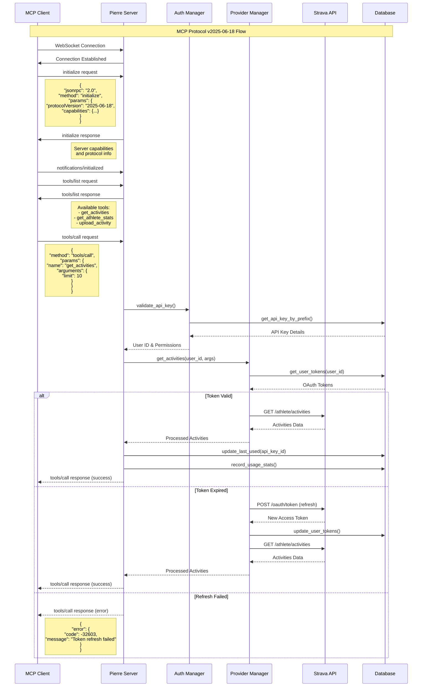
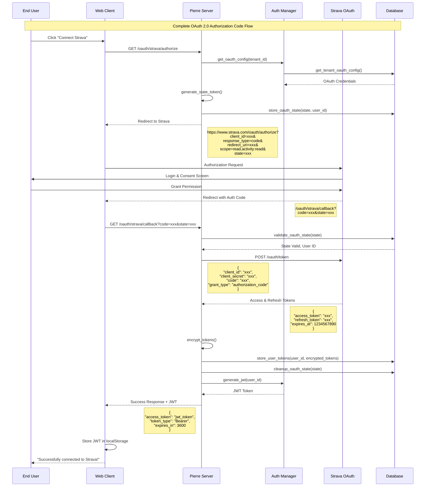
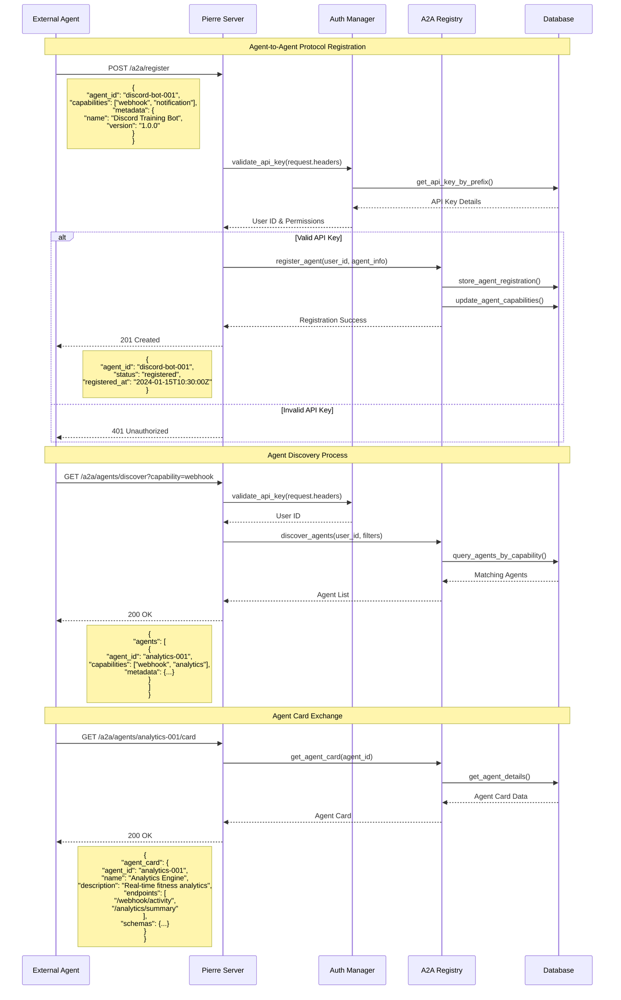
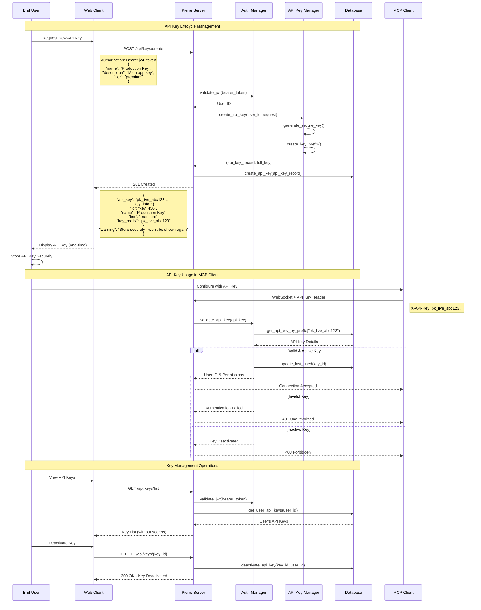
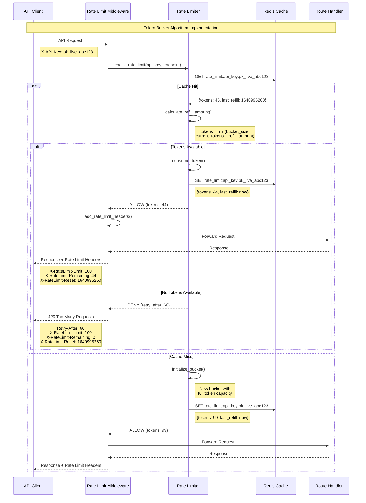
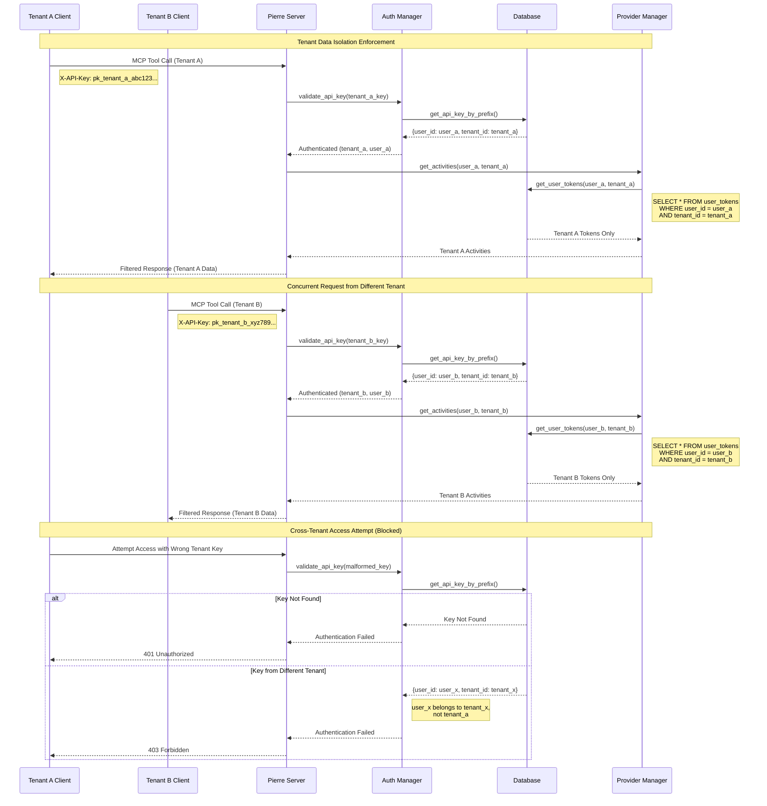
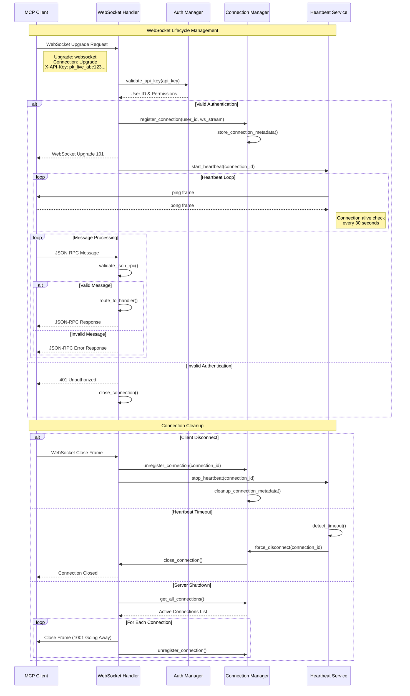

# Sequence Diagrams

This document contains sequence diagrams for the key flows in Pierre MCP Server, illustrating the interactions between components and external systems.

## Table of Contents

1. [MCP Connection and Tool Execution Flow](#mcp-connection-and-tool-execution-flow)
2. [OAuth Authentication Flow](#oauth-authentication-flow)
3. [A2A Registration and Discovery Flow](#a2a-registration-and-discovery-flow)
4. [API Key Creation and Usage Flow](#api-key-creation-and-usage-flow)
5. [Rate Limiting Enforcement Flow](#rate-limiting-enforcement-flow)
6. [Multi-Tenant Data Isolation Flow](#multi-tenant-data-isolation-flow)
7. [Database Migration Flow](#database-migration-flow)
8. [WebSocket Connection Management](#websocket-connection-management)

## MCP Connection and Tool Execution Flow



## OAuth Authentication Flow



## A2A Registration and Discovery Flow



## API Key Creation and Usage Flow



## Rate Limiting Enforcement Flow



## Multi-Tenant Data Isolation Flow



## Database Migration Flow

```mermaid
sequenceDiagram
    participant App as Application
    participant Migration as Migration Manager
    participant DB as Database
    participant Files as Migration Files

    Note over App, Files: Database Schema Migration Process

    App->>Migration: run_migrations()
    Migration->>DB: CREATE TABLE IF NOT EXISTS migrations
    
    Migration->>DB: SELECT * FROM migrations ORDER BY version
    DB-->>Migration: Applied Migrations List
    
    Migration->>Files: scan_migration_directory()
    Files-->>Migration: Available Migration Files
    Note right of Files: 001_initial.sql<br/>002_add_tenants.sql<br/>003_add_rate_limiting.sql

    Migration->>Migration: find_pending_migrations()
    Note right of Migration: Compare applied vs available<br/>to find new migrations

    loop For Each Pending Migration
        Migration->>Files: read_migration_file(version)
        Files-->>Migration: SQL Content
        
        Migration->>DB: BEGIN TRANSACTION
        
        alt Migration Success
            Migration->>DB: EXECUTE migration_sql
            Migration->>DB: INSERT INTO migrations (version, applied_at)
            Migration->>DB: COMMIT TRANSACTION
            Note right of Migration: Migration 002 applied successfully
        else Migration Failure
            Migration->>DB: ROLLBACK TRANSACTION
            Migration-->>App: Migration Failed Error
            Note left of Migration: Stop migration process<br/>on first failure
        end
    end

    Migration-->>App: All Migrations Applied
    
    Note over App, Files: Migration File Structure
    
    Note right of Files: -- 002_add_tenants.sql<br/>-- Description: Add multi-tenant support<br/>-- Up Migration<br/>CREATE TABLE tenants (<br/>  id UUID PRIMARY KEY,<br/>  name VARCHAR NOT NULL,<br/>  created_at TIMESTAMP DEFAULT NOW()<br/>);<br/><br/>-- Add tenant_id to users<br/>ALTER TABLE users ADD COLUMN tenant_id UUID<br/>REFERENCES tenants(id);<br/><br/>-- Down Migration (in separate file)<br/>-- 002_add_tenants_down.sql<br/>ALTER TABLE users DROP COLUMN tenant_id;<br/>DROP TABLE tenants;
```

## WebSocket Connection Management



## Notes on Sequence Diagrams

### Key Design Patterns Illustrated

1. **Error Handling**: Each flow shows proper error handling with meaningful error responses and rollback mechanisms.

2. **Authentication**: Consistent authentication patterns across all flows, with proper JWT and API key validation.

3. **Data Isolation**: Multi-tenant architecture ensures complete data separation between tenants.

4. **Rate Limiting**: Token bucket algorithm implementation with proper cache management and header responses.

5. **Connection Management**: WebSocket lifecycle management with heartbeat monitoring and graceful cleanup.

6. **Database Transactions**: Migration flows show proper transaction management with rollback on failure.

### Performance Considerations

- **Caching**: Rate limiting uses Redis for high-performance token bucket operations
- **Connection Pooling**: Database connections are pooled for optimal performance
- **Async Processing**: All I/O operations are asynchronous for maximum concurrency
- **Token Refresh**: OAuth token refresh is handled transparently without user intervention

### Security Features

- **Token Encryption**: All sensitive tokens are encrypted at rest using AES-256-GCM
- **State Validation**: OAuth flows include CSRF protection via state parameters
- **API Key Prefixes**: Partial key exposure for identification without compromising security
- **Tenant Isolation**: Database queries include tenant filtering to prevent cross-tenant data access

These sequence diagrams provide a comprehensive view of how the Pierre MCP Server handles complex multi-protocol interactions while maintaining security, performance, and reliability.