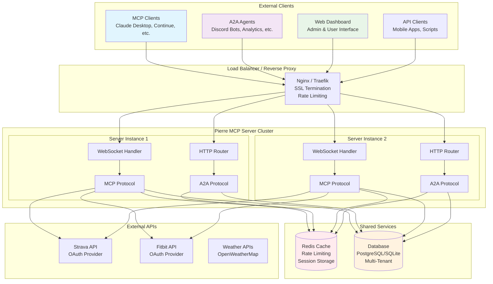
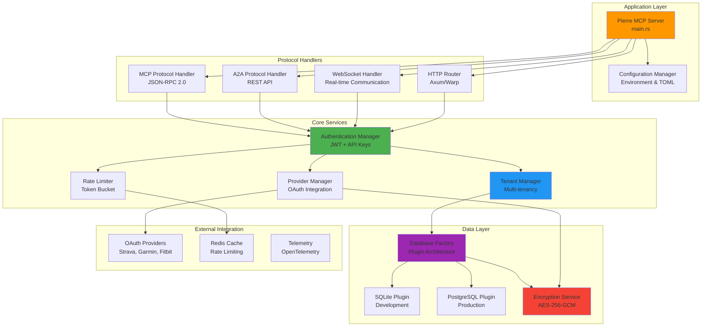
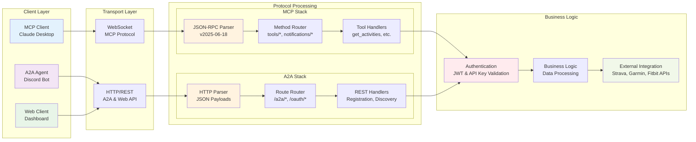
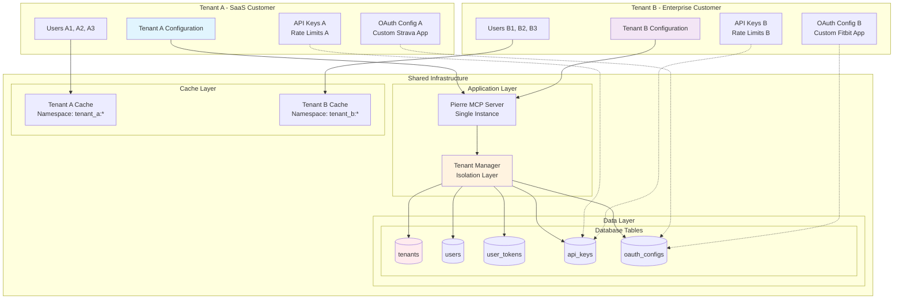
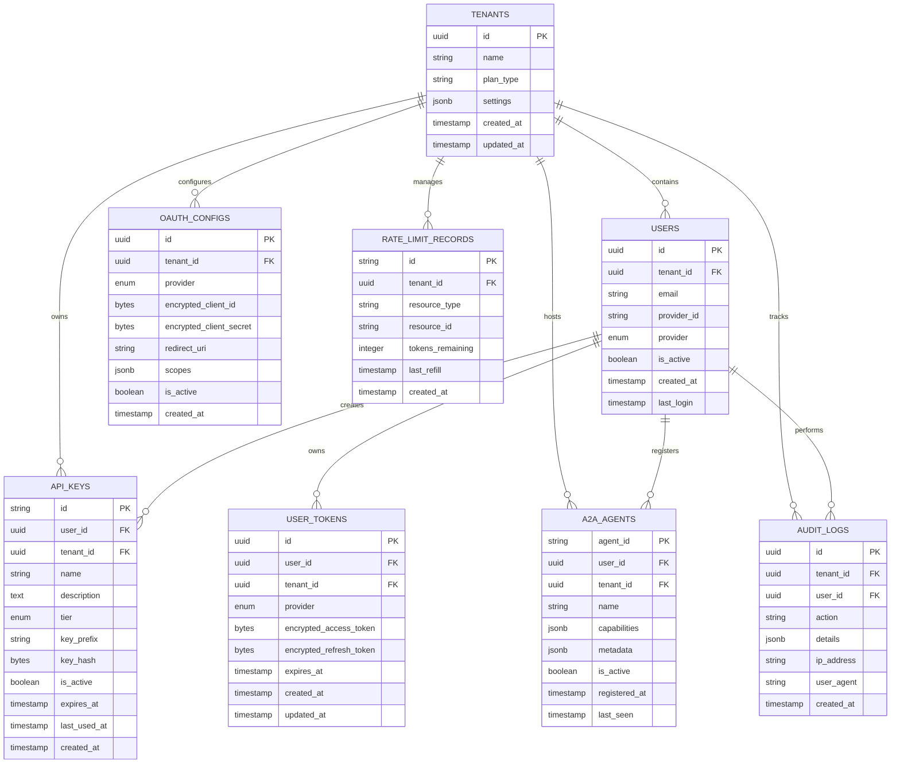
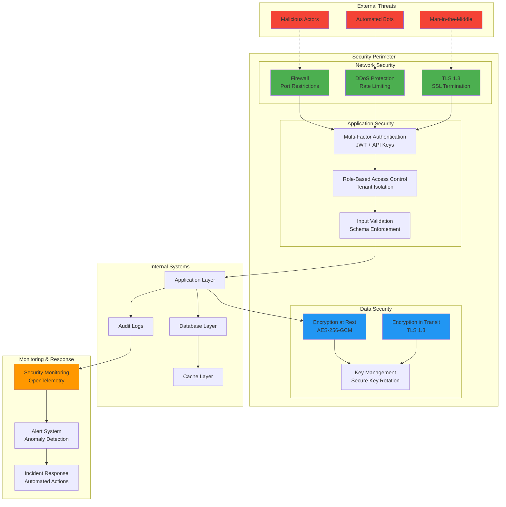
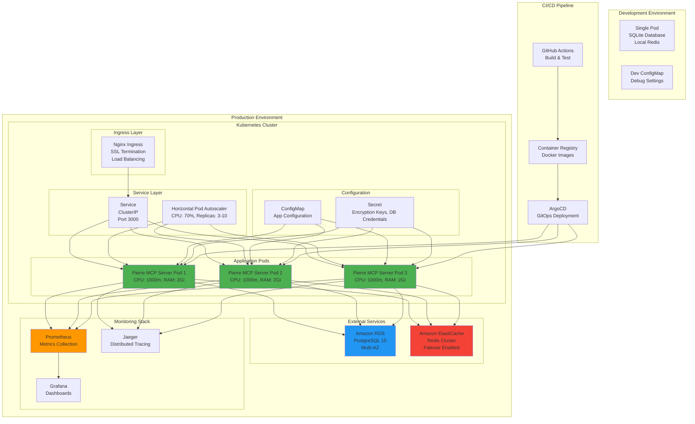
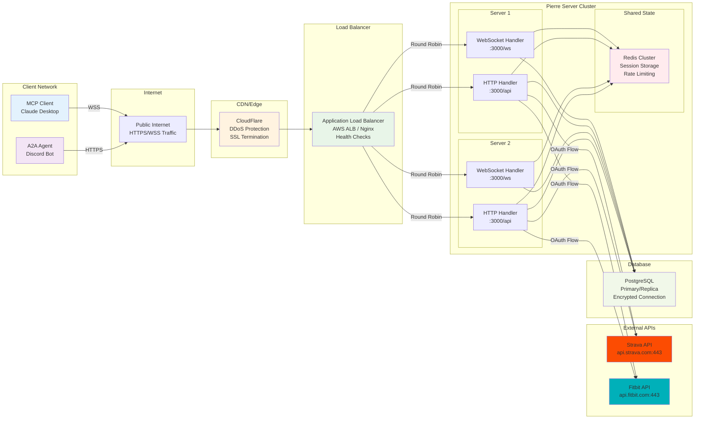

# Architecture Diagrams

This document contains comprehensive architecture diagrams for Pierre MCP Server, showing system structure, component relationships, and data flow patterns.

## Table of Contents

1. [System Overview Architecture](#system-overview-architecture)
2. [Component Architecture](#component-architecture)
3. [Protocol Layer Architecture](#protocol-layer-architecture)
4. [Multi-Tenant Architecture](#multi-tenant-architecture)
5. [Database Architecture](#database-architecture)
6. [Security Architecture](#security-architecture)
7. [Deployment Architecture](#deployment-architecture)
8. [Network Flow Architecture](#network-flow-architecture)

## System Overview Architecture

## Component Architecture

## Protocol Layer Architecture

## Multi-Tenant Architecture

## Database Architecture

## Security Architecture

## Deployment Architecture

## Network Flow Architecture

## Architecture Decision Records (ADR)

### ADR-001: Multi-Protocol Support
**Decision**: Support both MCP and A2A protocols in a single server instance.
**Rationale**: Reduces operational complexity while allowing different client types.
**Consequences**: Shared authentication and tenant isolation across protocols.

### ADR-002: Plugin-Based Database Architecture
**Decision**: Use a plugin architecture for database backends.
**Rationale**: Supports different deployment scenarios (SQLite for dev, PostgreSQL for prod).
**Consequences**: Abstracts database operations behind a common interface.

### ADR-003: JWT + API Key Dual Authentication
**Decision**: Support both JWT tokens and API keys for authentication.
**Rationale**: JWTs for web sessions, API keys for programmatic access.
**Consequences**: Dual validation paths in authentication middleware.

### ADR-004: Redis for Rate Limiting
**Decision**: Use Redis for distributed rate limiting state.
**Rationale**: Required for multi-instance deployments with consistent rate limits.
**Consequences**: External dependency but enables horizontal scaling.

### ADR-005: Tenant-Scoped OAuth Configurations
**Decision**: Allow per-tenant OAuth application configurations.
**Rationale**: Enterprise customers need their own OAuth apps for branding/compliance.
**Consequences**: Complex OAuth flow handling but supports B2B requirements.

## Performance Characteristics

### Throughput Metrics
- **WebSocket Connections**: 10,000+ concurrent connections per instance
- **HTTP Requests**: 1,000+ requests/second per instance
- **Database Operations**: 5,000+ queries/second with connection pooling
- **Rate Limiting**: Sub-millisecond token bucket operations via Redis

### Latency Metrics
- **MCP Tool Calls**: <100ms average (excluding external API calls)
- **Authentication**: <10ms for JWT validation, <50ms for API key lookup
- **Database Queries**: <5ms average with proper indexing
- **OAuth Token Refresh**: <500ms including external API round-trip

### Scalability Limits
- **Horizontal Scaling**: Stateless application design supports unlimited instances
- **Database Scaling**: Read replicas for analytics, primary for writes
- **Cache Scaling**: Redis cluster for distributed rate limiting state
- **External API Limits**: Bounded by provider rate limits (Strava/Garmin/Fitbit: 600 requests/15min)

These architecture diagrams provide a comprehensive view of how Pierre MCP Server is structured to handle multi-protocol communication, maintain tenant isolation, and scale horizontally while preserving security and performance characteristics.