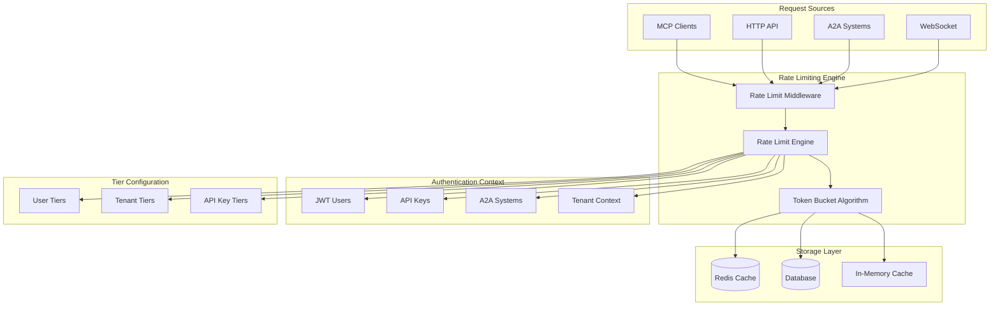
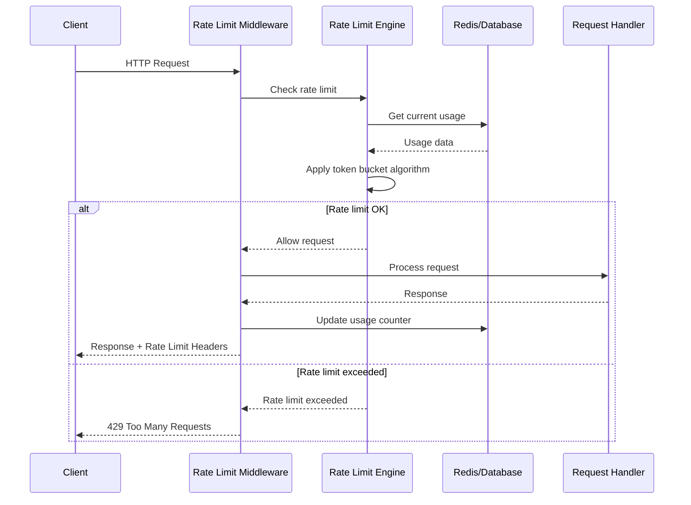

# Rate Limiting System

## Overview

Pierre MCP Server implements a comprehensive rate limiting system that protects against API abuse while providing fair usage across different subscription tiers and authentication methods. The system uses token bucket algorithms with configurable limits for different client types.

## Rate Limiting Architecture



## Rate Limiting Tiers

### User Tiers (JWT Authentication)

```rust
// src/rate_limiting.rs
pub enum UserTier {
    Free,          // 1,000 requests/month
    Basic,         // 10,000 requests/month  
    Professional,  // 100,000 requests/month
    Enterprise,    // Unlimited
}

impl UserTier {
    pub fn monthly_limit(&self) -> Option<u32> {
        match self {
            Self::Free => Some(1_000),
            Self::Basic => Some(10_000),
            Self::Professional => Some(100_000),
            Self::Enterprise => None, // Unlimited
        }
    }
    
    pub fn burst_limit(&self) -> u32 {
        match self {
            Self::Free => 10,
            Self::Basic => 50,
            Self::Professional => 200,
            Self::Enterprise => 1000,
        }
    }
}
```

### Tenant Tiers (Multi-Tenant Organizations)

```rust
#[derive(Debug, Clone, Serialize, Deserialize)]
pub struct TenantRateLimitTier {
    pub monthly_limit: u32,
    pub burst_limit: u32,
    pub multiplier: f32,        // Rate limit multiplier (1.0 = normal)
    pub unlimited: bool,
    pub custom_reset_period: Option<u64>,
}

impl TenantRateLimitTier {
    pub const fn starter() -> Self {
        Self {
            monthly_limit: 10_000,
            burst_limit: 100,
            multiplier: 1.0,
            unlimited: false,
            custom_reset_period: None,
        }
    }
    
    pub const fn professional() -> Self {
        Self {
            monthly_limit: 100_000,
            burst_limit: 500,
            multiplier: 1.0,
            unlimited: false,
            custom_reset_period: None,
        }
    }
    
    pub const fn enterprise() -> Self {
        Self {
            monthly_limit: 1_000_000,
            burst_limit: 2000,
            multiplier: 1.0,
            unlimited: true,
            custom_reset_period: None,
        }
    }
}
```

### API Key Tiers (A2A Systems)

```rust
#[derive(Debug, Clone, Serialize, Deserialize)]
pub enum ApiKeyTier {
    Trial,      // 500 requests/month
    Standard,   // 5,000 requests/month
    Premium,    // 50,000 requests/month
    Custom(u32), // Custom limit
}

impl ApiKeyTier {
    pub fn monthly_limit(&self) -> Option<u32> {
        match self {
            Self::Trial => Some(500),
            Self::Standard => Some(5_000),
            Self::Premium => Some(50_000),
            Self::Custom(limit) => Some(*limit),
        }
    }
    
    pub fn requests_per_second(&self) -> u32 {
        match self {
            Self::Trial => 1,
            Self::Standard => 5,
            Self::Premium => 20,
            Self::Custom(_) => 10,
        }
    }
}
```

## Token Bucket Algorithm

### Implementation

```rust
// src/rate_limiting.rs
#[derive(Debug, Clone)]
pub struct TokenBucket {
    capacity: u32,
    tokens: f64,
    last_refill: std::time::Instant,
    refill_rate_per_second: f64,
}

impl TokenBucket {
    pub fn new(capacity: u32, refill_rate_per_second: f64) -> Self {
        Self {
            capacity,
            tokens: capacity as f64,
            last_refill: std::time::Instant::now(),
            refill_rate_per_second,
        }
    }
    
    pub fn try_consume(&mut self, tokens: u32) -> bool {
        self.refill();
        
        if self.tokens >= tokens as f64 {
            self.tokens -= tokens as f64;
            true
        } else {
            false
        }
    }
    
    fn refill(&mut self) {
        let now = std::time::Instant::now();
        let elapsed = now.duration_since(self.last_refill).as_secs_f64();
        
        let tokens_to_add = elapsed * self.refill_rate_per_second;
        self.tokens = (self.tokens + tokens_to_add).min(self.capacity as f64);
        self.last_refill = now;
    }
    
    pub fn remaining_tokens(&mut self) -> u32 {
        self.refill();
        self.tokens.floor() as u32
    }
    
    pub fn time_until_tokens(&self, tokens: u32) -> Option<std::time::Duration> {
        if self.tokens >= tokens as f64 {
            return None;
        }
        
        let tokens_needed = tokens as f64 - self.tokens;
        let seconds = tokens_needed / self.refill_rate_per_second;
        
        Some(std::time::Duration::from_secs_f64(seconds))
    }
}
```

### Usage Example

```rust
// Example: Rate limiting for MCP requests
pub struct McpRateLimiter {
    buckets: HashMap<String, TokenBucket>,
}

impl McpRateLimiter {
    pub fn check_rate_limit(&mut self, user_id: &str, tier: &UserTier) -> RateLimitResult {
        let bucket = self.buckets.entry(user_id.to_string()).or_insert_with(|| {
            TokenBucket::new(
                tier.burst_limit(),
                tier.requests_per_second()
            )
        });
        
        if bucket.try_consume(1) {
            RateLimitResult::Allowed {
                remaining: bucket.remaining_tokens(),
            }
        } else {
            RateLimitResult::RateLimited {
                retry_after: bucket.time_until_tokens(1),
            }
        }
    }
}
```

## Rate Limiting Flow

### Request Processing Flow



### Rate Limit Check Implementation

```rust
// src/rate_limiting_middleware.rs
impl RateLimitMiddleware {
    pub async fn check_rate_limit(
        &self,
        auth_context: &AuthContext,
        request_path: &str,
    ) -> Result<RateLimitInfo, RateLimitError> {
        match auth_context {
            AuthContext::JwtUser { user_id, tenant_id, tier } => {
                self.check_user_rate_limit(*user_id, *tenant_id, tier, request_path).await
            }
            AuthContext::ApiKey { key_id, tier } => {
                self.check_api_key_rate_limit(*key_id, tier, request_path).await
            }
            AuthContext::SystemUser { system_id, limits } => {
                self.check_system_rate_limit(*system_id, limits, request_path).await
            }
        }
    }
    
    async fn check_user_rate_limit(
        &self,
        user_id: Uuid,
        tenant_id: Uuid,
        tier: &UserTier,
        _request_path: &str,
    ) -> Result<RateLimitInfo, RateLimitError> {
        let key = format!("rate_limit:user:{}:{}", tenant_id, user_id);
        let now = Utc::now();
        let month_start = now.with_day(1).unwrap()
            .with_hour(0).unwrap()
            .with_minute(0).unwrap()
            .with_second(0).unwrap();
        
        // Get current usage this month
        let usage_key = format!("{}:{}", key, month_start.format("%Y-%m"));
        let current_usage: u32 = self.redis
            .get(&usage_key)
            .await
            .unwrap_or(0);
        
        let monthly_limit = tier.monthly_limit();
        let burst_limit = tier.burst_limit();
        
        // Check monthly limit
        if let Some(limit) = monthly_limit {
            if current_usage >= limit {
                return Ok(RateLimitInfo {
                    is_rate_limited: true,
                    limit: Some(limit),
                    remaining: Some(0),
                    reset_at: Some(month_start + Duration::days(31)),
                    tier: tier.to_string(),
                    auth_method: "jwt".to_string(),
                });
            }
        }
        
        // Check burst limit using token bucket
        let burst_key = format!("{}:burst", key);
        let allowed = self.check_token_bucket(&burst_key, burst_limit, tier.requests_per_second()).await?;
        
        if !allowed {
            return Ok(RateLimitInfo {
                is_rate_limited: true,
                limit: Some(burst_limit),
                remaining: Some(0),
                reset_at: None,
                tier: tier.to_string(),
                auth_method: "jwt".to_string(),
            });
        }
        
        // Update usage counter
        self.redis.incr(&usage_key).await?;
        self.redis.expire(&usage_key, 32 * 24 * 3600).await?; // 32 days
        
        let remaining = monthly_limit.map(|limit| limit.saturating_sub(current_usage + 1));
        
        Ok(RateLimitInfo {
            is_rate_limited: false,
            limit: monthly_limit,
            remaining,
            reset_at: Some(month_start + Duration::days(31)),
            tier: tier.to_string(),
            auth_method: "jwt".to_string(),
        })
    }
}
```

## HTTP Headers

### Rate Limit Headers

Pierre includes standard rate limiting headers in all responses:

```http
HTTP/1.1 200 OK
X-RateLimit-Limit: 100000
X-RateLimit-Remaining: 99847
X-RateLimit-Reset: 1706716800
X-RateLimit-Window: 2592000
X-RateLimit-Tier: professional
X-RateLimit-AuthMethod: jwt
Content-Type: application/json
```

### Rate Limited Response

```http
HTTP/1.1 429 Too Many Requests
X-RateLimit-Limit: 100000
X-RateLimit-Remaining: 0
X-RateLimit-Reset: 1706716800
X-RateLimit-Tier: professional
X-RateLimit-AuthMethod: jwt
Retry-After: 3600
Content-Type: application/json

{
  "error": {
    "code": "RATE_LIMIT_EXCEEDED",
    "message": "Rate limit exceeded. You have reached your limit of 100000 requests for the professional tier",
    "details": {
      "limit": 100000,
      "used": 100000,
      "reset_at": "2024-01-31T00:00:00Z",
      "tier": "professional"
    }
  }
}
```

### Header Implementation

```rust
// src/rate_limiting_middleware.rs
pub fn create_rate_limit_headers(rate_limit_info: &RateLimitInfo) -> HeaderMap {
    let mut headers = HeaderMap::new();
    
    if let Some(limit) = rate_limit_info.limit {
        headers.insert(
            "X-RateLimit-Limit",
            HeaderValue::from_str(&limit.to_string()).unwrap()
        );
    }
    
    if let Some(remaining) = rate_limit_info.remaining {
        headers.insert(
            "X-RateLimit-Remaining",
            HeaderValue::from_str(&remaining.to_string()).unwrap()
        );
    }
    
    if let Some(reset_at) = rate_limit_info.reset_at {
        headers.insert(
            "X-RateLimit-Reset",
            HeaderValue::from_str(&reset_at.timestamp().to_string()).unwrap()
        );
        
        let retry_after = (reset_at - Utc::now()).num_seconds().max(0);
        headers.insert(
            "Retry-After",
            HeaderValue::from_str(&retry_after.to_string()).unwrap()
        );
    }
    
    headers.insert(
        "X-RateLimit-Tier",
        HeaderValue::from_str(&rate_limit_info.tier).unwrap()
    );
    
    headers.insert(
        "X-RateLimit-AuthMethod",
        HeaderValue::from_str(&rate_limit_info.auth_method).unwrap()
    );
    
    headers
}
```

## Protocol-Specific Rate Limiting

### MCP Rate Limiting

MCP requests have their own rate limiting context:

```rust
// MCP requests are rate limited per connection
impl MultiTenantMcpServer {
    async fn handle_mcp_request(&self, request: JsonRpcRequest) -> JsonRpcResponse {
        // Extract user context from WebSocket connection
        let user_context = self.get_connection_context(&connection_id).await?;
        
        // Check MCP-specific rate limits
        match self.rate_limiter.check_mcp_limit(&user_context).await {
            Ok(rate_info) => {
                // Process request
                self.process_mcp_request(request).await
            }
            Err(rate_limit_error) => {
                JsonRpcResponse::error(
                    request.id,
                    -32007, // Custom MCP rate limit error
                    &format!("MCP rate limit exceeded: {}", rate_limit_error)
                )
            }
        }
    }
}
```

### A2A Rate Limiting

A2A systems have dedicated rate limits:

```rust
// src/a2a/auth.rs
impl A2AAuthenticator {
    pub async fn check_system_rate_limit(
        &self,
        system_id: Uuid,
    ) -> Result<RateLimitInfo, RateLimitError> {
        let system_user = self.database
            .get_system_user(system_id)
            .await?;
        
        let key = format!("rate_limit:a2a:{}", system_id);
        let now = Utc::now();
        
        // A2A systems typically have daily limits
        let day_start = now.date_naive().and_hms(0, 0, 0);
        let usage_key = format!("{}:{}", key, day_start.format("%Y-%m-%d"));
        
        let current_usage: u32 = self.redis
            .get(&usage_key)
            .await
            .unwrap_or(0);
        
        let daily_limit = system_user.rate_limit.daily_limit;
        
        if current_usage >= daily_limit {
            return Ok(RateLimitInfo {
                is_rate_limited: true,
                limit: Some(daily_limit),
                remaining: Some(0),
                reset_at: Some(day_start + Duration::days(1)),
                tier: "a2a".to_string(),
                auth_method: "api_key".to_string(),
            });
        }
        
        // Update usage
        self.redis.incr(&usage_key).await?;
        self.redis.expire(&usage_key, 25 * 3600).await?; // 25 hours
        
        Ok(RateLimitInfo {
            is_rate_limited: false,
            limit: Some(daily_limit),
            remaining: Some(daily_limit - current_usage - 1),
            reset_at: Some(day_start + Duration::days(1)),
            tier: "a2a".to_string(),
            auth_method: "api_key".to_string(),
        })
    }
}
```

## Configuration and Management

### Environment Configuration

```bash
# Rate limiting configuration
RATE_LIMITING_ENABLED=true
RATE_LIMITING_STORAGE=redis
REDIS_URL=redis://localhost:6379

# Default limits
DEFAULT_USER_TIER=basic
DEFAULT_TENANT_TIER=starter
DEFAULT_A2A_TIER=standard

# Burst limits
MAX_BURST_SIZE=1000
MIN_BURST_SIZE=10

# Grace periods
RATE_LIMIT_GRACE_PERIOD_MINUTES=5
RATE_LIMIT_WARNING_THRESHOLD=0.9
```

### Admin Rate Limit Management

```bash
# View user rate limit status
curl -X GET https://pierre-api.example.com/api/admin/rate-limits/user/550e8400-e29b-41d4-a716-446655440000 \
  -H "Authorization: Bearer admin_token..."
```

**Response:**
```json
{
  "user_id": "550e8400-e29b-41d4-a716-446655440000",
  "tenant_id": "660f9511-f3ac-52e5-b827-557766551111",
  "current_tier": "professional",
  "current_period": {
    "start": "2024-01-01T00:00:00Z",
    "end": "2024-01-31T23:59:59Z",
    "limit": 100000,
    "used": 45678,
    "remaining": 54322
  },
  "burst_status": {
    "limit": 500,
    "available": 487,
    "refill_rate": "5.0 tokens/second"
  },
  "recent_activity": [
    {
      "timestamp": "2024-01-20T14:30:00Z",
      "requests": 15,
      "endpoint": "/api/fitness/activities"
    }
  ]
}
```

### Adjust Rate Limits

```bash
# Increase user's rate limit temporarily
curl -X POST https://pierre-api.example.com/api/admin/rate-limits/user/550e8400-e29b-41d4-a716-446655440000/adjust \
  -H "Authorization: Bearer admin_token..." \
  -H "Content-Type: application/json" \
  -d '{
    "multiplier": 2.0,
    "duration_hours": 24,
    "reason": "Temporary increase for data migration"
  }'
```

### Reset Rate Limits

```bash
# Reset user's rate limit counter
curl -X POST https://pierre-api.example.com/api/admin/rate-limits/user/550e8400-e29b-41d4-a716-446655440000/reset \
  -H "Authorization: Bearer admin_token..." \
  -H "Content-Type: application/json" \
  -d '{
    "reason": "Manual reset due to system error"
  }'
```

## Monitoring and Alerting

### Rate Limit Metrics

```rust
// src/rate_limiting.rs
pub struct RateLimitMetrics {
    pub requests_allowed: Counter,
    pub requests_blocked: Counter,
    pub rate_limit_hits_by_tier: CounterVec,
    pub burst_limit_hits: Counter,
    pub monthly_limit_hits: Counter,
    pub token_bucket_refills: Counter,
}

impl RateLimitMetrics {
    pub fn record_request(&self, allowed: bool, tier: &str, auth_method: &str) {
        if allowed {
            self.requests_allowed.inc();
        } else {
            self.requests_blocked.inc();
            self.rate_limit_hits_by_tier
                .with_label_values(&[tier, auth_method])
                .inc();
        }
    }
    
    pub fn record_burst_limit_hit(&self) {
        self.burst_limit_hits.inc();
    }
    
    pub fn record_monthly_limit_hit(&self) {
        self.monthly_limit_hits.inc();
    }
}
```

### Alerting Rules

```yaml
# prometheus/rules/rate_limiting.yml
groups:
  - name: rate_limiting
    rules:
      - alert: HighRateLimitHitRate
        expr: rate(pierre_rate_limit_hits_total[5m]) > 10
        for: 2m
        labels:
          severity: warning
        annotations:
          summary: "High rate limit hit rate detected"
          description: "Rate limit hits are occurring at {{ $value }} per second"
      
      - alert: BurstLimitExhaustion
        expr: rate(pierre_burst_limit_hits_total[1m]) > 100
        for: 30s
        labels:
          severity: critical
        annotations:
          summary: "Burst limits being exhausted rapidly"
          description: "Burst limit hits: {{ $value }} per second"
      
      - alert: MonthlyLimitApproaching
        expr: (pierre_monthly_usage / pierre_monthly_limit) > 0.9
        for: 5m
        labels:
          severity: warning
        annotations:
          summary: "Monthly rate limit approaching for {{ $labels.tenant_id }}"
          description: "Usage is at {{ $value | humanizePercentage }} of monthly limit"
```

### Usage Analytics

```bash
# Get rate limiting analytics
curl -X GET https://pierre-api.example.com/api/analytics/rate-limits \
  -H "Authorization: Bearer admin_token..." \
  -G \
  -d "start_date=2024-01-01" \
  -d "end_date=2024-01-31" \
  -d "granularity=daily"
```

**Response:**
```json
{
  "period": {
    "start": "2024-01-01T00:00:00Z",
    "end": "2024-01-31T23:59:59Z",
    "granularity": "daily"
  },
  "summary": {
    "total_requests": 2456789,
    "blocked_requests": 1234,
    "block_rate": 0.0005,
    "top_blocked_endpoints": [
      {
        "endpoint": "/api/fitness/activities",
        "blocks": 567
      }
    ]
  },
  "by_tier": {
    "free": {
      "requests": 123456,
      "blocks": 890,
      "block_rate": 0.0072
    },
    "professional": {
      "requests": 1234567,
      "blocks": 234,
      "block_rate": 0.0002
    }
  },
  "daily_data": [
    {
      "date": "2024-01-01",
      "requests": 78901,
      "blocks": 45,
      "unique_users": 1234
    }
  ]
}
```

## Best Practices

### Client-Side Handling

```javascript
// JavaScript client example
class PierreAPIClient {
    constructor(apiKey) {
        this.apiKey = apiKey;
        this.rateLimitInfo = null;
    }
    
    async makeRequest(endpoint, options = {}) {
        // Check if we're rate limited
        if (this.rateLimitInfo && this.rateLimitInfo.remaining === 0) {
            const resetTime = new Date(this.rateLimitInfo.reset_at);
            if (Date.now() < resetTime.getTime()) {
                throw new Error(`Rate limited until ${resetTime.toISOString()}`);
            }
        }
        
        const response = await fetch(endpoint, {
            ...options,
            headers: {
                'Authorization': `Bearer ${this.apiKey}`,
                'Content-Type': 'application/json',
                ...options.headers
            }
        });
        
        // Update rate limit info from headers
        this.updateRateLimitInfo(response.headers);
        
        if (response.status === 429) {
            const retryAfter = response.headers.get('Retry-After');
            throw new RateLimitError(retryAfter);
        }
        
        return response;
    }
    
    updateRateLimitInfo(headers) {
        this.rateLimitInfo = {
            limit: parseInt(headers.get('X-RateLimit-Limit')),
            remaining: parseInt(headers.get('X-RateLimit-Remaining')),
            reset_at: headers.get('X-RateLimit-Reset'),
            tier: headers.get('X-RateLimit-Tier')
        };
    }
}
```

### Exponential Backoff

```python
# Python client with exponential backoff
import time
import random
from typing import Optional

class PierreClient:
    def __init__(self, api_key: str):
        self.api_key = api_key
        
    def make_request_with_retry(self, endpoint: str, max_retries: int = 3) -> dict:
        for attempt in range(max_retries + 1):
            try:
                response = self.make_request(endpoint)
                return response
            except RateLimitError as e:
                if attempt == max_retries:
                    raise
                
                # Exponential backoff with jitter
                wait_time = (2 ** attempt) + random.uniform(0, 1)
                if e.retry_after:
                    wait_time = max(wait_time, e.retry_after)
                
                time.sleep(wait_time)
        
        raise Exception("Max retries exceeded")
```

### Graceful Degradation

```rust
// Server-side graceful degradation
impl FitnessProvider {
    pub async fn get_activities_with_fallback(
        &self,
        limit: u32,
        rate_limit_info: &RateLimitInfo,
    ) -> Result<ActivitiesResponse> {
        if rate_limit_info.remaining.unwrap_or(0) < 10 {
            // Use cached data if rate limit is low
            return self.get_cached_activities(limit).await;
        }
        
        match self.get_activities(limit).await {
            Ok(activities) => Ok(activities),
            Err(RateLimitError) => {
                // Fall back to cached data
                self.get_cached_activities(limit).await
            }
            Err(e) => Err(e),
        }
    }
}
```

This comprehensive rate limiting system ensures fair usage, prevents abuse, and provides clear feedback to clients about their usage status and limits.