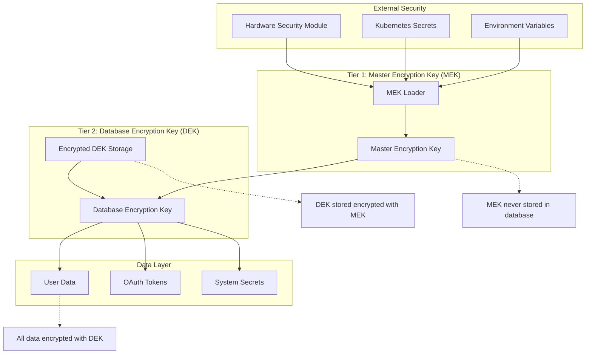
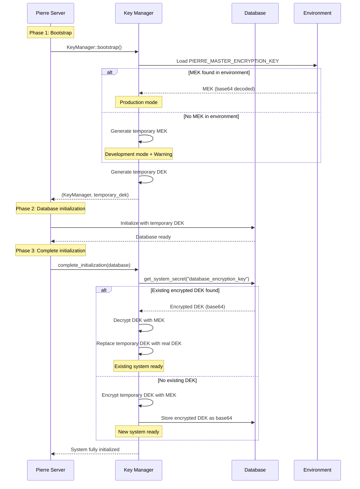
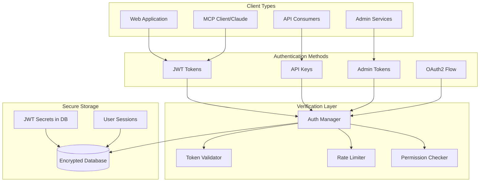
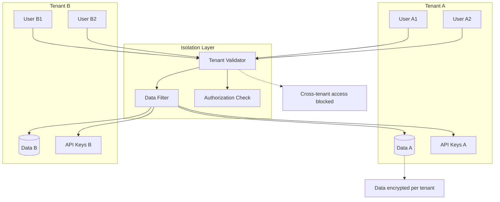
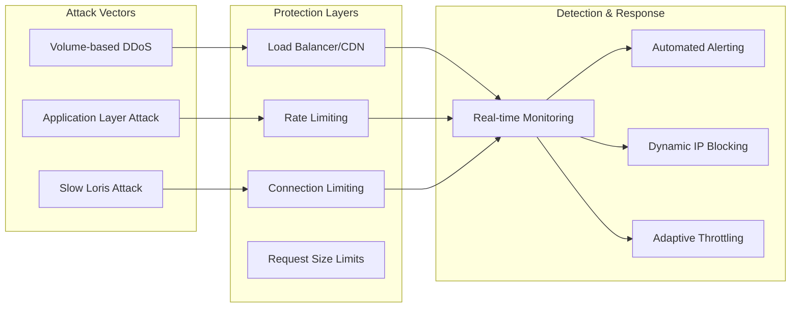

# Security Guide

## Overview

Pierre MCP Server implements multi-layered security protection for user data, authentication, and encryption. This guide covers all security aspects of the system.

## Two-Tier Key Management System

### Architecture

Pierre uses a sophisticated two-tier key management system that separates key encryption from data encryption:



### Key Hierarchy

**Master Encryption Key (MEK) - Tier 1:**
- 256-bit AES key loaded from secure external source
- Environment variable: `PIERRE_MASTER_ENCRYPTION_KEY`
- Used exclusively to encrypt/decrypt the Database Encryption Key
- Never stored in database or application logs
- Must be backed up separately from database

**Database Encryption Key (DEK) - Tier 2:**
- 256-bit AES key generated automatically on first startup
- Stored encrypted in database using MEK
- Used for all actual data encryption operations
- Can be rotated independently of MEK
- Backed up as part of database backup (encrypted)

### Bootstrap Security

The system solves the chicken-and-egg problem with a two-phase bootstrap pattern:



### Implementation

```rust
use pierre_mcp_server::key_management::KeyManager;

// Phase 1: Bootstrap with MEK from environment
let (mut key_manager, database_encryption_key) = 
    KeyManager::bootstrap()?;
info!("Two-tier key management system bootstrapped");

// Phase 2: Initialize database with temporary DEK
let database = Arc::new(Database::new(
    &database_url, 
    database_encryption_key.to_vec()
).await?);
info!("Database initialized with temporary DEK");

// Phase 3: Complete initialization - establish persistent DEK
key_manager.complete_initialization(&database).await?;
info!("Two-tier key management system fully initialized");

// CORRECT: Create ServerResources with shared database
let resources = Arc::new(ServerResources {
    database,
    // ... other resources initialized once at startup
});

// All components receive ServerResources, never create their own database instances

// System now has:
// - MEK: Loaded from PIERRE_MASTER_ENCRYPTION_KEY environment variable
// - DEK: Either loaded from database (existing) or stored (new installation)
// - All sensitive data encrypted with DEK
// - DEK itself encrypted with MEK and stored in database
```

### Key Rotation

```rust
// Rotate the Database Encryption Key (DEK only)
key_manager.rotate_database_key(&database).await?;
info!("Database Encryption Key rotated successfully");

// What happens during DEK rotation:
// 1. Generate new random DEK (32 bytes)
// 2. Encrypt new DEK with existing MEK 
// 3. Store encrypted DEK in database (replaces old one)
// 4. Old encrypted data becomes inaccessible

// IMPORTANT: DEK rotation requires data migration
// All existing encrypted data must be decrypted with old DEK
// and re-encrypted with new DEK before rotation
```

### Development vs Production Mode

The key management system automatically detects the deployment mode based on environment variables:

**Development Mode** (when `PIERRE_MASTER_ENCRYPTION_KEY` not set):
```rust
// System generates temporary MEK with warning messages:
warn!("PIERRE_MASTER_ENCRYPTION_KEY not found in environment");
warn!("Generating temporary MEK for development - NOT SECURE FOR PRODUCTION");
warn!("Generated MEK (save for production): PIERRE_MASTER_ENCRYPTION_KEY=<base64_key>");
warn!("Add this to your environment variables for production deployment");
```

**Production Mode** (when `PIERRE_MASTER_ENCRYPTION_KEY` is set):
```rust
// System loads MEK from environment variable:
info!("Loading Master Encryption Key from environment variable");
// No warnings, secure production operation
```

**Converting from Development to Production:**
1. Copy the generated MEK from development logs
2. Set `PIERRE_MASTER_ENCRYPTION_KEY=<base64_key>` in production environment
3. Database with encrypted DEK transfers seamlessly
4. No data migration required

### MEK Rotation (Production)

```rust
// MEK rotation requires coordinated process:
// 1. Set new PIERRE_MASTER_ENCRYPTION_KEY in environment
// 2. Restart application - will load new MEK
// 3. System will fail to decrypt existing DEK
// 4. Must restore old MEK to decrypt DEK, then migrate

// For zero-downtime MEK rotation:
// 1. Support multiple MEKs (key versioning)  
// 2. Migrate DEK to new MEK encryption
// 3. Update environment variable
// 4. Restart with new MEK as primary
```

## Authentication Architecture

### Multi-Layer Authentication



### JWT Security Implementation

```rust
// JWT token structure with security claims
#[derive(Debug, Serialize, Deserialize)]
pub struct SecurityClaims {
    pub sub: String,        // User ID
    pub tenant_id: String,  // Tenant isolation
    pub role: String,       // Authorization level
    pub permissions: Vec<String>, // Fine-grained permissions
    pub iat: i64,          // Issued at (replay protection)
    pub exp: i64,          // Expiry (time-bound access)
    pub jti: String,       // JWT ID (revocation support)
    pub aud: String,       // Audience (pierre-mcp-server)
    pub iss: String,       // Issuer (pierre-api)
    pub ip: Option<String>, // IP binding (optional)
}
```

### API Key Security

```rust
// API key structure with security features
pub struct SecureApiKey {
    pub id: String,           // Unique identifier
    pub key_hash: String,     // SHA-256 hash (never store plain key)
    pub prefix: String,       // First 8 chars for identification
    pub user_id: Uuid,       // Owner
    pub tenant_id: String,   // Tenant isolation
    pub permissions: Vec<String>, // Scope limitation
    pub rate_limit: u32,     // Request rate limit
    pub ip_whitelist: Option<Vec<String>>, // IP restrictions
    pub expires_at: Option<DateTime<Utc>>, // Expiration
    pub last_used: Option<DateTime<Utc>>,  // Usage tracking
    pub is_active: bool,     // Revocation support
}
```

## Encryption Standards

### Data at Rest

All sensitive data is encrypted using AES-256-GCM:

- **OAuth tokens**: Encrypted with DEK
- **User passwords**: Hashed with Argon2id
- **System secrets**: Encrypted with DEK
- **Session data**: Encrypted with DEK

### Encryption Implementation

```rust
// AES-256-GCM encryption with DEK
use aes_gcm::{Aes256Gcm, Key, Nonce};
use aes_gcm::aead::{Aead, KeyInit};

pub fn encrypt_sensitive_data(data: &[u8], dek: &[u8; 32]) -> Result<Vec<u8>> {
    let cipher = Aes256Gcm::new(Key::from_slice(dek));
    let nonce = Nonce::from_slice(&generate_nonce()); // 96-bit nonce
    
    let ciphertext = cipher.encrypt(nonce, data)
        .map_err(|e| anyhow!("Encryption failed: {}", e))?;
    
    // Prepend nonce to ciphertext for storage
    let mut encrypted = Vec::with_capacity(12 + ciphertext.len());
    encrypted.extend_from_slice(nonce);
    encrypted.extend_from_slice(&ciphertext);
    
    Ok(encrypted)
}
```

### Password Security

```rust
// Argon2id password hashing
use argon2::{Argon2, PasswordHash, PasswordHasher, PasswordVerifier};
use argon2::password_hash::{SaltString, rand_core::OsRng};

pub fn hash_password(password: &str) -> Result<String> {
    let salt = SaltString::generate(&mut OsRng);
    let argon2 = Argon2::default(); // Uses Argon2id variant
    
    let password_hash = argon2
        .hash_password(password.as_bytes(), &salt)?
        .to_string();
    
    Ok(password_hash)
}
```

## Data Protection

### Tenant Isolation



### Database Security

```sql
-- Row-level security for tenant isolation
CREATE POLICY tenant_isolation_policy ON user_data
    USING (tenant_id = current_setting('app.current_tenant_id'));

-- Encrypted columns for sensitive data
CREATE TABLE oauth_tokens (
    id UUID PRIMARY KEY,
    user_id UUID REFERENCES users(id),
    tenant_id UUID NOT NULL,
    provider VARCHAR(50) NOT NULL,
    encrypted_access_token BYTEA NOT NULL,  -- AES-256-GCM encrypted
    encrypted_refresh_token BYTEA,          -- AES-256-GCM encrypted
    token_type VARCHAR(20) DEFAULT 'Bearer',
    expires_at TIMESTAMPTZ,
    scope TEXT,
    created_at TIMESTAMPTZ DEFAULT NOW(),
    updated_at TIMESTAMPTZ DEFAULT NOW()
);
```

## Rate Limiting & DDoS Protection

### Multi-Tier Rate Limiting

```rust
pub struct SecurityRateLimits {
    pub global: RateLimit,      // Overall system protection
    pub per_user: RateLimit,    // Individual user limits
    pub per_tenant: RateLimit,  // Tenant-based limits
    pub per_endpoint: HashMap<String, RateLimit>, // Endpoint-specific
}

pub struct RateLimit {
    pub requests_per_minute: u32,
    pub burst_allowance: u32,
    pub window_seconds: u64,
    pub backoff_multiplier: f32,
}

// Implementation with token bucket algorithm
impl SecurityRateLimiter {
    pub async fn check_rate_limit(
        &self,
        identifier: &str,
        endpoint: &str,
        tenant_id: &str
    ) -> Result<RateLimitResult> {
        // Check multiple limits in order of strictness
        self.check_global_limit().await?;
        self.check_tenant_limit(tenant_id).await?;
        self.check_endpoint_limit(endpoint).await?;
        self.check_user_limit(identifier).await?;
        
        Ok(RateLimitResult::Allowed)
    }
}
```

### DDoS Protection



## Security Monitoring

### Audit Logging

```rust
// Security event logging
#[derive(Debug, Serialize)]
pub struct SecurityEvent {
    pub event_type: SecurityEventType,
    pub user_id: Option<Uuid>,
    pub tenant_id: Option<String>,
    pub ip_address: String,
    pub user_agent: String,
    pub timestamp: DateTime<Utc>,
    pub details: serde_json::Value,
    pub risk_level: RiskLevel,
}

#[derive(Debug, Serialize)]
pub enum SecurityEventType {
    LoginSuccess,
    LoginFailure,
    TokenGenerated,
    TokenExpired,
    RateLimitExceeded,
    UnauthorizedAccess,
    DataAccess,
    AdminAction,
    KeyRotation,
    SuspiciousActivity,
}
```

### Real-time Monitoring

```rust
// Security metrics collection
pub struct SecurityMetrics {
    pub failed_auth_attempts: Counter,
    pub rate_limit_violations: Counter,
    pub token_generations: Counter,
    pub data_access_events: Counter,
    pub suspicious_activities: Counter,
}

// Alerting thresholds
pub struct SecurityThresholds {
    pub max_failed_attempts_per_minute: u32,
    pub max_rate_limit_violations_per_hour: u32,
    pub suspicious_activity_score: f32,
}
```

## Production Security Checklist

### Pre-Deployment Security

- **Master Encryption Key (MEK) Security**
  - `PIERRE_MASTER_ENCRYPTION_KEY` environment variable set in production
  - MEK stored in HSM, Kubernetes secrets, or secure key management system
  - MEK never logged, stored in files, or included in application code
  - MEK backup stored separately from database backups
  - MEK rotation procedure documented and tested
  - Development warnings disabled in production (no temporary MEK generation)

- **Database Security**
  - Database encryption enabled (TDE)
  - Database access restricted to application only
  - Database backups encrypted
  - Row-level security policies enabled

- **Authentication Security**
  - JWT secrets generated from cryptographically secure source
  - Password policies enforced (complexity, length, history)
  - Multi-factor authentication enabled for admin accounts
  - Session timeouts configured appropriately

- **Network Security**
  - TLS 1.3 enabled for all communications
  - Certificate pinning implemented
  - CORS policies configured restrictively
  - Security headers configured (HSTS, CSP, etc.)

### Runtime Security Monitoring

- **Continuous Monitoring**
  - Security event logging enabled
  - Real-time alerting configured
  - Anomaly detection system active
  - Regular security scans scheduled

- **Incident Response**
  - Security incident response plan documented
  - Emergency key rotation procedures tested
  - Data breach notification procedures ready
  - Forensic logging enabled

### Compliance & Auditing

- **Audit Requirements**
  - All administrative actions logged
  - Data access patterns monitored
  - Compliance reports automated
  - External security audits scheduled

## Security Best Practices

### Development Security

1. **Secure Coding Practices**
   - Input validation on all user inputs
   - Output encoding for all dynamic content
   - Parameterized queries for database access
   - Secure random number generation

2. **Secret Management**
   - No secrets in source code
   - Environment-specific secret management
   - Secret rotation procedures
   - Least privilege access

3. **Error Handling**
   - No sensitive information in error messages
   - Consistent error responses
   - Proper logging without data leakage
   - Graceful degradation

### Operational Security

1. **Key Management**
   - Regular key rotation (annual minimum)
   - Secure key storage (HSM preferred)
   - Key escrow for disaster recovery
   - Multi-person key operations

2. **Access Control**
   - Principle of least privilege
   - Regular access reviews
   - Strong authentication requirements
   - Administrative access logging

3. **Monitoring & Response**
   - 24/7 security monitoring
   - Automated threat detection
   - Incident response procedures
   - Regular security assessments

This security guide provides comprehensive coverage of Pierre MCP Server's security architecture and operational practices for production deployment.