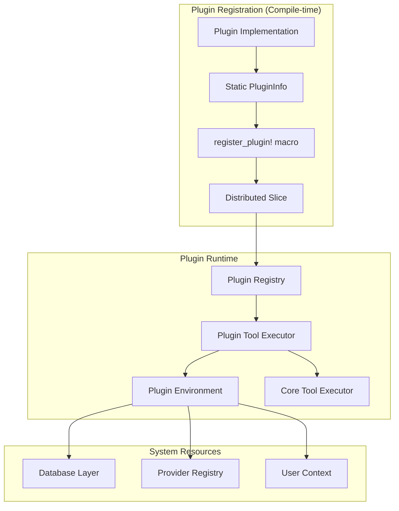
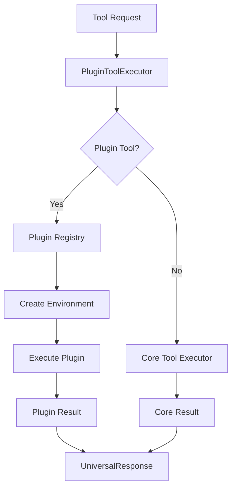

# Plugin System

## Overview

Pierre MCP Server implements a compile-time plugin system for extensible tool architecture. The system uses distributed slices for zero-cost plugin registration and provides type-safe execution with categorized organization.

## Architecture



## Core Components

### Plugin Registry

The plugin registry manages plugin discovery, registration, and execution:

```rust
pub struct PluginRegistry {
    plugins: HashMap<String, Arc<dyn PluginTool>>,
    plugin_info: HashMap<String, PluginInfo>,
}
```

### Plugin Tool Executor 

Bridges plugin system with existing tool execution:

```rust
pub struct PluginToolExecutor {
    core_executor: UniversalToolExecutor,
    plugin_registry: PluginRegistry,
    resources: Arc<ServerResources>,
}
```

### Plugin Environment

Provides controlled resource access to plugins:

```rust
pub struct PluginEnvironment<'a> {
    pub database: &'a Database,
    pub provider_registry: &'a ProviderRegistry,
    pub context: &'a PluginContext,
}
```

## Plugin Traits

### Base Plugin Trait

```rust
#[async_trait]
pub trait PluginTool: Send + Sync {
    fn info(&self) -> &PluginInfo;
    async fn execute(
        &self,
        request: UniversalRequest,
        env: PluginEnvironment<'_>,
    ) -> Result<PluginResult, ProtocolError>;
    
    fn validate_input(&self, params: &Value) -> Result<(), ProtocolError>;
    fn on_register(&self) -> Result<(), ProtocolError>;
    fn on_unregister(&self) -> Result<(), ProtocolError>;
}
```

### Static Plugin Trait

```rust
pub trait PluginToolStatic: PluginTool {
    fn new() -> Self where Self: Sized;
    const INFO: PluginInfo;
}
```

### Implementation Trait

```rust
#[async_trait]
pub trait PluginImplementation {
    async fn execute_impl(
        &self,
        request: UniversalRequest,
        env: PluginEnvironment<'_>,
    ) -> Result<UniversalResponse, ProtocolError>;
}
```

## Plugin Information

```rust
pub struct PluginInfo {
    pub name: &'static str,
    pub description: &'static str,
    pub input_schema: &'static str,
    pub version: &'static str,
    pub credit_cost: u32,
    pub author: &'static str,
    pub category: PluginCategory,
}
```

## Plugin Categories

```rust
pub enum PluginCategory {
    DataAccess,     // Data retrieval operations
    Intelligence,   // AI/ML analysis
    Analytics,      // Performance metrics
    Goals,          // Training management
    Providers,      // External integrations
    Environmental,  // Weather/location data
    Community,      // Custom implementations
}
```

## Compile-time Registration

### Distributed Slice

```rust
#[distributed_slice]
pub static PIERRE_PLUGINS: [fn() -> Box<dyn PluginTool>] = [..];
```

### Registration Macro

```rust
#[macro_export]
macro_rules! register_plugin {
    ($plugin_type:ty) => {
        #[linkme::distributed_slice($crate::plugins::registry::PIERRE_PLUGINS)]
        #[linkme(crate = linkme)]
        static PLUGIN_FACTORY: fn() -> Box<dyn $crate::plugins::core::PluginTool> =
            || Box::new(<$plugin_type>::new());
    };
}
```

## Plugin Implementation

### Basic Structure

```rust
use crate::plugins::core::{PluginCategory, PluginImplementation, PluginInfo, PluginToolStatic};
use crate::{impl_static_plugin, plugin_info, register_plugin};

pub struct ExamplePlugin;

impl PluginToolStatic for ExamplePlugin {
    fn new() -> Self {
        Self
    }

    const INFO: PluginInfo = plugin_info!(
        name: "example_tool",
        description: "Example plugin implementation",
        category: PluginCategory::Analytics,
        input_schema: r#"{
            "type": "object",
            "properties": {
                "activity_id": {"type": "string"}
            },
            "required": ["activity_id"]
        }"#,
        credit_cost: 1,
        author: "Development Team",
        version: "1.0.0",
    );
}

#[async_trait]
impl PluginImplementation for ExamplePlugin {
    async fn execute_impl(
        &self,
        request: UniversalRequest,
        env: PluginEnvironment<'_>,
    ) -> Result<UniversalResponse, ProtocolError> {
        let activity_id = request
            .parameters
            .get("activity_id")
            .and_then(serde_json::Value::as_str)
            .ok_or_else(|| ProtocolError::InvalidParameters("activity_id required".into()))?;

        Ok(UniversalResponse {
            success: true,
            result: Some(serde_json::json!({
                "activity_id": activity_id,
                "processed": true
            })),
            error: None,
            metadata: None,
        })
    }
}

impl_static_plugin!(ExamplePlugin);
register_plugin!(ExamplePlugin);
```

## Tool Resolution



## Resource Access

### Database Operations

```rust
async fn execute_impl(
    &self,
    request: UniversalRequest,
    env: PluginEnvironment<'_>,
) -> Result<UniversalResponse, ProtocolError> {
    // Access user data through environment
    let user_data = env.database
        .get_user_data(env.context.user_id)
        .await?;
    
    // Tenant-isolated operations
    if let Some(tenant_id) = env.context.tenant_id {
        let tenant_data = env.database
            .get_tenant_data(tenant_id)
            .await?;
    }
    
    // Process data...
}
```

### Provider Integration

```rust
async fn execute_impl(
    &self,
    request: UniversalRequest,
    env: PluginEnvironment<'_>,
) -> Result<UniversalResponse, ProtocolError> {
    let provider = env.provider_registry
        .create_provider("strava")
        .map_err(|e| ProtocolError::ExecutionFailed(format!("Provider error: {e}")))?;
    
    let activities = provider
        .get_activities(&request.user_id, None)
        .await?;
    
    // Process activities...
}
```

## Registry Operations

### Plugin Discovery

```rust
// List available plugins
let plugins = registry.list_plugin_names();

// Get plugin metadata
let info = registry.get_plugin_info("example_tool");

// Filter by category
let analytics = registry.get_plugins_by_category(PluginCategory::Analytics);
```

### Plugin Execution

```rust
let result = registry.execute_plugin(
    "example_tool",
    request,
    environment,
).await?;
```

### Dynamic Registration

```rust
// Runtime registration (testing)
registry.register_plugin(Box::new(TestPlugin::new()))?;

// Unregistration
registry.unregister_plugin("plugin_name")?;
```

## Error Handling

### Plugin Errors

```rust
pub enum ProtocolError {
    PluginNotFound(String),
    PluginError(String), 
    InvalidSchema(String),
    InvalidParameters(String),
    ExecutionFailed(String),
}
```

### Error Propagation

```rust
async fn execute_impl(
    &self,
    request: UniversalRequest,
    env: PluginEnvironment<'_>,
) -> Result<UniversalResponse, ProtocolError> {
    // Parameter validation
    let param = request.parameters
        .get("required_param")
        .ok_or_else(|| ProtocolError::InvalidParameters("Missing parameter".into()))?;
    
    // Resource access with error mapping
    let data = env.database
        .fetch_data()
        .await
        .map_err(|e| ProtocolError::ExecutionFailed(format!("Database: {e}")))?;
    
    // External service integration
    let result = external_call()
        .await
        .map_err(|e| ProtocolError::PluginError(format!("Service: {e}")))?;
    
    Ok(response)
}
```

## Performance

### Zero-Cost Design

- Compile-time plugin registration eliminates runtime discovery overhead
- Static dispatch through trait objects with Arc sharing
- HashMap storage with pre-computed string keys
- Borrowed references in plugin environment

### Resource Metrics

```rust
pub struct PluginResult {
    pub response: Result<UniversalResponse, ProtocolError>,
    pub credits_consumed: u32,
    pub execution_time_ms: u64,
}
```

### Execution Tracking

```rust
// Automatic timing in macro implementation
let start_time = std::time::Instant::now();
let response = self.execute_impl(request, env).await;
let execution_time_ms = start_time.elapsed().as_millis() as u64;
```

## Security

### Resource Isolation

- Database access limited to user/tenant scope
- Provider registry controls external service access
- Immutable plugin context prevents privilege escalation

### Input Validation

```rust
fn validate_input(&self, params: &Value) -> Result<(), ProtocolError> {
    let schema: Value = serde_json::from_str(self.info().input_schema)?;
    
    if let Some(required_fields) = schema["required"].as_array() {
        for field in required_fields {
            if let Some(field_name) = field.as_str() {
                if params.get(field_name).is_none() {
                    return Err(ProtocolError::InvalidParameters(
                        format!("Missing: {field_name}")
                    ));
                }
            }
        }
    }
    
    Ok(())
}
```

## Testing

### Unit Tests

```rust
#[tokio::test]
async fn test_plugin_execution() {
    let plugin = ExamplePlugin::new();
    let env = create_test_environment().await;
    let request = create_test_request("example_tool");

    let result = plugin.execute(request, env).await;
    assert!(result.is_ok());
}
```

### Integration Tests

```rust
#[tokio::test] 
async fn test_registry_integration() {
    let registry = PluginRegistry::new();
    assert!(registry.has_plugin("example_tool"));
    
    let result = registry.execute_plugin("example_tool", request, env).await;
    assert!(result.is_ok());
}
```

## Monitoring

### Registry Statistics

```rust
pub struct PluginRegistryStatistics {
    pub total_plugins: usize,
    pub data_access_plugins: usize,
    pub intelligence_plugins: usize,
    pub analytics_plugins: usize,
    pub goals_plugins: usize,
    pub provider_plugins: usize,
    pub environmental_plugins: usize,
    pub custom_plugins: usize,
}
```

### Logging

```rust
tracing::info!("Registered plugin: {} (category: {:?})", info.name, info.category);
tracing::debug!("Executing plugin: {} for user: {}", plugin_name, request.user_id);
```

## File Structure

```
src/plugins/
├── core.rs              # Plugin traits and metadata
├── executor.rs          # Tool executor integration  
├── registry.rs          # Plugin registry implementation
├── mod.rs              # Module definitions
└── community/          # Plugin implementations
    ├── mod.rs
    ├── basic_analysis.rs
    └── weather_integration.rs
```

## Implementation Guidelines

### Plugin Design

- Single responsibility per plugin
- Stateless execution model
- Comprehensive error handling
- Schema-validated input parameters

### Resource Usage

- Minimize memory allocation in execution paths
- Use borrowed references where possible
- Implement proper error propagation
- Include execution time tracking

### Code Organization

- Place plugins in categorized modules
- Use descriptive names for plugin identification
- Include comprehensive input schemas
- Document resource requirements and limitations