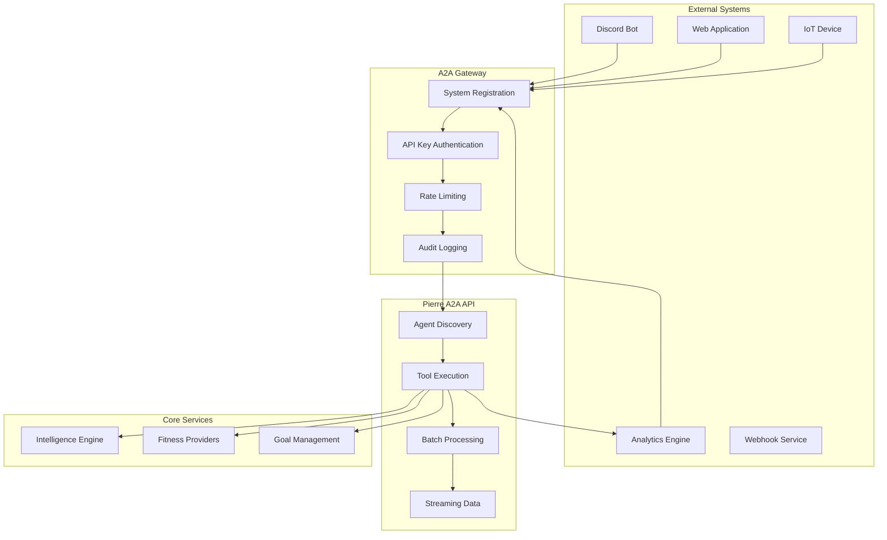

# A2A Integration Guide

## Overview

The Agent-to-Agent (A2A) protocol enables external systems to integrate directly with Pierre MCP Server for automated fitness data processing, analysis, and insights. This guide provides comprehensive directives for implementing A2A integrations.

## Integration Architecture



## Integration Patterns

### 1. Fitness Bot Integration

**Use Case**: Discord/Slack bot for fitness tracking and social features

```javascript
// Discord Bot A2A Integration
const { Client: DiscordClient, GatewayIntentBits } = require('discord.js');
const { PierreA2AClient } = require('./pierre-a2a-client');

class FitnessBotIntegration {
    constructor(discordToken, pierreApiKey) {
        this.discord = new DiscordClient({
            intents: [GatewayIntentBits.Guilds, GatewayIntentBits.GuildMessages]
        });
        this.pierre = new PierreA2AClient(pierreApiKey);
        
        this.setupCommands();
    }
    
    setupCommands() {
        // Slash command: /fitness-summary
        this.discord.on('interactionCreate', async (interaction) => {
            if (!interaction.isChatInputCommand()) return;
            
            switch (interaction.commandName) {
                case 'fitness-summary':
                    await this.handleFitnessSummary(interaction);
                    break;
                case 'analyze-activity':
                    await this.handleActivityAnalysis(interaction);
                    break;
                case 'set-goal':
                    await this.handleSetGoal(interaction);
                    break;
            }
        });
    }
    
    async handleFitnessSummary(interaction) {
        try {
            await interaction.deferReply();
            
            // Get user's fitness data via A2A
            const summary = await this.pierre.executeTool('get_athlete_summary', {
                user_id: this.getUserId(interaction.user.id),
                timeframe: '30d'
            });
            
            const embed = this.createSummaryEmbed(summary);
            await interaction.editReply({ embeds: [embed] });
            
        } catch (error) {
            await interaction.editReply({
                content: `Error: ${error.message}`,
                ephemeral: true
            });
        }
    }
    
    async handleActivityAnalysis(interaction) {
        const activityUrl = interaction.options.getString('activity_url');
        
        try {
            await interaction.deferReply();
            
            // Extract activity data from URL
            const activityData = await this.extractActivityData(activityUrl);
            
            // Analyze via A2A
            const analysis = await this.pierre.executeTool('analyze_activity', {
                activity_data: activityData,
                analysis_type: 'comprehensive'
            });
            
            const embed = this.createAnalysisEmbed(analysis);
            await interaction.editReply({ embeds: [embed] });
            
        } catch (error) {
            await interaction.editReply({
                content: `Analysis failed: ${error.message}`,
                ephemeral: true
            });
        }
    }
    
    createSummaryEmbed(summary) {
        return {
            title: `🏃 Fitness Summary - ${summary.period}`,
            color: 0x00FF00,
            fields: [
                {
                    name: '📊 Activities',
                    value: `${summary.total_activities} activities\n${summary.total_distance}km total`,
                    inline: true
                },
                {
                    name: '⏱️ Time',
                    value: `${summary.total_time} hours\nAvg: ${summary.avg_duration}min`,
                    inline: true
                },
                {
                    name: 'Goals',
                    value: `${summary.goals_completed}/${summary.goals_total} completed`,
                    inline: true
                }
            ],
            footer: {
                text: 'Powered by Pierre Fitness AI'
            }
        };
    }
}
```

### 2. IoT Device Integration

**Use Case**: Smart fitness device sending workout data

```python
# IoT Device A2A Integration
import asyncio
import json
from datetime import datetime
from pierre_a2a_client import PierreA2AClient

class SmartTreadmillIntegration:
    def __init__(self, api_key, device_id):
        self.pierre = PierreA2AClient(api_key)
        self.device_id = device_id
        self.session_data = {}
        
    async def start_workout_session(self, user_id):
        """Initialize a new workout session"""
        self.session_data = {
            'user_id': user_id,
            'start_time': datetime.utcnow(),
            'device_id': self.device_id,
            'metrics': [],
            'session_id': f"treadmill_{int(datetime.utcnow().timestamp())}"
        }
        
        # Register session with Pierre
        await self.pierre.execute_tool('start_workout_session', {
            'session_id': self.session_data['session_id'],
            'user_id': user_id,
            'device_type': 'treadmill',
            'device_id': self.device_id
        })
        
        print(f"Workout session started: {self.session_data['session_id']}")
    
    async def record_metric(self, metric_type, value, timestamp=None):
        """Record real-time workout metrics"""
        if not timestamp:
            timestamp = datetime.utcnow()
            
        metric = {
            'type': metric_type,
            'value': value,
            'timestamp': timestamp.isoformat(),
            'device_id': self.device_id
        }
        
        self.session_data['metrics'].append(metric)
        
        # Send real-time data to Pierre for live analysis
        await self.pierre.execute_tool('record_live_metric', {
            'session_id': self.session_data['session_id'],
            'metric': metric
        })
    
    async def end_workout_session(self):
        """Complete workout session and get analysis"""
        end_time = datetime.utcnow()
        duration = (end_time - self.session_data['start_time']).total_seconds()
        
        # Compile session summary
        workout_data = {
            'session_id': self.session_data['session_id'],
            'user_id': self.session_data['user_id'],
            'start_time': self.session_data['start_time'].isoformat(),
            'end_time': end_time.isoformat(),
            'duration_seconds': duration,
            'device_type': 'treadmill',
            'device_id': self.device_id,
            'metrics': self.session_data['metrics'],
            'summary': self.calculate_session_summary()
        }
        
        # Send complete workout for analysis
        analysis = await self.pierre.execute_tool('analyze_workout_session', {
            'workout_data': workout_data,
            'analysis_depth': 'detailed'
        })
        
        # Get personalized recommendations
        recommendations = await self.pierre.execute_tool('generate_recommendations', {
            'user_id': self.session_data['user_id'],
            'recent_workout': workout_data,
            'recommendation_type': 'immediate_feedback'
        })
        
        return {
            'analysis': analysis,
            'recommendations': recommendations
        }
    
    def calculate_session_summary(self):
        """Calculate basic session metrics"""
        speed_metrics = [m for m in self.session_data['metrics'] if m['type'] == 'speed']
        hr_metrics = [m for m in self.session_data['metrics'] if m['type'] == 'heart_rate']
        distance_metrics = [m for m in self.session_data['metrics'] if m['type'] == 'distance']
        
        return {
            'avg_speed': sum(m['value'] for m in speed_metrics) / len(speed_metrics) if speed_metrics else 0,
            'max_speed': max(m['value'] for m in speed_metrics) if speed_metrics else 0,
            'avg_heart_rate': sum(m['value'] for m in hr_metrics) / len(hr_metrics) if hr_metrics else 0,
            'max_heart_rate': max(m['value'] for m in hr_metrics) if hr_metrics else 0,
            'total_distance': max(m['value'] for m in distance_metrics) if distance_metrics else 0,
            'total_metrics': len(self.session_data['metrics'])
        }

# Usage example
async def main():
    treadmill = SmartTreadmillIntegration(
        api_key="A2A_your_api_key_here",
        device_id="treadmill_001"
    )
    
    # Start workout
    await treadmill.start_workout_session("user_123")
    
    # Simulate workout data
    for minute in range(30):  # 30-minute workout
        await treadmill.record_metric('speed', 8.0 + (minute * 0.1))
        await treadmill.record_metric('heart_rate', 140 + minute)
        await treadmill.record_metric('distance', minute * 0.133)
        await asyncio.sleep(60)  # Wait 1 minute
    
    # End workout and get analysis
    results = await treadmill.end_workout_session()
    print("Workout Analysis:", results['analysis'])
    print("Recommendations:", results['recommendations'])

if __name__ == "__main__":
    asyncio.run(main())
```

### 3. Analytics Platform Integration

**Use Case**: Business intelligence platform aggregating fitness data

```python
# Analytics Platform A2A Integration
import pandas as pd
from datetime import datetime, timedelta
from pierre_a2a_client import PierreA2AClient

class FitnessAnalyticsPlatform:
    def __init__(self, api_key):
        self.pierre = PierreA2AClient(api_key)
        
    async def generate_cohort_analysis(self, cohort_criteria):
        """Generate cohort analysis for user engagement"""
        
        # Get user cohorts based on criteria
        cohort_data = await self.pierre.execute_tool('get_user_cohorts', {
            'criteria': cohort_criteria,
            'time_range': '90d'
        })
        
        # Analyze engagement patterns
        engagement_analysis = await self.pierre.execute_tool('analyze_engagement_patterns', {
            'cohort_data': cohort_data,
            'metrics': ['activity_frequency', 'goal_completion', 'social_interaction']
        })
        
        # Generate retention metrics
        retention_data = await self.pierre.execute_tool('calculate_retention_metrics', {
            'cohort_data': cohort_data,
            'periods': ['1d', '7d', '30d', '90d']
        })
        
        return {
            'cohorts': cohort_data,
            'engagement': engagement_analysis,
            'retention': retention_data
        }
    
    async def create_performance_dashboard(self, dashboard_config):
        """Create real-time performance dashboard data"""
        
        # Batch request for efficiency
        dashboard_data = await self.pierre.execute_batch([
            {
                'tool': 'get_platform_metrics',
                'arguments': {
                    'metrics': ['active_users', 'total_activities', 'avg_session_duration'],
                    'timeframe': '24h'
                }
            },
            {
                'tool': 'get_popular_activities',
                'arguments': {
                    'time_range': '7d',
                    'limit': 10
                }
            },
            {
                'tool': 'get_goal_completion_rates',
                'arguments': {
                    'period': 'current_month'
                }
            },
            {
                'tool': 'get_geographic_distribution',
                'arguments': {
                    'metric': 'active_users',
                    'granularity': 'country'
                }
            }
        ])
        
        # Process and structure data for dashboard
        return self.format_dashboard_data(dashboard_data)
    
    async def run_ml_analysis(self, analysis_type, parameters):
        """Execute machine learning analysis on fitness data"""
        
        if analysis_type == 'churn_prediction':
            return await self.pierre.execute_tool('predict_user_churn', {
                'model_type': 'gradient_boosting',
                'features': parameters.get('features', ['activity_frequency', 'goal_completion', 'social_engagement']),
                'prediction_horizon': parameters.get('horizon', '30d')
            })
            
        elif analysis_type == 'goal_recommendation':
            return await self.pierre.execute_tool('recommend_optimal_goals', {
                'user_segments': parameters.get('segments'),
                'recommendation_engine': 'collaborative_filtering'
            })
            
        elif analysis_type == 'activity_clustering':
            return await self.pierre.execute_tool('cluster_activity_patterns', {
                'clustering_algorithm': 'kmeans',
                'features': parameters.get('features'),
                'n_clusters': parameters.get('n_clusters', 5)
            })
    
    def format_dashboard_data(self, raw_data):
        """Format A2A responses for dashboard consumption"""
        return {
            'real_time_metrics': {
                'active_users_24h': raw_data[0]['active_users'],
                'total_activities_24h': raw_data[0]['total_activities'],
                'avg_session_duration': raw_data[0]['avg_session_duration']
            },
            'popular_activities': raw_data[1],
            'goal_metrics': {
                'completion_rate': raw_data[2]['completion_rate'],
                'average_progress': raw_data[2]['average_progress']
            },
            'geographic_data': raw_data[3],
            'generated_at': datetime.utcnow().isoformat()
        }
```

### 4. Webhook Integration

**Use Case**: Real-time event processing and notifications

```javascript
// Webhook Service A2A Integration
const express = require('express');
const { PierreA2AClient } = require('./pierre-a2a-client');

class WebhookIntegrationService {
    constructor(pierreApiKey, webhookSecret) {
        this.pierre = new PierreA2AClient(pierreApiKey);
        this.webhookSecret = webhookSecret;
        this.app = express();
        
        this.setupRoutes();
    }
    
    setupRoutes() {
        this.app.use(express.json());
        
        // Strava webhook endpoint
        this.app.post('/webhooks/strava', async (req, res) => {
            try {
                await this.handleStravaWebhook(req.body);
                res.status(200).json({ status: 'processed' });
            } catch (error) {
                console.error('Strava webhook error:', error);
                res.status(500).json({ error: error.message });
            }
        });
        
        // Fitbit webhook endpoint
        this.app.post('/webhooks/fitbit', async (req, res) => {
            try {
                await this.handleFitbitWebhook(req.body);
                res.status(200).json({ status: 'processed' });
            } catch (error) {
                console.error('Fitbit webhook error:', error);
                res.status(500).json({ error: error.message });
            }
        });
        
        // Generic fitness event webhook
        this.app.post('/webhooks/fitness-event', async (req, res) => {
            try {
                await this.handleFitnessEvent(req.body);
                res.status(200).json({ status: 'processed' });
            } catch (error) {
                console.error('Fitness event error:', error);
                res.status(500).json({ error: error.message });
            }
        });
    }
    
    async handleStravaWebhook(payload) {
        const { object_type, object_id, aspect_type, owner_id } = payload;
        
        if (object_type === 'activity' && aspect_type === 'create') {
            // New activity created
            await this.processNewActivity({
                provider: 'strava',
                activity_id: object_id,
                user_id: owner_id
            });
        } else if (object_type === 'athlete' && aspect_type === 'update') {
            // Athlete profile updated
            await this.processProfileUpdate({
                provider: 'strava',
                user_id: owner_id
            });
        }
    }
    
    async handleFitbitWebhook(payload) {
        for (const notification of payload) {
            const { collectionType, date, ownerId } = notification;
            
            if (collectionType === 'activities') {
                await this.processNewActivity({
                    provider: 'fitbit',
                    date: date,
                    user_id: ownerId
                });
            } else if (collectionType === 'sleep') {
                await this.processSleepData({
                    provider: 'fitbit',
                    date: date,
                    user_id: ownerId
                });
            }
        }
    }
    
    async processNewActivity(data) {
        try {
            // Analyze new activity via A2A
            const analysis = await this.pierre.executeTool('analyze_new_activity', {
                provider: data.provider,
                activity_id: data.activity_id,
                user_id: data.user_id,
                analysis_type: 'real_time'
            });
            
            // Check for achievements
            const achievements = await this.pierre.executeTool('check_achievements', {
                user_id: data.user_id,
                activity_analysis: analysis
            });
            
            // Update goal progress
            const goalUpdates = await this.pierre.executeTool('update_goal_progress', {
                user_id: data.user_id,
                activity_analysis: analysis
            });
            
            // Send notifications if needed
            if (achievements.length > 0) {
                await this.sendAchievementNotifications(data.user_id, achievements);
            }
            
            if (goalUpdates.goals_completed.length > 0) {
                await this.sendGoalCompletionNotifications(data.user_id, goalUpdates.goals_completed);
            }
            
        } catch (error) {
            console.error('Error processing new activity:', error);
        }
    }
    
    async handleFitnessEvent(payload) {
        const { event_type, user_id, data } = payload;
        
        switch (event_type) {
            case 'goal_milestone':
                await this.processGoalMilestone(user_id, data);
                break;
            case 'social_challenge':
                await this.processSocialChallenge(user_id, data);
                break;
            case 'training_plan_update':
                await this.processTrainingPlanUpdate(user_id, data);
                break;
            default:
                console.log(`Unknown event type: ${event_type}`);
        }
    }
    
    async processGoalMilestone(userId, data) {
        // Generate personalized celebration message
        const celebration = await this.pierre.executeTool('generate_milestone_celebration', {
            user_id: userId,
            milestone: data.milestone,
            goal_type: data.goal_type
        });
        
        // Get next milestone suggestions
        const nextMilestones = await this.pierre.executeTool('suggest_next_milestones', {
            user_id: userId,
            completed_milestone: data.milestone
        });
        
        // Send celebration notification
        await this.sendNotification(userId, {
            type: 'milestone_celebration',
            message: celebration.message,
            next_suggestions: nextMilestones
        });
    }
    
    async sendNotification(userId, notification) {
        // Implementation depends on notification system
        // Could be push notifications, email, SMS, etc.
        console.log(`Sending notification to ${userId}:`, notification);
    }
    
    start(port = 3000) {
        this.app.listen(port, () => {
            console.log(`Webhook service listening on port ${port}`);
        });
    }
}

// Usage
const webhookService = new WebhookIntegrationService(
    'A2A_your_api_key_here',
    'your_webhook_secret'
);

webhookService.start(3000);
```

## A2A Integration Best Practices

### 1. Error Handling and Resilience

```python
# Robust A2A Client with Retry Logic
import asyncio
import logging
from typing import Optional, Dict, Any
import aiohttp
from tenacity import retry, stop_after_attempt, wait_exponential

class ResilientPierreA2AClient:
    def __init__(self, api_key: str, base_url: str = "https://pierre-api.example.com"):
        self.api_key = api_key
        self.base_url = base_url
        self.session: Optional[aiohttp.ClientSession] = None
        self.logger = logging.getLogger(__name__)
        
    async def __aenter__(self):
        self.session = aiohttp.ClientSession(
            headers={
                'X-API-Key': self.api_key,
                'Content-Type': 'application/json'
            },
            timeout=aiohttp.ClientTimeout(total=30)
        )
        return self
        
    async def __aexit__(self, exc_type, exc_val, exc_tb):
        if self.session:
            await self.session.close()
    
    @retry(
        stop=stop_after_attempt(3),
        wait=wait_exponential(multiplier=1, min=4, max=10),
        reraise=True
    )
    async def execute_tool(self, tool_name: str, arguments: Dict[str, Any]) -> Dict[str, Any]:
        """Execute A2A tool with retry logic"""
        request_data = {
            "jsonrpc": "2.0",
            "method": "tools.execute",
            "params": {
                "tool": tool_name,
                "arguments": arguments
            },
            "id": f"req_{int(asyncio.get_event_loop().time() * 1000)}"
        }
        
        try:
            async with self.session.post(
                f"{self.base_url}/api/a2a/rpc",
                json=request_data
            ) as response:
                
                if response.status == 429:  # Rate limited
                    retry_after = int(response.headers.get('Retry-After', 60))
                    self.logger.warning(f"Rate limited, retrying after {retry_after}s")
                    await asyncio.sleep(retry_after)
                    raise aiohttp.ClientError("Rate limited")
                
                response.raise_for_status()
                result = await response.json()
                
                if 'error' in result:
                    raise A2AError(result['error']['message'], result['error']['code'])
                
                return result['result']
                
        except aiohttp.ClientError as e:
            self.logger.error(f"A2A request failed: {e}")
            raise
        except Exception as e:
            self.logger.error(f"Unexpected error in A2A request: {e}")
            raise

class A2AError(Exception):
    def __init__(self, message: str, code: int = None):
        super().__init__(message)
        self.code = code
```

### 2. Rate Limit Management

```javascript
// A2A Rate Limit Manager
class A2ARateLimitManager {
    constructor(apiKey, baseUrl) {
        this.apiKey = apiKey;
        this.baseUrl = baseUrl;
        this.rateLimitInfo = {
            limit: null,
            remaining: null,
            resetAt: null
        };
        this.requestQueue = [];
        this.processing = false;
    }
    
    async executeWithRateLimit(tool, arguments) {
        return new Promise((resolve, reject) => {
            this.requestQueue.push({ tool, arguments, resolve, reject });
            this.processQueue();
        });
    }
    
    async processQueue() {
        if (this.processing || this.requestQueue.length === 0) {
            return;
        }
        
        this.processing = true;
        
        while (this.requestQueue.length > 0) {
            // Check if we need to wait for rate limit reset
            if (this.rateLimitInfo.remaining === 0 && this.rateLimitInfo.resetAt) {
                const waitTime = new Date(this.rateLimitInfo.resetAt) - new Date();
                if (waitTime > 0) {
                    console.log(`Waiting ${waitTime}ms for rate limit reset`);
                    await new Promise(resolve => setTimeout(resolve, waitTime));
                }
            }
            
            const request = this.requestQueue.shift();
            
            try {
                const result = await this.executeRequest(request.tool, request.arguments);
                request.resolve(result);
            } catch (error) {
                request.reject(error);
            }
            
            // Add delay between requests to avoid hitting burst limits
            await new Promise(resolve => setTimeout(resolve, 100));
        }
        
        this.processing = false;
    }
    
    async executeRequest(tool, arguments) {
        const response = await fetch(`${this.baseUrl}/api/a2a/rpc`, {
            method: 'POST',
            headers: {
                'X-API-Key': this.apiKey,
                'Content-Type': 'application/json'
            },
            body: JSON.stringify({
                jsonrpc: '2.0',
                method: 'tools.execute',
                params: { tool, arguments },
                id: Date.now()
            })
        });
        
        // Update rate limit info from headers
        this.updateRateLimitInfo(response.headers);
        
        if (!response.ok) {
            if (response.status === 429) {
                throw new Error('Rate limit exceeded');
            }
            throw new Error(`HTTP ${response.status}: ${response.statusText}`);
        }
        
        const result = await response.json();
        
        if (result.error) {
            throw new Error(`A2A Error: ${result.error.message}`);
        }
        
        return result.result;
    }
    
    updateRateLimitInfo(headers) {
        this.rateLimitInfo.limit = parseInt(headers.get('X-RateLimit-Limit') || '0');
        this.rateLimitInfo.remaining = parseInt(headers.get('X-RateLimit-Remaining') || '0');
        
        const resetTimestamp = headers.get('X-RateLimit-Reset');
        if (resetTimestamp) {
            this.rateLimitInfo.resetAt = new Date(parseInt(resetTimestamp) * 1000);
        }
    }
}
```

### 3. Bulk Data Processing

```python
# Efficient Bulk Data Processing
class BulkDataProcessor:
    def __init__(self, pierre_client, batch_size=50):
        self.pierre = pierre_client
        self.batch_size = batch_size
        
    async def process_activity_batch(self, activities):
        """Process multiple activities efficiently"""
        
        # Group activities into batches
        batches = [
            activities[i:i + self.batch_size] 
            for i in range(0, len(activities), self.batch_size)
        ]
        
        results = []
        
        for batch in batches:
            # Create batch request
            batch_operations = []
            
            for activity in batch:
                batch_operations.append({
                    'tool': 'analyze_activity',
                    'arguments': {
                        'activity_data': activity,
                        'analysis_type': 'standard'
                    }
                })
            
            # Execute batch
            batch_results = await self.pierre.execute_batch(batch_operations)
            results.extend(batch_results)
            
            # Small delay between batches
            await asyncio.sleep(0.5)
        
        return results
    
    async def bulk_goal_updates(self, user_goal_updates):
        """Update multiple user goals efficiently"""
        
        # Group by user to minimize context switching
        user_groups = {}
        for update in user_goal_updates:
            user_id = update['user_id']
            if user_id not in user_groups:
                user_groups[user_id] = []
            user_groups[user_id].append(update)
        
        results = {}
        
        for user_id, updates in user_groups.items():
            batch_operations = []
            
            for update in updates:
                batch_operations.append({
                    'tool': 'update_goal_progress',
                    'arguments': {
                        'user_id': user_id,
                        'goal_id': update['goal_id'],
                        'progress_data': update['progress']
                    }
                })
            
            # Execute all updates for this user
            user_results = await self.pierre.execute_batch(batch_operations)
            results[user_id] = user_results
        
        return results
```

### 4. Real-time Event Streaming

```javascript
// Real-time Event Streaming Integration
class A2AEventStream {
    constructor(apiKey, baseUrl) {
        this.apiKey = apiKey;
        this.baseUrl = baseUrl;
        this.eventSource = null;
        this.eventHandlers = new Map();
        this.reconnectAttempts = 0;
        this.maxReconnectAttempts = 5;
    }
    
    connect() {
        const url = new URL('/api/a2a/events/stream', this.baseUrl);
        
        this.eventSource = new EventSource(url.toString(), {
            headers: {
                'X-API-Key': this.apiKey
            }
        });
        
        this.eventSource.onopen = () => {
            console.log('A2A event stream connected');
            this.reconnectAttempts = 0;
        };
        
        this.eventSource.onmessage = (event) => {
            try {
                const data = JSON.parse(event.data);
                this.handleEvent(data);
            } catch (error) {
                console.error('Error parsing event data:', error);
            }
        };
        
        this.eventSource.onerror = (error) => {
            console.error('A2A event stream error:', error);
            this.handleReconnection();
        };
    }
    
    handleEvent(eventData) {
        const { event_type, user_id, data, timestamp } = eventData;
        
        // Call registered handlers
        if (this.eventHandlers.has(event_type)) {
            const handlers = this.eventHandlers.get(event_type);
            handlers.forEach(handler => {
                try {
                    handler(user_id, data, timestamp);
                } catch (error) {
                    console.error(`Error in event handler for ${event_type}:`, error);
                }
            });
        }
        
        // Call global handlers
        if (this.eventHandlers.has('*')) {
            const globalHandlers = this.eventHandlers.get('*');
            globalHandlers.forEach(handler => {
                try {
                    handler(event_type, user_id, data, timestamp);
                } catch (error) {
                    console.error('Error in global event handler:', error);
                }
            });
        }
    }
    
    on(eventType, handler) {
        if (!this.eventHandlers.has(eventType)) {
            this.eventHandlers.set(eventType, []);
        }
        this.eventHandlers.get(eventType).push(handler);
    }
    
    off(eventType, handler) {
        if (this.eventHandlers.has(eventType)) {
            const handlers = this.eventHandlers.get(eventType);
            const index = handlers.indexOf(handler);
            if (index > -1) {
                handlers.splice(index, 1);
            }
        }
    }
    
    handleReconnection() {
        if (this.reconnectAttempts < this.maxReconnectAttempts) {
            this.reconnectAttempts++;
            const delay = Math.pow(2, this.reconnectAttempts) * 1000; // Exponential backoff
            
            console.log(`Attempting to reconnect in ${delay}ms (attempt ${this.reconnectAttempts})`);
            
            setTimeout(() => {
                this.connect();
            }, delay);
        } else {
            console.error('Max reconnection attempts reached');
        }
    }
    
    disconnect() {
        if (this.eventSource) {
            this.eventSource.close();
            this.eventSource = null;
        }
    }
}

// Usage example
const eventStream = new A2AEventStream('A2A_your_api_key', 'https://pierre-api.example.com');

// Listen for specific events
eventStream.on('activity_completed', (userId, activityData) => {
    console.log(`User ${userId} completed activity:`, activityData);
    // Process activity completion
});

eventStream.on('goal_achieved', (userId, goalData) => {
    console.log(`User ${userId} achieved goal:`, goalData);
    // Send congratulations message
});

// Listen for all events
eventStream.on('*', (eventType, userId, data) => {
    console.log(`Event ${eventType} for user ${userId}:`, data);
    // Log all events for debugging
});

eventStream.connect();
```

### 5. Configuration Management

```yaml
# A2A Integration Configuration
pierre_a2a:
  # Authentication
  api_key: "${PIERRE_A2A_API_KEY}"
  base_url: "https://pierre-api.example.com"
  
  # Rate limiting
  rate_limit:
    requests_per_minute: 100
    burst_size: 20
    retry_attempts: 3
    backoff_multiplier: 2
  
  # Timeouts
  timeouts:
    connection: 10s
    request: 30s
    read: 60s
  
  # Batch processing
  batch:
    max_size: 50
    timeout: 120s
    parallel_batches: 3
  
  # Event streaming
  events:
    enabled: true
    reconnect_attempts: 5
    buffer_size: 1000
  
  # Tool configurations
  tools:
    analyze_activity:
      default_analysis_type: "standard"
      cache_results: true
      cache_ttl: 3600
    
    generate_recommendations:
      max_recommendations: 10
      include_reasoning: true
    
    get_athlete_stats:
      default_timeframe: "30d"
      include_trends: true
  
  # Error handling
  error_handling:
    log_errors: true
    retry_on_server_error: true
    fallback_to_cache: true
    
  # Monitoring
  monitoring:
    metrics_enabled: true
    health_check_interval: 60s
    alert_on_rate_limit: true
```

## Integration Testing

### 1. Unit Tests for A2A Client

```python
# test_a2a_integration.py
import pytest
import asyncio
from unittest.mock import AsyncMock, patch
from your_a2a_client import PierreA2AClient, A2AError

@pytest.mark.asyncio
class TestA2AIntegration:
    
    @pytest.fixture
    async def a2a_client(self):
        return PierreA2AClient("test_api_key", "https://test-api.example.com")
    
    async def test_execute_tool_success(self, a2a_client):
        """Test successful tool execution"""
        with patch('aiohttp.ClientSession.post') as mock_post:
            mock_response = AsyncMock()
            mock_response.status = 200
            mock_response.json.return_value = {
                "jsonrpc": "2.0",
                "result": {"analysis": "test_result"},
                "id": "test_id"
            }
            mock_post.return_value.__aenter__.return_value = mock_response
            
            result = await a2a_client.execute_tool('analyze_activity', {
                'activity_data': {'type': 'run', 'distance': 5000}
            })
            
            assert result == {"analysis": "test_result"}
            mock_post.assert_called_once()
    
    async def test_rate_limit_handling(self, a2a_client):
        """Test rate limit error handling"""
        with patch('aiohttp.ClientSession.post') as mock_post:
            mock_response = AsyncMock()
            mock_response.status = 429
            mock_response.headers = {'Retry-After': '60'}
            mock_post.return_value.__aenter__.return_value = mock_response
            
            with pytest.raises(A2AError):
                await a2a_client.execute_tool('test_tool', {})
    
    async def test_batch_execution(self, a2a_client):
        """Test batch tool execution"""
        operations = [
            {'tool': 'get_athlete', 'arguments': {'provider': 'strava'}},
            {'tool': 'get_activities', 'arguments': {'provider': 'strava', 'limit': 5}}
        ]
        
        with patch('aiohttp.ClientSession.post') as mock_post:
            mock_response = AsyncMock()
            mock_response.status = 200
            mock_response.json.return_value = {
                "jsonrpc": "2.0",
                "result": [
                    {"athlete": "test_athlete"},
                    {"activities": ["activity1", "activity2"]}
                ],
                "id": "batch_test"
            }
            mock_post.return_value.__aenter__.return_value = mock_response
            
            results = await a2a_client.execute_batch(operations)
            
            assert len(results) == 2
            assert results[0] == {"athlete": "test_athlete"}
            assert results[1] == {"activities": ["activity1", "activity2"]}
```

### 2. Integration Tests

```javascript
// integration.test.js
const { PierreA2AClient } = require('../src/pierre-a2a-client');

describe('Pierre A2A Integration Tests', () => {
    let client;
    
    beforeAll(() => {
        client = new PierreA2AClient(
            process.env.PIERRE_A2A_TEST_API_KEY,
            process.env.PIERRE_A2A_TEST_URL || 'https://test-api.pierre.example.com'
        );
    });
    
    test('should discover agent capabilities', async () => {
        const agentCard = await client.getAgentCard();
        
        expect(agentCard).toHaveProperty('name');
        expect(agentCard).toHaveProperty('capabilities');
        expect(agentCard).toHaveProperty('tools');
        expect(Array.isArray(agentCard.tools)).toBe(true);
        expect(agentCard.tools.length).toBeGreaterThan(0);
    });
    
    test('should execute fitness analysis tool', async () => {
        const activityData = {
            type: 'run',
            distance: 5000,
            duration: 1800,
            gps_points: generateMockGPSPoints(),
            heart_rate: generateMockHeartRate()
        };
        
        const analysis = await client.executeTool('analyze_activity', {
            activity_data: activityData,
            analysis_type: 'comprehensive'
        });
        
        expect(analysis).toHaveProperty('analysis');
        expect(analysis).toHaveProperty('recommendations');
        expect(analysis.analysis).toHaveProperty('average_pace');
        expect(analysis.analysis).toHaveProperty('training_load');
    }, 30000); // 30 second timeout for complex analysis
    
    test('should handle rate limiting gracefully', async () => {
        // Make multiple rapid requests to test rate limiting
        const promises = [];
        for (let i = 0; i < 10; i++) {
            promises.push(
                client.executeTool('get_athlete_stats', { timeframe: '7d' })
            );
        }
        
        // Should not throw errors, client should handle rate limits
        const results = await Promise.allSettled(promises);
        
        // At least some should succeed
        const successful = results.filter(r => r.status === 'fulfilled');
        expect(successful.length).toBeGreaterThan(0);
    });
    
    function generateMockGPSPoints() {
        const points = [];
        for (let i = 0; i < 100; i++) {
            points.push({
                lat: 37.7749 + (Math.random() - 0.5) * 0.01,
                lng: -122.4194 + (Math.random() - 0.5) * 0.01,
                elevation: 50 + Math.random() * 100,
                time: new Date(Date.now() - (100 - i) * 18000).toISOString()
            });
        }
        return points;
    }
    
    function generateMockHeartRate() {
        return Array.from({ length: 100 }, (_, i) => ({
            value: 140 + Math.sin(i / 10) * 20 + Math.random() * 10,
            time: new Date(Date.now() - (100 - i) * 18000).toISOString()
        }));
    }
});
```

This comprehensive A2A Integration Guide provides developers with everything needed to integrate external systems with Pierre MCP Server, from simple Discord bots to complex analytics platforms, with proper error handling, rate limiting, and testing strategies.